<!-- Carátula -->

    

# Universidad Peruana de Ciencias Aplicadas

## Carrera de Ingeniería de Software

 

**Ciclo:** 2026 - 1  
**Curso:** Desarrollo de aplicaciones Open Source 
**NRC:** 11896 
**Docente:** Efraín Ricardo Bautista Ubillús

## "Informe del trabajo final"
**Startup:** GuandiAnts 
**Producto:** GOD's Tracker

## Relacion de integrantes:

| Código      | Nombre                              |
|-------------|-------------------------------------|
| U20221d382  | Poma Muñoz, Ariadna Geraldine       |
| U20241b962  | Navarro Aldoradin, Carolina Celeste |
| U202412903  | Lozano Quispe, Fabricio Jofred      |
| U202414356  | Vite Celis, Rodrigo Matias          |

 Abril, 2026

## Registro de Versiones del Informe

| Versión | Fecha    | Autor       | Descripción de Modificación            |
| ------- | -------- | ----------- | -------------------------------------- |
| 0.1     | 07/04/26 | Poma Muñoz, Ariadna Geraldine    | Desarrollo de la Estructura del informe |
| 0.1    | 07/04/26 | Navarro Aldoradin, Carolina Celeste | Desarrollo de la Estructura del informe|
| 0.1    | 07/04/26 | Lozano Quispe, Fabricio Jofred | Desarrollar de la estructura del informe |
| 0.1    | 07/04/26 | Vite Celis, Rodrigo Matias | Desarrollo de la Estructura del informe|

## Project Report Collaboration Insights

| URL de la organización del proyecto | URL del repositorio del reporte   | URL del repositorio de la landing page |
| :------------------: | :---------------------------: |  :----------------------------: 
| https://github.com/upc-pre-202610-1asi0729-11896-guardiant | https://github.com/upc-pre-202610-1asi0729-11896-guardiant/guardiants-report | https://github.com/upc-pre-202610-1asi0729-11896-guardiant/guardiants-website | 

**URL LANDING PAGE DESPLEGADO**:
https://upc-pre-202610-1asi0729-11896-guardiant.github.io/guardiants-website/

Commits del Report:

  

## CONTENIDO

### Tabla de contenido
- [Capítulo I: Introducción](#capítulo-i-introducción)
  - [1.1. Startup Profile](#11-startup-profile)
    - [1.1.1. Descripción de la Startup](#111-descripción-de-la-startup)
    - [1.1.2. Perfiles de integrantes del equipo](#112-perfiles-de-integrantes-del-equipo)
  - [1.2. Solution Profile](#12-solution-profile)
    - [1.2.1. Antecedentes y problemática](#121-antecedentes-y-problemática)
    - [1.2.2. Lean UX Process](#122-lean-ux-process)
      - [1.2.2.1. Lean UX Problem Statements](#1221-lean-ux-problem-statements)
      - [1.2.2.2. Lean UX Assumptions](#1222-lean-ux-assumptions)
      - [1.2.2.3. Lean UX Hypothesis Statements](#1223-lean-ux-hypothesis-statements)
      - [1.2.2.4. Lean UX Canvas](#1224-lean-ux-canvas)
  - [1.3. Segmentos objetivos](#13-segmentos-objetivos)
- [Capítulo II: Requirements Elicitation & Analysis](#capítulo-ii-requirements-elicitation--analysis)
  - [2.1. Competidores](#21-competidores)
    - [2.1.1. Análisis competitivo](#211-análisis-competitivo)
    - [2.1.2. Estrategias y tácticas frente a competidores](#212-estrategias-y-tácticas-frente-a-competidores)
  - [2.2. Entrevistas](#22-entrevistas)
    - [2.2.1. Diseño de entrevistas](#221-diseño-de-entrevistas)
    - [2.2.2. Registro de entrevistas](#222-registro-de-entrevistas)
    - [2.2.3. Análisis de entrevistas](#223-análisis-de-entrevistas)
  - [2.3. Needfinding](#23-needfinding)
    - [2.3.1. User Personas](#231-user-personas)
    - [2.3.2. User Task Matrix](#232-user-task-matrix)
    - [2.3.3. User Journey Mapping](#233-user-journey-mapping)
    - [2.3.4. Empathy Mapping](#234-empathy-mapping)
  - [2.4. Big Picture Event Storming](#24-big-picture-event-storming)
  - [2.5. Ubiquitous Language](#25-ubiquitous-language)
- [Capítulo III: Requirements Specification](#capítulo-iii-requirements-specification)
  - [3.1. User Stories](#31-user-stories)
  - [3.2. Impact Mapping](#32-impact-mapping)
  - [3.3. Product Backlog](#33-product-backlog)
- [Capítulo IV: Product Design](#capítulo-iv-product-design)
  - [4.1. Style Guidelines](#41-style-guidelines)
    - [4.1.1. General Style Guidelines](#411-general-style-guidelines)
    - [4.1.2. Web Style Guidelines](#412-web-style-guidelines)
  - [4.2. Information Architecture](#42-information-architecture)
    - [4.2.1. Organization Systems](#421-organization-systems)
    - [4.2.2. Labeling Systems](#422-labeling-systems)
    - [4.2.3. SEO Tags and Meta Tags](#423-seo-tags-and-meta-tags)
    - [4.2.4. Searching Systems](#424-searching-systems)
    - [4.2.5. Navigation Systems](#425-navigation-systems)
  - [4.3. Landing Page UI Design](#43-landing-page-ui-design)
    - [4.3.1. Landing Page Wireframe](#431-landing-page-wireframe)
    - [4.3.2. Landing Page Mock-up](#432-landing-page-mock-up)
  - [4.4. Web Applications UX/UI Design](#44-web-applications-uxui-design)
    - [4.4.1. Web Applications Wireframes](#441-web-applications-wireframes)
    - [4.4.2. Web Applications Wireflow Diagrams](#442-web-applications-wireflow-diagrams)
    - [4.4.3. Web Applications Mock-ups](#443-web-applications-mock-ups)
    - [4.4.4. Web Applications User Flow Diagrams](#444-web-applications-user-flow-diagrams)
  - [4.5. Web Applications Prototyping](#45-web-applications-prototyping)
  - [4.6. Domain-Driven Software Architecture](#46-domain-driven-software-architecture)
    - [4.6.1. Design-Level Event Storming](#461-design-level-event-storming)
    - [4.6.2. Software Architecture Context Diagram](#462-software-architecture-context-diagram)
    - [4.6.3. Software Architecture Container Diagrams](#463-software-architecture-container-diagrams)
    - [4.6.4. Software Architecture Components Diagrams](#464-software-architecture-components-diagrams)
  - [4.7. Software Object-Oriented Design](#47-software-object-oriented-design)
    - [4.7.1. Class Diagrams](#471-class-diagrams)
  - [4.8. Database Design](#48-database-design)
    - [4.8.1. Database Diagrams](#481-database-diagrams)
- [Capítulo V: Product Implementation, Validation & Deployment](#capítulo-v-product-implementation-validation--deployment)
  - [5.1. Software Configuration Management](#51-software-configuration-management)
    - [5.1.1. Software Development Environment Configuration](#511-software-development-environment-configuration)
    - [5.1.2. Source Code Management](#512-source-code-management)
    - [5.1.3. Source Code Style Guide & Conventions](#513-source-code-style-guide--conventions)
    - [5.1.4. Software Deployment Configuration](#514-software-deployment-configuration)
  - [5.2. Landing Page, Services & Applications Implementation](#52-landing-page-services--applications-implementation)
    - [5.2.1. Sprint n](#521-sprint-n)
      - [5.2.1.1. Sprint Planning n](#5211-sprint-planning-n)
      - [5.2.1.2. Aspect Leaders and Collaborators](#5212-aspect-leaders-and-collaborators)
      - [5.2.1.3. Sprint Backlog n](#5213-sprint-backlog-n)
      - [5.2.1.4. Development Evidence for Sprint Review](#5214-development-evidence-for-sprint-review)
      - [5.2.1.5. Execution Evidence for Sprint Review](#5215-execution-evidence-for-sprint-review)
      - [5.2.1.6. Services Documentation Evidence for Sprint Review](#5216-services-documentation-evidence-for-sprint-review)
      - [5.2.1.7. Software Deployment Evidence for Sprint Review](#5217-software-deployment-evidence-for-sprint-review)
      - [5.2.1.8. Team Collaboration Insights during Sprint](#5218-team-collaboration-insights-during-sprint)
  - [5.3. Validation Interviews](#53-validation-interviews)
    - [5.3.1. Diseño de Entrevistas](#531-diseño-de-entrevistas)
    - [5.3.2. Registro de Entrevistas](#532-registro-de-entrevistas)
    - [5.3.3. Evaluaciones según heurísticas](#533-evaluaciones-según-heurísticas)
  - [5.4. Video About-the-Product](#54-video-about-the-product)
- [Conclusiones](#conclusiones)
  - [Conclusiones y recomendaciones](#conclusiones-y-recomendaciones)
- [Video About-the-Team](#video-about-the-team)
- [Bibliografía](#bibliografía)
- [Anexos](#anexos)

# **Student Outcomes**

# **Student Outcomes**

## Student Outcome - TA1

| Criterio Específico | Acciones realizadas | Conclusiones |
|---|---|---|
| **Comunica oralmente con efectividad a diferentes rangos de audiencia** | **Poma Muñoz, Ariadna Geraldine:** Realice la exposición de la problemática asociada a la inseguridad vehicular en Lima y presente la propuesta de valor del proyecto GuardiAnts, explicando los objetivos del producto GOD’s Tracker y la manera en que la solución basada en IoT y telemetría responde a las necesidades identificadas en los segmentos objetivo. Además, participe en la explicación de los hallazgos obtenidos en las entrevistas realizadas a usuarios del segmento de personas naturales y empresas.    **Navarro Aldoradin, Carolina Celeste:** Desarrolle la presentación de los avances del proyecto durante las reuniones de trabajo y exposiciones académicas, comunicando la organización del equipo, la distribución de responsabilidades y los principales progresos alcanzados en el desarrollo del producto. Asimismo, explique la propuesta tecnológica y los beneficios del monitoreo en tiempo real para la seguridad de vehículos y flotas.    **Lozano Quispe, Fabricio Jofred:** Realicé la exposición del análisis de entrevistas y de los resultados obtenidos en el proceso de levantamiento de requerimientos, explicando cómo esta información permitió actualizar las Epics, User Stories y Product Backlog. Asimismo, participé en la presentación de la estructura del sistema, detallando el Big Picture Event Storming y el Design-Level Event Storming para facilitar la comprensión del dominio del proyecto.    **Vite Celis, Rodrigo Matias:** Presente el flujo general del proyecto, explicando las etapas de análisis, diseño e implementación del sistema. Además, desarrolle la exposición de artefactos como User Personas, User Journey Mapping y Product Backlog, facilitando la comprensión de la propuesta tanto para audiencias técnicas como no técnicas. | La comunicación oral del equipo permitió presentar de manera efectiva la propuesta del proyecto GuardiAnts y el producto GOD’s Tracker a diferentes rangos de audiencia. A través de exposiciones claras sobre la problemática, la solución tecnológica y los procesos de desarrollo, se logró transmitir los objetivos y beneficios del sistema. Asimismo, la participación activa de cada integrante fortaleció la coordinación grupal y facilitó una presentación estructurada, comprensible y alineada con los requerimientos académicos del curso. |
| **Comunica por escrito con efectividad a diferentes rangos de audiencia** | **Poma Muñoz, Ariadna Geraldine:** Realice la redacción de apartados del informe relacionados con la descripción de la startup, la problemática y la propuesta de solución, organizando la información de manera clara y comprensible para diferentes tipos de lectores. Asimismo, documente parte del proceso de entrevistas y los hallazgos del segmento objetivo.    **Navarro Aldoradin, Carolina Celeste:** Elabore documentación relacionada con la organización del equipo y el desarrollo del informe, registrando avances, distribución de tareas y estructura del proyecto. Además, participe en la redacción de secciones relacionadas con la solución tecnológica y la propuesta de valor del producto.    **Lozano Quispe, Fabricio Jofred:** Realicé la redacción de parte del Capítulo II y III del informe, incluyendo el diseño y análisis de entrevistas, así como la actualización de Epics, User Stories y Product Backlog. Asimismo, documenté mejoras en SEO Tags, Navigation Systems y Event Storming, asegurando que la información fuera comprensible tanto para perfiles técnicos como no técnicos.    **Vite Celis, Rodrigo Matias:** Desarrolle la documentación de artefactos como User Personas, User Task Matrix, User Journey Mapping, Empathy Mapping y Software Configuration Management. Además, revice y consolide el documento final, mejorando la coherencia, estructura y claridad de la información presentada en el reporte del proyecto. | La comunicación escrita del equipo permitió documentar de manera clara y estructurada el desarrollo del proyecto GuardiAnts, desde la identificación de la problemática hasta la definición de la solución tecnológica. La elaboración colaborativa del informe facilitó la presentación de información técnica y funcional de forma comprensible para distintos tipos de audiencia. Además, la revisión y consolidación del documento fortalecieron su calidad, coherencia y consistencia, permitiendo evidenciar adecuadamente el trabajo realizado durante el desarrollo del proyecto. 

# Capítulo I: Introducción

## 1.1. Startup Profile

###  1.1.1. Descripción de la Startup
En una ciudad como Lima,  donde la inseguridad ciudadana y el robo de vehículos son problemas críticos que afectan la tranquilidad y el patrimonio de miles de personas, la protección convencional ya no es suficiente. Frente a esta realidad surge GuardiAnts, una startup impulsada por estudiantes de Ingeniería de Software de la Universidad Peruana de Ciencias Aplicadas (UPC). Reconocemos que la falta de control en tiempo real y la ausencia de datos precisos generan vulnerabilidad tanto en usuarios particulares como en empresas que dependen de su logística diaria. A través de nuestra plataforma de Telemetría e IoT, conectamos directamente al propietario con su activo en tiempo real. No nos limitamos al rastreo, sino que convertimos cada unidad en un centro de datos inteligente capaz de defenderse solo, optimizar sus rutas y analizar el comportamiento de manejo para maximizar la rentabilidad operativa. En GuardiAnts, trabajamos con la precisión y agilidad de un hormiguero organizado para que tú recuperes el control total. Protegemos tu inversión, potenciamos tu eficiencia.

**Misión:** Nuestra misión es transformar la seguridad vehicular mediante un sistema de monitoreo inteligente y telemetría avanzada, permitiendo que nuestros segmentos objetivos recuperen el control absoluto de sus unidades en tiempo real. Estamos comprometidos con resguardar el patrimonio de nuestros usuarios y potenciar la rentabilidad de sus activos, eliminando la incertidumbre mediante respuestas inmediatas y analíticas personalizadas que convierten a cada vehículo en una entidad protegida y eficiente.

**Visión:** Nuestra visión es consolidarnos como la plataforma líder en seguridad vehicular y gestión inteligente de activos mediante telemetría e IoT elevando el estándar de protección frente a la delincuencia tecnificada. Asimismo, aspiramos a que cada vehículo conectado a GuardiAnts opere como un sistema inteligente y autónomo capaz de anticipar riesgos, detectar interferencias, activar protocolos de resguardo y mantener al propietario o administrador siempre en control desde cualquier lugar. Con nuestro producto buscamos construir un ecosistema confiable, seguro y de alta disponibilidad que no solo incremente la recuperación y prevención de robos, sino que también impulse una movilidad más eficiente y rentable para personas y empresas convirtiendo los datos en decisiones rápidas, claras y accionables en tiempo real.

  

 

### 1.1.2. Perfiles de integrantes del equipo

- 

 Carolina Celeste Navarro Aldoradin
 u20241b962 |
Ingeniería de Software

Estudiante de 5to ciclo con conocimiento de IIoT, sistemas satelitales, lenguajes de programación como C++, Python, Javascript, Typescript y otros. 
 

&nbsp;

- 

Ariadna Geraldine Poma Muñoz
 u20221d382 | Ingeniería de Software  

 Estudio la carrera de Ingeniería de Software, tengo 20 años y me considero una persona comprometida, curiosa y optimista, con pasión por el aprendizaje continuo en diversos temas relacionados con la tecnología y otros intereses personales. Cuento con una buena capacidad de adaptación al cambio constante, que se complementa con habilidades blandas como trabajo en equipo, resolución creativa de problemas y ser proactiva. Mi objetivo es aplicar lo aprendido para desarrollar soluciones innovadoras que aporten valor.
  

- 

Fabricio Jofred Lozano Quispe
 u202412903 | Ingeniería de Software  

 Estudio la carrera de Ingeniería de Software, tengo 19 años. Me considero una persona responsable, persistente y con una gran disposición por aprender constantemente. Hasta el momento he aprendido C++, Java y he fortalecido mi lógica de programación, lo que ha despertado aún más mi interés por la programación. Me motiva seguir aprendiendo y desarrollando mis habilidades, con el propósito de crear una idea innovadora que me permita crecer como persona y profesional. Siempre busco dar lo mejor de mí en cada tarea que realizo y me gusta enfrentar retos, porque me ayudan a desarrollarme tanto en el ámbito académico como en el personal. En mis tiempos libres practico fútbol, un deporte que me gusta mucho.
  

- 

Rodrigo Matias Vite Celis
 u202414356 | Ingeniería de Software  

 Estudio la carrera de Ingeniería de Software, tengo 18 años. Me destaco por mi disciplina y compromiso tanto en el estudio como en el deporte, lo que me ha enseñado a ser constante y trabajar con enfoque. Me gusta aprender de manera práctica y resolver problemas aplicando pensamiento lógico. Tengo conocimientos en programación orientada a objetos, estructuras de datos, algoritmos, y estoy familiarizado con metodologías ágiles como Scrum. Además, me esfuerzo por mejorar continuamente mi desempeño académico y mis habilidades sociales
  

## 1.2. Solution Profile

### 1.2.1 Antecedentes y problemática
### What (¿Qué?)

-¿Cuál es el problema?  
La vulnerabilidad de los vehículos frente a una delincuencia cada vez más tecnificada y la falta de control real sobre los activos, lo que resulta en robos exitosos mediante el uso de jammers, pérdida total de unidades y una gestión ineficiente basada en sistemas de rastreo pasivos que no previenen el incidente.

-¿Cuál es la relación con la persona en cuestión?  
La relación con los usuarios se basa en devolverles la tranquilidad y el control total de su patrimonio, ofreciendo una plataforma de inteligencia activa que transforma el vehículo de un objeto expuesto a un activo que se defiende solo.

### When (¿Cuándo?)

-¿Cuándo sucede el problema?  
El problema ocurre de manera latente durante cada trayecto o momento en que el vehículo queda estacionado, y se critica en el instante de un intento de robo, donde la ausencia de una respuesta automatizada impide la recuperación o el bloqueo efectivo de la unidad.

-¿Cuándo utiliza el cliente el producto?  
El usuario utiliza GuardiAnts en dos momentos clave: 1) En el monitoreo preventivo diario, para analizar el comportamiento de manejo y estado de la unidad, y 2) Durante una alerta o evento crítico, para ejecutar protocolos de seguridad y localización exacta en segundos.

### Where (¿Donde?)

-¿Dónde está el cliente cuando utiliza el producto?  
Desde cualquier lugar con acceso a su dispositivo móvil o computadora: su hogar, oficina, o incluso mientras se encuentra en tránsito.

-¿A dónde se dirige?  
El usuario o sus unidades se dirigen a rutas logísticas, zonas comerciales o áreas residenciales, muchas de ellas con altos índices de inseguridad o baja cobertura de vigilancia tradicional.

-¿Dónde surge el problema?  
El problema se origina en la brecha tecnológica que existe entre los métodos de robo modernos y los sistemas GPS convencionales. Si bien el impacto es físico (el robo del auto), el origen es la falta de una plataforma que procese telemetría avanzada y datos en tiempo real para anticipar y neutralizar amenazas antes de que el activo sea inalcanzable.

### Who (¿Quienes?)

-¿Quiénes están involucrados?  
Los principales involucrados son los propietarios de vehículos particulares, administradores de flotas comerciales, el equipo de soporte técnico de GuardiAnts y la infraestructura IoT que conecta las unidades con la plataforma de seguridad.

-¿A quiénes les sucede el problema?  
El problema afecta principalmente a dueños de vehículos y empresas de transporte que enfrentan la frustración y el impacto financiero de la inseguridad. También afecta a las aseguradoras, que ven incrementados sus costos operativos ante la baja tasa de recuperación de vehículos robados con sistemas tradicionales.

-¿Quién lo utiliza?  
La plataforma GuardiAnts será utilizada por personas que valoran la seguridad de su inversión y buscan herramientas de control avanzadas.
Why (¿Por qué?)

-¿Cuál es la causa del problema?  
La falta de una herramienta de seguridad activa que no solo "observe", sino que "actúe" mediante el procesamiento inteligente de variables como la desactivación de señales, cambios bruscos en la telemetría y patrones de conducción sospechosos.

### How (¿Cómo?)

-¿En qué condiciones nuestros clientes usan el producto?  
Los clientes usan GuardiAnts cuando necesitan garantizar que su vehículo esté protegido 24/7 y buscan minimizar el riesgo de pérdida total. Esto ocurre tanto en la supervisión rutinaria del activo como en situaciones de emergencia donde se requiere intervención inmediata.

-¿Cómo nos conocieron nuestros compradores?  
Los usuarios conocen GuardiAnts a través de marketing enfocado en seguridad patrimonial, recomendaciones de gremios de transporte, publicidad en redes sociales dirigida a entusiastas del sector automotriz y colaboraciones con empresas de tecnología y ciberseguridad.

-¿Cómo prefieren nuestros consumidores acceder a nuestro producto?  
Los usuarios accederán a GuardiAnts mediante una aplicación móvil fácil de usar y un panel web intuitivo, complementado con notificaciones push en tiempo real que informan sobre cualquier anomalía detectada por los sensores IoT.

-¿Qué llevó a la persona a esa situación?  
El aumento constante de la inseguridad vehicular y la limitada efectividad de las alarmas tradicionales llevan a los usuarios a buscar soluciones de seguridad más inteligentes. La necesidad de proteger su vehículo, su inversión y a su familia frente a la delincuencia impulsa la adopción de una plataforma que funcione de manera continua y confiable.

### How much (¿Cuánto?)
En Lima, el robo de vehículos presenta cifras alarmantes, consolidándose como la ciudad con mayor incidencia de este delito en el país. Según el Instituto Nacional de Estadística e Informática (INEI), entre enero y septiembre de 2024 se registraron más de 20 000 denuncias por robo de vehículos a nivel nacional, de las cuales 5 546 ocurrieron en Lima, lo que equivale a aproximadamente 20 robos diarios (La República, 2025).

Esta situación genera pérdidas económicas significativas para los propietarios, quienes no solo enfrentan la posible pérdida total del vehículo, sino también costos adicionales asociados a seguros y procesos de reposición. Además, la baja tasa de recuperación de vehículos robados incrementa el impacto financiero y la percepción de riesgo en los usuarios, afectando tanto a personas como a actividades que dependen del transporte para su operación diaria.

En este contexto, GuardiAnts busca reducir este impacto económico mediante la prevención del robo y el aumento de las probabilidades de recuperación del vehículo, minimizando el riesgo de pérdida total y fortaleciendo la seguridad del usuario.

### 1.2.2 Lean UX Process
#### 1.2.2.1. Lean UX Problem Statements
Nuestro servicio ofrece una aplicación web de telemetría e IoT que conecta directamente a propietarios de vehículos y administradores de flotas con sus activos en tiempo real, permitiendo a los usuarios monitorear, proteger y optimizar sus unidades mediante datos precisos de ubicación y comportamiento de manejo. Al mismo tiempo, brindamos a empresas y personas naturales herramientas de seguridad activa para ejecutar protocolos de respuesta inmediata, bloquear unidades ante intentos de robo y analizar métricas operativas de manera eficiente, promoviendo la protección del patrimonio y la rentabilidad de los activos. Hemos observado un factor crítico que afecta tanto a usuarios particulares como a empresas logísticas en Lima. Los propietarios enfrentan una vulnerabilidad extrema frente al alto índice de delincuencia y métodos de robo modernos, mientras que los sistemas de rastreo convencionales carecen de una capacidad de respuesta activa para prevenir el incidente. Esta desconexión genera frustración e inseguridad en los usuarios, que sufren la pérdida total de sus unidades, y limita el crecimiento de las empresas, que no logran neutralizar las amenazas ni optimizar sus rutas ante la falta de inteligencia en tiempo real. ¿Cómo podemos mejorar nuestra plataforma de telemetría y seguridad activa para que los propietarios de vehículos en Lima logren neutralizar intentos de robo de manera inmediata y optimizar su gestión operativa, basándonos en la reducción de pérdida total de unidades y el aumento de la eficiencia logística?

#### 1.2.2.2. Lean UX Assumptions
**User Assumptions**
- ¿Quién es mi usuario?  
  Nuestros usuarios son personas naturales que buscan proteger su patrimonio vehicular frente a la delincuencia en Lima, y empresas de logística o transporte que necesitan control total y optimización de sus flotas en tiempo real.
- ¿Dónde encaja nuestro producto en su trabajo o vida?  
  Para las personas, es una herramienta de tranquilidad diaria que protege su inversión; para las empresas, es el centro de control operativo que maximiza la rentabilidad y seguridad de sus activos.
- ¿Qué problemas tiene nuestro producto? ¿Resolver?  
  Resuelve la incapacidad de respuesta ante robos con tecnología de interferencia y la pérdida de control operativo por falta de datos en tiempo real sobre el estado y manejo de la unidad.
- ¿Cuándo y cómo es nuestro producto? ¿Usado?  
  Los usuarios lo utilizan diariamente para monitorear la ubicación y el estado de sus unidades. Además, en situaciones críticas, sirve para ejecutar protocolos de seguridad y realizar el bloqueo del vehículo en segundos.
- ¿Qué características son importantes?  
  Telemetría en tiempo real, bloqueo de motor remoto, detección de interferencias, reportes de comportamiento de manejo y alertas instantáneas mediante notificaciones push.
- ¿Cómo debe verse nuestro producto y cómo debe comportarse?  
Debe tener una interfaz limpia y profesional que facilite la lectura rápida bajo presión. Su comportamiento debe ser inmediato y de alta disponibilidad, garantizando que cada comando de seguridad se ejecute sin errores ni retrasos.
  
#### 1.2.2.3. Lean UX Hypothesis Statements 
- **Hipótesis 1: Sistema Anti-Interferencias (Jammers)**
Creemos que: Al implementar un sistema de detección de interferencias de señal, los propietarios de vehículos reducirán el riesgo de pérdida total del activo por robo con tecnología de inhibición.

  Sabremos que hemos tenido éxito cuando veamos: Que el 95% de los intentos de interferencia detectados activan el protocolo de bloqueo automático en menos de 5 segundos, logrando una reducción del 15% en reportes de vehículos no recuperados en un periodo de 6 meses.

- **Hipótesis 2: Notificaciones de Alta Prioridad**
Creemos que: La integración de notificaciones push de alta prioridad que ignoren el modo silencio garantizará que los usuarios actúen a tiempo ante eventos sospechosos.

  Sabremos que hemos tenido éxito cuando veamos: Que el 90% de las alertas críticas son visualizadas por el usuario en menos de 60 segundos tras la emisión, y que la tasa de interacción (click-through rate) con la alerta sea superior al 85% durante el primer trimestre de implementación.

- **Hipótesis 3: Analíticas de Telemetría para Logística**
Creemos que: Proporcionar un panel de control con analíticas de hábitos de conducción a las empresas de logística permitirá una optimización de sus recursos operativos.

  Sabremos que hemos tenido éxito cuando veamos: Una disminución del 10% en el consumo de combustible y un 12% menos en gastos de mantenimiento correctivo en las flotas activas, medido tras 90 días de uso continuo del panel.

- **Hipótesis 4: Interfaz de Respuesta Rápida (One-Touch)**
Creemos que: Una interfaz de respuesta rápida de un solo toque reducirá la carga cognitiva y los errores operativos del usuario en situaciones de alto estrés.

  *Sabremos que hemos tenido éxito* cuando veamos: Que el 98% de los usuarios logran ejecutar el bloqueo de motor exitosamente al primer intento en un tiempo máximo de 3 segundos durante los simulacros mensuales de emergencia realizados en la app.

#### 1.2.2.4. Lean UX Canvas

    

## 1.3. Segmentos objetivos
**Segmento #1: Persona natural**  
Personas naturales que quieren proteger su vehículo, recibir alertas básicas y conocer la ubicación del vehículo en tiempo real.
- Aspectos demográficos:
   - Sexo: Masculino y femenino.
   - Edades: Entre 25 y 65 años.
   - Ubicación: Residentes de zonas urbanas con altos índices de robo vehicular en Lima Metropolitana.
- Aspectos psicográficos:
   - Motivaciones: Recuperar la sensación de seguridad, proteger su inversión económica, evitar la pérdida total del vehículo y garantizar asistencia inmediata ante emergencias.
   - Intereses: Seguridad inteligente, tecnología IoT, protección patrimonial y herramientas de monitoreo preventivo.
   - Comportamiento: Valoran soluciones que ofrezcan respuesta activa más que solo rastreo. Investigan dispositivos de seguridad, comparan planes de protección y prefieren aplicaciones móviles intuitivas que les permitan actuar rápidamente (bloqueo remoto) ante una alerta.

**Segmento #2: Empresas**  
Empresas de todos los sectores, especialmente los de transporte de carga pesada, empresas de logística, así como de transporte público, para un análisis más avanzado. 
- Aspectos demográficos:
  - Tipo de negocio: Micro, pequeñas y medianas empresas de logística, transporte de carga pesada, delivery y transporte de personal.
  - Ubicación: Empresas con almacenes o centros de despacho ubicados en zonas estratégicas de Lima Metropolitana
- Aspectos psicográficos:
  - Motivaciones: Reducir costos operativos (combustible y mantenimiento), prevenir el robo de mercadería, mejorar los tiempos de entrega y garantizar la seguridad de sus conductores.
  - Intereses: Telemetría avanzada, eficiencia operativa, optimización de rutas, innovación tecnológica y sostenibilidad del negocio.
  - Comportamiento: Buscan un software centralizado que les permita controlar todos sus vehículos desde una sola pantalla. Priorizan herramientas que generen reportes automáticos sobre cómo conducen sus choferes y que faciliten una respuesta rápida si un camión se sale de su ruta permitida o si alguien intenta manipular el GPS.

# Capítulo II: Requirements Elicitation & Analysis
## 2.1. Competidores.
### 2.1.1. Análisis competitivo
  
**Objetivo del análisis:** Determinar cómo se posiciona nuestra solución de protección de carga mediante IoT frente a las alternativas existentes y definir un modelo de precios competitivo en el mercado de Latinoamérica.

| Característica | **Mi Startup (Propuesta)** | **SITRACK** | **Lojack México** | **Wialon (Gurtam)** | **Cloudtainer** | **IA27** |
| :--- | :--- | :--- | :--- | :--- | :--- | :--- |
| **Logo** |  |  |  |  |  |  |
| **Overview** | Empresa emergente enfocada en innovación y competitividad global mediante IoT. | Líder en telemática global con monitoreo satelital y control de combustible. | Especialista en recuperación vehicular con tecnología GPS + Radiofrecuencia. | Plataforma SaaS global masiva para gestión de flotas multimarca. | Startup de seguridad extrema con candados IoT y Blockchain. | Firma de seguridad 4.0 basada en IA predictiva antirrobos. |
| **Ventaja Competitiva** | Alineación con estándares BASC y ciberseguridad de punta. | Tecnología inteligente de sensores y geocercas para reducir pérdidas. | Recuperación garantizada y enlace directo con autoridades. | Alta personalización, escalabilidad y capacidad de integración API. | Trazabilidad inviolable, sellado digital y biometría. | Análisis de datos en tiempo real para generar rutas seguras. |
| **Mercado Objetivo** | Sector logística, carga pesada y organismos gubernamentales. | Grandes flotas (minería, construcción, petróleo) en LatAm. | Flotillas empresariales y particulares en México. | Empresas logísticas de todo tamaño y proveedores de marca blanca. | Exportadores de carga valiosa, aduanas y farmacéuticas. | Transportistas interesados en reducir siniestralidad mediante datos. |
| **Precios & Costos** | Modelo competitivo (Por definir: Suscripción/Pago por uso). | Estimado de $20-$30 USD por vehículo/mes (No público). | Planes desde ~$25 USD mensuales con contratos de 24 meses. | Licencia por unidad a través de revendedores (~$15-$40 USD). | Solución premium bajo cotización (Hardware + Suscripción). | Modelo por proyecto o licencia anual (Precios no públicos). |
| **Canales de Distribución** | Plataforma SaaS, App Móvil y alianzas estratégicas. | Portal web, Dashboard PC y App. Venta vía distribuidores. | Venta directa (Web/Teléfono) y App Lojack Connect. | Acceso vía Web, API pública y red global de socios locales. | Cloud, App para custodios y venta corporativa directa. | Integración directa con centrales de monitoreo de empresas. |
| **Fortalezas (SWOT)** | Agilidad tecnológica y enfoque en ciberseguridad. | Trayectoria internacional y plataforma madura. | Marca reconocida y respuesta rápida ante incidentes. | Software robusto con más de 4 millones de vehículos conectados. | Tecnología única e inviolable para carga crítica. | Enfoque único en analítica predictiva avanzada. |
| **Debilidades (SWOT)** | Etapa temprana de mercado y marca en construcción. | Enfoque muy amplio; poca transparencia en precios. | Presencia limitada principalmente al territorio mexicano. | Puede resultar complejo para usuarios o flotas pequeñas. | Costos elevados y barreras de adopción tecnológica. | Dependencia de la calidad de datos de dispositivos externos. |

## 2.2. Entrevistas.
### 2.2.1. Diseño de entrevistas
**Primer segmento: Persona natural**

A continuación, se presentan las preguntas dirigidas al segmento de personas naturales, compuesto por individuos que buscan proteger su vehículo, conocer su ubicación en tiempo real y recibir alertas básicas de seguridad mediante una solución tecnológica como GOD’s Tracker.

**Preguntas principales**
1.	¿Te preocupa que puedan robar tu vehículo? ¿Por qué? 
2.	¿Has tenido alguna experiencia con robo o intento de robo? 
3.	¿Qué haces actualmente para proteger tu vehículo? 
4.	¿Te gustaría saber en todo momento dónde está tu vehículo? 
5.	¿Qué tan útil sería para ti recibir alertas en tu celular si algo pasa con tu vehículo? 
6.	¿Qué tipo de alertas te gustaría recibir? (movimiento, robo, ubicación, etc.) 
7.	¿Qué tan fácil te gustaría que sea usar una app para ver tu vehículo? 
8.	¿Confiarías en un sistema que usa GPS para rastrear tu vehículo? ¿Por qué? 
9.	¿Qué es lo más importante para ti en un sistema de seguridad vehicular?
10.	¿Qué te haría sentir más seguro usando este tipo de producto? 
11.	¿Usarías una aplicación para controlar tu vehículo desde el celular? 
12.	¿Recomendarías un sistema así a otras personas?

**Preguntas complementarias**

13.	¿Qué edad tienes?
14.	¿A qué te dedicas?
15.	¿Qué tipo de vehículo tienes?
16.	¿En qué distrito vives o sueles moverte más? 
17.	¿Qué tanto usas aplicaciones en tu celular? 
18.	¿Prefieres usar más el celular o la computadora?

**Segundo segmento: Empresas**

A continuación, se presentan las preguntas dirigidas al segmento empresarial, compuesto por empresas de transporte, logística y otros sectores que requieren monitoreo, control y análisis avanzado de sus flotas vehiculares.

**Preguntas principales**
1.	¿Te preocupa la seguridad de los vehículos o la carga con la que trabajas?
2. ¿Has vivido o visto problemas de robos o pérdidas en el trabajo?
3. ¿Cómo saben actualmente dónde están los vehículos durante el día?
4. ¿Te gustaría poder ver la ubicación de los vehículos en tiempo real?
5. ¿Qué tan útil sería recibir alertas si un vehículo se desvía o se detiene mucho tiempo?
6. ¿Qué información te ayudaría más en tu trabajo sobre los vehículos?
7. ¿Te serviría tener un historial de recorridos o rutas?
8. ¿Qué tan fácil debería ser usar una app o sistema de monitoreo?
9. ¿Qué es lo más importante para ti en un sistema de este tipo?
10. ¿Te ayudaría tener todo el control en una sola plataforma?
11. ¿Qué problemas te gustaría solucionar con una herramienta como esta?
12. ¿Crees que un sistema así mejoraría tu trabajo o el de tu empresa?
    
**Preguntas complementarias**

13. ¿Cuál es tu puesto o función dentro de la empresa?
14. ¿En qué tipo de empresa trabajas? (transporte, logística, etc.)
15. ¿Trabajas directamente con vehículos? ¿Cómo?
16. ¿En qué zonas sueles trabajar o movilizarte?
17. ¿Qué herramientas o apps usas en tu trabajo actualmente?
18. ¿Qué tan seguido usas celular o computadora en tu trabajo?

### 2.2.2. Registro de entrevistas
## Segmento 1: Persona natural

| Nº Entrevista | Datos del entrevistado | Resumen de la entrevista | Evidencia de entrevista |
|--------------|------------------------|--------------------------|--------------------------|
| 1 | **Nombre:** Luis Lopez   **Edad:** 25   **Distrito:** San Borja   **Link:** [link ](https://upcedupe-my.sharepoint.com/:v:/g/personal/u20221d382_upc_edu_pe/IQB1t_JXO08-ToO-FehysAJ_Afw6wmSxswLWOmdzimUAfKc?nav=eyJyZWZlcnJhbEluZm8iOnsicmVmZXJyYWxBcHAiOiJTdHJlYW1XZWJBcHAiLCJyZWZlcnJhbFZpZXciOiJTaGFyZURpYWxvZy1MaW5rIiwicmVmZXJyYWxBcHBQbGF0Zm9ybSI6IldlYiIsInJlZmVycmFsTW9kZSI6InZpZXcifX0%3D&e=sQzaON)   Minutos: 0:00 - 3:58|  El entrevistado, trabajador en logística y usuario frecuente de su vehículo, muestra alta preocupación por el robo, reforzada por un intento previo. Considera que las medidas actuales como la alarma y precaución son insuficientes, evidenciando la necesidad de una solución más completa. Valora el monitoreo en tiempo real y las alertas inmediatas (movimiento sospechoso, intento de robo y ubicación), alineándose con la propuesta de GuardiAnts. Prioriza una app simple, rápida y fácil de usar desde el celular, destacando la precisión y confiabilidad del GPS como factores clave. Su perfil digital y disposición a recomendar la solución refuerzan el potencial de adopción del producto. | 

 |
| 2 | **Nombre:** Juana Quispe   **Edad:** 47   **Distrito:** El Agustino   **Link:** [link](https://upcedupe-my.sharepoint.com/:v:/g/personal/u20221d382_upc_edu_pe/IQB1t_JXO08-ToO-FehysAJ_Afw6wmSxswLWOmdzimUAfKc?nav=eyJyZWZlcnJhbEluZm8iOnsicmVmZXJyYWxBcHAiOiJTdHJlYW1XZWJBcHAiLCJyZWZlcnJhbFZpZXciOiJTaGFyZURpYWxvZy1MaW5rIiwicmVmZXJyYWxBcHBQbGF0Zm9ybSI6IldlYiIsInJlZmVycmFsTW9kZSI6InZpZXcifX0%3D&e=sQzaON)   Minutos: 3:59 - 7:51| La entrevistada, comerciante independiente, evidencia una alta preocupación por la inseguridad vehicular debido al contexto actual de delincuencia en Lima y a experiencias previas de intento de robo y manipulación de su vehículo mientras realizaba sus actividades laborales. Actualmente no cuenta con una medida de seguridad para su auto, pero considera que es insuficiente, ya que busca mayor control y seguimiento constante. Destaca la necesidad de conocer la ubicación de su vehículo en todo momento y recibir alertas inmediatas ante cualquier movimiento sospechoso. Valora especialmente funciones como notificaciones en tiempo real, ubicación precisa y alertas por movimiento, priorizando un sistema que le permita reaccionar rápidamente ante posibles incidentes. Busca una aplicación simple, fácil de usar y accesible desde el celular, que le brinde mayor tranquilidad y control. Además, muestra disposición a adoptar este tipo de tecnología y recomendarla a su entorno si demuestra ser confiable y efectiva. | 

 |
| 3 | **Nombre:** Enrique Castillo   **Edad:** 22   **Distrito:** Magdalena   **Link:** [link](https://upcedupe-my.sharepoint.com/:v:/g/personal/u20221d382_upc_edu_pe/IQB1t_JXO08-ToO-FehysAJ_Afw6wmSxswLWOmdzimUAfKc?nav=eyJyZWZlcnJhbEluZm8iOnsicmVmZXJyYWxBcHAiOiJTdHJlYW1XZWJBcHAiLCJyZWZlcnJhbFZpZXciOiJTaGFyZURpYWxvZy1MaW5rIiwicmVmZXJyYWxBcHBQbGF0Zm9ybSI6IldlYiIsInJlZmVycmFsTW9kZSI6InZpZXcifX0%3D&e=sQzaON)   Minutos: 7:52 - 12:53| Enrique, un estudiante de 22 años que se mueve por varias zonas de Lima, considera que sí usaría una app de seguridad vehicular sencilla que le permita ver la ubicación de su auto en tiempo real y recibir alertas ante situaciones sospechosas, especialmente por experiencias cercanas de intento de robo. | 

 |

### Resumen de entrevistas segmento #1

A partir de las entrevistas, se observa que todos los participantes comparten una fuerte preocupación por la inseguridad vehicular en Lima, influenciada tanto por el contexto actual como por experiencias cercanas o personales de intento de robo. Aunque algunos cuentan con medidas básicas como alarmas o simplemente toman precauciones, coinciden en que estas resultan insuficientes frente a los riesgos actuales, lo que genera una sensación constante de vulnerabilidad. En general, valoran mucho la posibilidad de monitorear su vehículo en tiempo real, recibir alertas inmediatas ante movimientos sospechosos y contar con una ubicación precisa, ya que esto les permitiría reaccionar rápidamente ante cualquier incidente. Además, destacan la importancia de que la solución sea fácil de usar, accesible desde el celular y confiable en términos de funcionamiento. Más allá de las funcionalidades, lo que realmente buscan es sentirse más tranquilos, tener mayor control sobre su vehículo y reducir la incertidumbre en su día a día, mostrando también una buena disposición a adoptar y recomendar una herramienta que cumpla con estas expectativas.

## Segmento 2: Empresas

| Nº Entrevista | Datos del entrevistado | Resumen de la entrevista | Evidencia de entrevista |
|--------------|------------------------|--------------------------|--------------------------|
| 1 | **Nombre:** Jesus Alvites   **Edad:** 25   **Distrito:**    **Link:** [link](https://upcedupe-my.sharepoint.com/:v:/g/personal/u20221d382_upc_edu_pe/IQB1t_JXO08-ToO-FehysAJ_Afw6wmSxswLWOmdzimUAfKc?nav=eyJyZWZlcnJhbEluZm8iOnsicmVmZXJyYWxBcHAiOiJTdHJlYW1XZWJBcHAiLCJyZWZlcnJhbFZpZXciOiJTaGFyZURpYWxvZy1MaW5rIiwicmVmZXJyYWxBcHBQbGF0Zm9ybSI6IldlYiIsInJlZmVycmFsTW9kZSI6InZpZXcifX0%3D&e=sQzaON)   Minutos: 12:54 - 18:30| El entrevistado, con experiencia como supervisor de tráfico, confirma que la inseguridad en rutas es frecuente, especialmente en zonas como el Callao o durante paradas donde ocurren robos de carga. Destaca que el monitoreo en tiempo real mediante GPS es indispensable, aunque presenta limitaciones como pérdida de conexión y falta de integración de información. Valora alertas de desvíos o detenciones, acceso a historiales y comunicación con conductores. Busca una solución simple, accesible desde el celular y centralizada que mejore el control, la toma de decisiones y reduzca riesgos operativos. | 

 |
| 2 | **Nombre:** Matias Diaz   **Edad:** 25   **Distrito:** San Juan de Lurigancho    **Link:** [link](https://upcedupe-my.sharepoint.com/:v:/g/personal/u20221d382_upc_edu_pe/IQB1t_JXO08-ToO-FehysAJ_Afw6wmSxswLWOmdzimUAfKc?nav=eyJyZWZlcnJhbEluZm8iOnsicmVmZXJyYWxBcHAiOiJTdHJlYW1XZWJBcHAiLCJyZWZlcnJhbFZpZXciOiJTaGFyZURpYWxvZy1MaW5rIiwicmVmZXJyYWxBcHBQbGF0Zm9ybSI6IldlYiIsInJlZmVycmFsTW9kZSI6InZpZXcifX0%3D&e=sQzaON)   Minutos: 18:31 - 22:48| Matias Diaz, quien se desempeña como supervisor de seguridad en una empresa de distribución, destaca que su rol se centra en la prevención de riesgos y el cumplimiento de protocolos durante el traslado de vehículos y carga. Señala que la inseguridad en rutas de Lima Metropolitana es constante, especialmente en zonas de alto riesgo, donde ha presenciado robos y pérdidas operativas. Utiliza herramientas como GPS, radios y reportes manuales, pero considera que estas no son suficientes, ya que requieren complementar información de varias fuentes. Por ello, enfatiza la necesidad de un sistema más completo que muestre la ubicación y el nivel de riesgo de las zonas. Valora especialmente funciones como monitoreo en tiempo real, alertas por desvíos, paradas prolongadas, exceso de velocidad y acceso a historiales de rutas para identificar patrones de riesgo. Busca una plataforma centralizada, rápida y confiable, que le permita reaccionar de inmediato ante emergencias, mejorar el control operativo y reducir tanto riesgos de seguridad como pérdidas económicas en la empresa. | 

 |
| 3 | **Nombre:** Juan Velasquez   **Edad:** 25   **Distrito:**    **Link:** [link](https://upcedupe-my.sharepoint.com/:v:/g/personal/u20221d382_upc_edu_pe/IQB1t_JXO08-ToO-FehysAJ_Afw6wmSxswLWOmdzimUAfKc?nav=eyJyZWZlcnJhbEluZm8iOnsicmVmZXJyYWxBcHAiOiJTdHJlYW1XZWJBcHAiLCJyZWZlcnJhbFZpZXciOiJTaGFyZURpYWxvZy1MaW5rIiwicmVmZXJyYWxBcHBQbGF0Zm9ybSI6IldlYiIsInJlZmVycmFsTW9kZSI6InZpZXcifX0%3D&e=sQzaON)   Minutos: 22:49 - 27:48| Juan revela una necesidad crítica de seguridad y visibilidad operativa, ya que actualmente depende de métodos manuales e ineficientes como llamadas y WhatsApp para gestionar su flota en un entorno de alto riesgo por robos y desvíos. La implementación de un sistema de telemetría se percibe como una inversión estratégica para obtener paz mental mediante el monitoreo en tiempo real y alertas automáticas, buscando no solo proteger el patrimonio y la carga, sino también optimizar costos de combustible y tiempos de entrega a través de una plataforma centralizada y extremadamente sencilla de usar. El interés principal no radica en la tecnología por sí misma, sino en su capacidad de transformar la incertidumbre actual en un control total que garantice la rentabilidad y la profesionalización del servicio frente al cliente. | 

 |

### Resumen de entrevistas segmento #2

A partir de las entrevistas, se puede ver que todos los participantes trabajan en entornos donde la inseguridad en rutas es un problema constante, especialmente por robos y desvíos que afectan directamente sus operaciones. Actualmente dependen de herramientas básicas como GPS, llamadas o WhatsApp, lo que hace que el seguimiento de los vehículos sea poco eficiente y muy manual, generando incertidumbre y dificultando la toma de decisiones rápidas. En general, coinciden en que necesitan tener mayor control y visibilidad en tiempo real, valorando mucho funciones como alertas automáticas ante situaciones sospechosas y el acceso a historiales de rutas para entender mejor lo que ocurre. También buscan una solución que sea simple, accesible desde el celular y que centralice toda la información en un solo lugar. Más allá de la tecnología, lo que realmente esperan es poder trabajar con mayor tranquilidad, reducir riesgos y mejorar la eficiencia de sus operaciones.

### 2.2.3. Análisis de entrevistas.

**Segmento Objetivo: Persona natural**
A partir de las 3 entrevistas realizadas a usuarios que utilizan su vehículo de forma personal (trabajo y actividades diarias), se identificaron patrones claros tanto en características objetivas como subjetivas.

### Características objetivas
- El 100% de los entrevistados utiliza su vehículo de manera frecuente como parte de su rutina diaria.  
- El 100% reside o se moviliza en distritos de Lima Metropolitana con percepción de alta inseguridad.  
- El 67% ha experimentado directamente intentos de robo o situaciones sospechosas con su vehículo.  
- El 100% cuenta con acceso a smartphone y muestra familiaridad con el uso de aplicaciones móviles.  
- El 67% utiliza medidas básicas de seguridad como alarmas o precauciones personales, pero sin sistemas tecnológicos avanzados.  

### Características subjetivas
- El 100% manifiesta una alta preocupación por la inseguridad vehicular, asociada a robos, manipulación del auto o riesgos en la vía pública.  

- El 100% considera que las medidas actuales son insuficientes debido a:  
  - Falta de monitoreo constante  
  - Ausencia de alertas en tiempo real  
  - Limitado control sobre el vehículo cuando no está presente  

- El 100% valora funcionalidades clave como:  
  - Monitoreo en tiempo real  
  - Alertas inmediatas ante movimientos sospechosos  
  - Ubicación precisa del vehículo  

- El 100% busca una solución que sea:  
  - Fácil de usar  
  - Accesible desde el celular  
  - Rápida e intuitiva  

- El 100% muestra disposición a adoptar nuevas tecnologías siempre que sean confiables y efectivas.  

- El 100% asocia el uso de este tipo de soluciones con mayor tranquilidad y control, destacando que el principal valor no está solo en la tecnología, sino en la sensación de seguridad y reducción de la incertidumbre en su día a día.

**Segmento Objetivo: Empresas**
A partir de las 3 entrevistas realizadas a profesionales vinculados a la supervisión de flotas y seguridad vehicular, se identificaron patrones comunes tanto en características objetivas como subjetivas.

#### Características objetivas

- El 100% de los entrevistados trabaja directamente con vehículos o gestión de flotas (supervisor de tráfico, operaciones o seguridad).
- El 100% utiliza herramientas básicas como GPS, llamadas telefónicas o WhatsApp para el seguimiento de unidades.
- El 100% se desempeña en contextos urbanos con alta incidencia de robos, especialmente en rutas de Lima Metropolitana.
- El 100% requiere monitoreo en tiempo real para el control de vehículos.

#### Características subjetivas
- El 100% manifiesta alta preocupación por la inseguridad en rutas, mencionando robos, pérdidas de carga o incidentes operativos.
- El 100% considera que las soluciones actuales son insuficientes debido a:
  - Falta de integración de información  
  - Dependencia de procesos manuales  
  - Limitaciones del GPS tradicional  

- El 100% valora funcionalidades clave como:
  - Monitoreo en tiempo real  
  - Alertas automáticas (desvíos, paradas, velocidad)  
  - Historial de rutas  

- El 100% busca una plataforma centralizada que integre toda la información en un solo sistema.

- El 67% enfatiza la necesidad de:
  - Reducir costos operativos  
  - Optimizar tiempos de entrega  
  - Mejorar la rentabilidad  

- El 100% prioriza la facilidad de uso, indicando que el sistema debe ser:
  - Rápido  
  - Accesible desde el celular  
  - Intuitivo  

- El 100% asocia el uso de estas soluciones con mayor control y tranquilidad, destacando que el valor principal no radica en la tecnología en sí, sino en la reducción de la incertidumbre operativa.

## 2.3. Needfinding
### 2.3.1. User Personas
En esta sección vamos a detallar las tareas que realizan los diferentes segmentos de usuarios representados por los User Personas de nuestra aplicación GOD's Tracker

>Segmento 1: Persona Natural     

>Segmento 2: Empresas     

### 2.3.2. User Task Matrix  

>Segmento 1: Persona Natural

| Tarea                                      | Frecuencia     | Importancia |
|-------------------------------------------|---------------|-------------|
| Ver ubicación del vehículo en tiempo real | Often         | High        |
| Recibir alertas de robo                   | Occasionally  | High        |
| Detectar movimientos sospechosos          | Occasionally  | High        |
| Usar la app de forma fácil y rápida       | Often         | High        |
| Confiar en la precisión del GPS           | Often         | High        |
| Revisar estado general del vehículo       | Sometimes     | Medium      |

>Segmento 2: Empresas

| Tarea                                      | Frecuencia     | Importancia |
|-------------------------------------------|---------------|-------------|
| Monitorear ubicación de la flota          | Often         | High        |
| Recibir alertas de desvíos o paradas      | Occasionally  | High        |
| Centralizar información en una plataforma | Often         | High        |
| Comunicarse con conductores               | Often         | High        |
| Analizar historial de rutas               | Occasionally  | Medium      |
| Reducir costos operativos                 | Sometimes     | High        |

### 2.3.3. User Journey Mapping  

## Segmento 1: Personas Naturales

## Segmento 2: Empresas

### 2.3.4. Empathy Mapping    

## Segmento 1

## Segmento 2

## 2.4. Big Picture Event Storming

En la sesión de Big Picture Event Storming, el equipo exploró de forma visual el panorama general del dominio de seguridad vehicular inteligente de GuardiAnts. Se identificaron los eventos significativos del ciclo de vida de un activo monitoreado, desde el registro del vehículo hasta la respuesta ante incidentes críticos, integrando los sistemas externos que interactúan con la plataforma y exponiendo los problemas, dudas y oportunidades de mejora detectados durante la sesión. Esta primera aproximación permitió alinear el entendimiento del equipo y sentar las bases para el diseño detallado de la solución.

### Big Picture Event Storming – Mapa General

### Big Picture Event Storming - Leyenda de Colores

## 2.5. Ubiquitous Language  

| Término | Definición |
|--------|-----------|
| Asset (Activo) | Vehículo o carga que es monitoreado y protegido dentro del sistema. |
| Active Defense Protocol (Protocolo de Defensa Activa) | Conjunto de acciones automáticas (como bloqueo de motor) ejecutadas ante una amenaza detectada. |
| Interference Detection (Detección de Interferencias) | Identificación de intentos de bloqueo de señal (jammers) que afectan el rastreo del vehículo. |
| Live Tracking (Seguimiento en tiempo real) | Visualización continua de la ubicación y estado del vehículo en la plataforma. |
| Driving Behavior (Comportamiento de Manejo) | Análisis del estilo de conducción basado en datos como aceleración, frenado y velocidad. |
| Geofence (Geocerca) | Área virtual definida en el mapa que permite detectar entradas o salidas del vehículo. |
| Health Check (Verificación de Estado) | Confirmación periódica de que el sistema y los dispositivos se encuentran conectados y operativos. |
| Security Alert (Alerta de Seguridad) | Notificación de alta prioridad ante eventos críticos como robo o manipulación del sistema. |
| Operational Performance (Rendimiento Operativo) | Medición de la eficiencia del uso del vehículo basada en datos de operación y rutas. |

# Capítulo III: Requirements Specifications

## 3.1. User Stories

| Epic / Story ID | Título | Descripción | Criterios de Aceptación | Relacionado con |
|----------------|--------|-------------|--------------------------|-----------------| 
| US01 | Visualizar ubicación del vehículo en tiempo real | Como persona natural, deseo ver la ubicación actual de mi vehículo en el mapa del dashboard para mantener control sobre su seguridad. | **Given** que el vehículo está registrado y conectado   **When** accede al inicio o a "Estado en Vivo"   **Then** el sistema muestra la ubicación actual del vehículo en el mapa con la etiqueta "Actualizado hace X seg"    **Given** que el vehículo pierde señal   **When** consulta la ubicación   **Then** se muestra la última ubicación disponible y el estado de señal GPS | Epic 01, Epic 07 |
| US02 | Consultar estado general del vehículo | Como persona natural, deseo revisar el estado general del vehículo desde la pantalla de inicio para saber si está activo, seguro y conectado. | **Given** que el vehículo está vinculado   **When** accede al dashboard de inicio   **Then** se muestra la tarjeta con "Vehículo: Activo", ubicación, batería del dispositivo y estado de seguridad    **Given** cambios recientes en el estado   **When** se actualiza el sistema   **Then** refleja el cambio más reciente con timestamp | Epic 01, Epic 07 |
| US03 | Revisar historial de rutas | Como persona natural, deseo consultar rutas pasadas filtrando por fecha para revisar los trayectos realizados por mi vehículo. | **Given** que existen rutas registradas   **When** accede a "Historial de Rutas" y selecciona una fecha   **Then** muestra el mapa con el trayecto, puntos de inicio y fin, hora, distancia parcial y total, duración y total de recorridos    **Given** rutas con eventos   **When** visualiza el historial   **Then** muestra fecha, hora, trayecto y distancia total del día | Epic 01 |
| US04 | Configurar geocerca | Como persona natural, deseo definir una geocerca desde la sección de configuración para recibir alertas si mi vehículo sale del perímetro. | **Given** que el usuario define un perímetro en el mapa   **When** el vehículo sale del área   **Then** genera alerta visible en "Alertas de Seguridad" con tipo y ubicación    **Given** que la geocerca ya está activa   **When** se modifica el área   **Then** el sistema guarda los cambios y aplica la nueva geocerca | Epic 02 |
| US05 | Recibir alerta de seguridad | Como persona natural, deseo recibir alertas categorizadas en la sección "Alertas de Seguridad" para reaccionar ante eventos como movimiento sospechoso o GPS manipulado. | **Given** que se detecta actividad sospechosa   **When** el sistema la procesa   **Then** aparece en la lista de alertas con tipo (movimiento sospechoso, GPS manipulado, velocidad excedida), ubicación y hora    **Given** que una alerta fue emitida   **When** revisa el panel   **Then** muestra filtros por "Todas", "No leídas" y "Urgentes" y permite ver detalle | Epic 02 |
| US06 | Activar defensa automática | Como persona natural, deseo que el sistema ejecute acciones automáticas ante amenazas confirmadas como activar el "Modo seguro auto" desde configuración. | **Given** que el modo seguro automático está habilitado en Configuración > Seguridad   **When** se detecta una amenaza confirmada   **Then** el sistema ejecuta la acción de defensa (bloqueo de motor u otra)    **Given** que la defensa fue ejecutada   **When** revisa el historial de eventos   **Then** registra resultado, tipo de acción y hora | Epic 02 |
| US07 | Bloquear vehículo remotamente | Como persona natural, deseo bloquear el motor de mi vehículo desde el botón "Bloquear Vehículo" en el dashboard o desde "Acciones Rápidas" para actuar ante una emergencia. | **Given** que el vehículo está conectado   **When** presiona "Bloquear Vehículo" en el inicio o en Estado en Vivo   **Then** el sistema envía el comando de bloqueo al dispositivo IoT y confirma la ejecución    **Given** que el bloqueo fue enviado   **When** el dispositivo lo recibe   **Then** actualiza el estado del vehículo a bloqueado en el panel | Epic 02 |
| US08 | Reportar robo desde la app | Como persona natural, deseo reportar el robo de mi vehículo desde la acción rápida "Reportar robo" para activar el protocolo de emergencia de forma inmediata. | **Given** que el usuario selecciona "Reportar robo" en Acciones Rápidas   **When** confirma la acción   **Then** el sistema registra el reporte, activa alertas prioritarias y notifica    **Given** que el reporte fue generado   **When** consulta el panel   **Then** muestra el incidente activo con estado y hora | Epic 02 |
| US09 | Compartir ubicación del vehículo | Como persona natural, deseo compartir la ubicación en tiempo real de mi vehículo desde "Acciones Rápidas" para coordinación con terceros o autoridades. | **Given** que el usuario selecciona "Compartir ubicación"   **When** confirma   **Then** genera un enlace o notificación con la ubicación actual del vehículo    **Given** que la ubicación fue compartida   **When** el destinatario accede   **Then** ve la posición actualizada del vehículo | Epic 02 |
| US10 | Visualizar flota completa | Como supervisor, deseo ver todos los vehículos de la flota desde el panel web para tener una visión general del estado de cada unidad. | **Given** que existen múltiples vehículos registrados   **When** accede al panel de flota   **Then** muestra todas las unidades con estado, ubicación y última actualización    **Given** que una unidad cambia de estado   **When** se actualiza   **Then** refleja el cambio en tiempo real en la vista de flota | Epic 03 |
| US11 | Monitorear vehículos en tiempo real | Como supervisor, deseo ver las ubicaciones actuales de todos los vehículos en un mapa para gestionar operaciones de forma eficiente. | **Given** que los vehículos están conectados   **When** accede al mapa de monitoreo   **Then** muestra las ubicaciones actuales de todos los vehículos    **Given** que un vehículo pierde conexión   **When** el supervisor revisa   **Then** muestra la última ubicación conocida con indicador de sin señal | Epic 03, Epic 07 |
| US12 | Detectar desvíos de ruta | Como supervisor, deseo recibir alertas cuando un vehículo se desvíe de la ruta asignada para tomar acción inmediata. | **Given** que una ruta fue definida para el vehículo   **When** el vehículo se desvía del trayecto   **Then** genera alerta de desvío con ubicación y hora    **Given** que el vehículo continúa fuera de ruta   **When** el supervisor monitorea   **Then** registra el incidente como evento activo | Epic 03 |
| US13 | Recibir alertas de paradas prolongadas | Como supervisor, deseo detectar paradas largas no programadas para identificar incidentes operativos o de seguridad. | **Given** que un vehículo permanece detenido más tiempo del umbral configurado   **When** el sistema lo detecta   **Then** genera alerta de parada prolongada con ubicación y duración    **Given** que el vehículo retoma el movimiento   **When** ocurre   **Then** actualiza el estado y cierra la alerta de parada | Epic 03 |
| US14 | Analizar comportamiento de manejo | Como supervisor, deseo analizar el comportamiento de conducción de cada vehículo para identificar patrones riesgosos y generar reportes de hábitos. | **Given** que existen datos de telemetría disponibles   **When** accede al módulo de analítica   **Then** muestra métricas de velocidad, frenadas, aceleración y score de conducción    **Given** que se detectan patrones riesgosos   **When** el sistema los procesa   **Then** registra los eventos y los incluye en el reporte de hábitos | Epic 03, Epic 09 |
| US15 | Consultar reportes operativos | Como supervisor, deseo ver reportes históricos de operaciones para tomar decisiones basadas en datos de la flota. | **Given** que existen datos históricos registrados   **When** solicita un reporte con rango de fechas   **Then** genera reporte con rutas, alertas, distancias y comportamiento de conductores    **Given** que el reporte está listo   **When** consulta   **Then** muestra los datos estructurados exportables | Epic 03, Epic 09 |
| US16 | Gestionar vehículos de la flota | Como supervisor, deseo agregar, editar o desactivar vehículos dentro de la plataforma para mantener actualizado el inventario de la flota. | **Given** que el supervisor ingresa los datos del vehículo (placa, modelo, flota asignada)   **When** guarda el registro   **Then** el vehículo aparece disponible en el panel de flota    **Given** que desea desactivar una unidad   **When** cambia su estado   **Then** la unidad deja de aparecer en el monitoreo activo | Epic 03 |
| US17 | Asignar dispositivo IoT a vehículo | Como supervisor, deseo asignar un dispositivo IoT a un vehículo de la flota para activar el monitoreo de telemetría. | **Given** que el dispositivo IoT tiene un número serial registrado   **When** el supervisor lo asigna a un vehículo   **Then** el sistema vincula el dispositivo y comienza a recibir telemetría    **Given** que el dispositivo ya está asignado a otro vehículo   **When** intenta reasignarlo   **Then** muestra advertencia y solicita confirmación | Epic 03, Epic 08 |
| US18 | Configurar reglas de alerta para flota | Como supervisor, deseo definir reglas de alerta personalizadas por tipo (geocerca, velocidad, interferencia GPS) para adaptar la detección a las necesidades operativas. | **Given** que el supervisor accede al módulo de reglas de alerta   **When** define el tipo de regla, umbral y vehículos afectados   **Then** el sistema guarda la regla y la aplica en tiempo real    **Given** que una regla ya existe   **When** se modifica o deshabilita   **Then** los cambios se aplican sin afectar otras reglas activas | Epic 03 |
| US19 | Bloquear motor de vehículo de flota remotamente | Como supervisor, deseo enviar un comando de bloqueo de motor a cualquier unidad de la flota desde el panel web ante una emergencia confirmada. | **Given** que el supervisor selecciona un vehículo y ejecuta "Bloquear Motor"   **When** el comando es enviado   **Then** el Telemetry Gateway entrega la orden al dispositivo IoT y confirma la ejecución    **Given** que el comando fue ejecutado   **When** revisa el registro   **Then** aparece el comando con estado, resultado y hora | Epic 03 |
| US20 | Navegación por la landing page | Como visitante, deseo navegar por las secciones de la landing page (Home, About Us, How does it work, FAQs, Contact) para conocer el producto antes de registrarme. | **Given** que el visitante accede a la landing page   **When** navega por el menú de navegación   **Then** cada sección carga correctamente mostrando su contenido sin recargar la página    **Given** que el visitante cambia de sección   **When** hace scroll o usa el menú   **Then** mantiene continuidad visual y navegación fluida | Epic 04 |
| US21 | Acceder a la aplicación desde la landing page | Como visitante, deseo ingresar a la aplicación desde los botones "Login" o "Get Started" de la landing page para comenzar a usar el servicio. | **Given** que el visitante está en la landing page   **When** selecciona "Login" o "Get Started"   **Then** es redirigido a la pantalla de acceso o registro de la aplicación    **Given** que el visitante completa el acceso   **When** autentica correctamente   **Then** es llevado al dashboard principal | Epic 04 |
| US22 | Registrarse en la plataforma | Como visitante, deseo registrarme como nuevo usuario seleccionando mi tipo de perfil (Persona Natural, Empresa, Gobierno) para acceder a las funcionalidades correspondientes. | **Given** que el visitante completa el formulario con datos válidos y selecciona tipo de usuario   **When** envía el registro   **Then** el sistema crea la cuenta y redirige al dashboard correspondiente    **Given** que los datos son inválidos o el correo ya existe   **When** procesa el formulario   **Then** muestra error de validación específico por campo | Epic 04, Epic 10 |
| US23 | Contactar al equipo desde la landing page | Como visitante, deseo enviar un mensaje al equipo de soporte desde el formulario de contacto de la landing page para resolver dudas antes de suscribirme. | **Given** que el visitante completa el formulario (nombre, teléfono, email, tipo de usuario, mensaje)   **When** presiona "Send Message"   **Then** el sistema registra la solicitud y muestra confirmación de envío    **Given** que hay datos faltantes o formato inválido   **When** envía   **Then** muestra error de validación por campo | Epic 04 |
| US24 | Ver sección "How does it work" en landing page | Como visitante, deseo ver la explicación de cómo funciona GOD's Tracker para cada segmento (Persona Natural, Empresas, Entidades Gubernamentales) para entender el valor del producto. | **Given** que el visitante accede a la sección "How does it work"   **When** la página carga   **Then** muestra los tres segmentos con descripción de beneficios diferenciados    **Given** que navega entre segmentos   **When** interactúa   **Then** el contenido relevante se muestra sin recargar la página | Epic 04 |
| US25 | Ver sección de preguntas frecuentes (FAQs) | Como visitante, deseo acceder a la sección de preguntas frecuentes para resolver dudas comunes sobre GOD's Tracker antes de registrarme. | **Given** que el visitante accede a la sección FAQs   **When** selecciona una pregunta del acordeón   **Then** se despliega la respuesta correspondiente    **Given** que el visitante ya visualizó una respuesta   **When** selecciona otra pregunta   **Then** colapsa la anterior y expande la nueva | Epic 04 |
| US26 | Ver resumen de alertas del día en dashboard | Como persona natural, deseo ver en el dashboard el contador de alertas del día, recorridos realizados, señal GPS y nivel de batería del dispositivo para tener un resumen rápido del estado. | **Given** que el usuario accede al inicio   **When** la pantalla carga   **Then** muestra las 4 tarjetas de resumen: "Alertas hoy", "Recorridos", "Señal GPS" y "Batería" con valores actuales    **Given** que los datos cambian durante el día   **When** se actualizan   **Then** los contadores reflejan los valores más recientes automáticamente | Epic 01, Epic 07, Epic 09 |
| US27 | Filtrar alertas de seguridad por categoría y período | Como persona natural, deseo filtrar las alertas en la sección "Alertas de Seguridad" por tipo (Todas, No leídas, Urgentes) y período (Última hora, Hoy, 7 días, 30 días) para revisar solo las relevantes. | **Given** que existen alertas registradas   **When** selecciona un filtro de tipo o período   **Then** la lista se actualiza mostrando solo las alertas que coinciden con los criterios    **Given** que no hay alertas en el filtro seleccionado   **When** aplica el filtro   **Then** muestra mensaje de "Sin alertas en este período" | Epic 02 |
| US28 | Ver detalle de alerta de seguridad | Como persona natural, deseo ver el detalle de una alerta de seguridad (tipo, ubicación, descripción, hora) para decidir si bloquear el vehículo o ignorarla. | **Given** que existe una alerta en la lista   **When** presiona "Ver Detalle"   **Then** muestra tipo de alerta, ubicación exacta, descripción del evento y hora de ocurrencia    **Given** que la alerta tiene acción disponible   **When** visualiza el detalle   **Then** ofrece botón de "Bloquear Vehículo" directamente desde el detalle | Epic 02 |
| US29 | Gestionar configuración de notificaciones | Como persona natural, deseo activar o desactivar notificaciones (alertas de seguridad, ubicación en tiempo real, recordatorios de mantenimiento) desde la sección de Configuración para personalizar mis avisos. | **Given** que el usuario accede a Configuración > Notificaciones   **When** activa o desactiva un toggle   **Then** el sistema guarda la preferencia y aplica el cambio inmediatamente    **Given** que la notificación está desactivada   **When** ocurre el evento correspondiente   **Then** el sistema no genera push para ese tipo | Epic 06 |
| US30 | Configurar opciones de seguridad del dispositivo | Como persona natural, deseo activar o desactivar opciones de seguridad (movimiento sospechoso, apaga motor, modo seguro auto) desde Configuración > Seguridad para definir cómo reacciona el sistema ante amenazas. | **Given** que el usuario accede a Configuración > Seguridad   **When** activa un toggle de seguridad (ej. "Modo seguro auto")   **Then** el sistema guarda la regla y la aplica en el monitoreo    **Given** que la opción "Apaga Motor" está activa   **When** se confirma una amenaza   **Then** el sistema envía el comando de bloqueo al dispositivo IoT automáticamente | Epic 02, Epic 06 |
| US31 | Editar perfil y cambiar contraseña | Como persona natural, deseo editar mi perfil (nombre, email) y cambiar mi contraseña desde la sección Configuración > Cuenta para mantener mis datos actualizados. | **Given** que el usuario accede a Configuración > Cuenta   **When** presiona "Editar perfil"   **Then** puede modificar nombre y email y guardar los cambios    **Given** que presiona "Cambiar contraseña"   **When** ingresa la contraseña actual y la nueva   **Then** el sistema actualiza la contraseña y solicita reautenticación | Epic 06, Epic 10 |
| US32 | Cambiar idioma y tema de la aplicación | Como persona natural, deseo cambiar el idioma (ES/EN) y el tema (Claro/Oscuro) desde Configuración > Otros para adaptar la app a mis preferencias. | **Given** que el usuario accede a Configuración > Otros   **When** cambia el idioma o el tema   **Then** la aplicación aplica el cambio de forma inmediata en toda la interfaz    **Given** que reinicia la aplicación   **When** vuelve a ingresar   **Then** mantiene las preferencias guardadas | Epic 06 |
| US33 | Ver información del dispositivo IoT vinculado | Como persona natural, deseo ver la información del dispositivo IoT vinculado a mi vehículo (estado, modelo, IMEI) desde Configuración > Dispositivo para verificar que está operativo. | **Given** que el dispositivo está asignado al vehículo   **When** accede a Configuración > Dispositivo   **Then** muestra estado (Activo/Inactivo), modelo y IMEI del dispositivo    **Given** que el dispositivo está desconectado   **When** consulta   **Then** muestra estado "Inactivo" con última fecha de conexión | Epic 06, Epic 08 |
| US34 | Reiniciar dispositivo IoT remotamente | Como persona natural, deseo reiniciar el dispositivo IoT vinculado a mi vehículo desde Configuración > Dispositivo para resolver problemas de conectividad sin intervención presencial. | **Given** que el dispositivo está vinculado y activo   **When** presiona "Reiniciar Dispositivo" y confirma   **Then** el sistema envía el comando de reinicio al dispositivo IoT    **Given** que el reinicio se completa   **When** el dispositivo se reconecta   **Then** actualiza su estado a "Activo" en la configuración | Epic 02, Epic 08 |
| US35 | Buscar vehículo por nombre o placa | Como persona natural o supervisor, deseo buscar un vehículo usando la barra de búsqueda en la parte superior de la app para localizarlo rápidamente entre múltiples unidades. | **Given** que el usuario escribe en la barra "Buscar Vehículo"   **When** ingresa nombre o placa   **Then** el sistema filtra y muestra los vehículos que coinciden con el criterio    **Given** que no existe coincidencia   **When** realiza la búsqueda   **Then** muestra mensaje de "Ningún vehículo encontrado" | Epic 01, Epic 07 |
| US36 | Ver plan y estado de suscripción | Como persona natural, deseo ver mi plan actual (Básico, Pro, etc.) y el estado de mi dispositivo (Conectado/Desconectado) desde el panel lateral para saber qué funcionalidades tengo disponibles. | **Given** que el usuario accede a la app   **When** visualiza el panel lateral inferior   **Then** muestra nombre de usuario, plan activo y estado del dispositivo    **Given** que el plan ha expirado o cambiado   **When** consulta   **Then** muestra el plan actualizado con opción de mejora | Epic 04, Epic 10 |
| US37 | Cerrar sesión de la aplicación | Como persona natural o supervisor, deseo cerrar sesión desde el menú lateral de la app o desde Configuración > Cuenta para proteger el acceso en dispositivos compartidos. | **Given** que el usuario presiona "Cerrar Sesión" en el menú lateral o en configuración   **When** confirma la acción   **Then** el sistema invalida la sesión y redirige a la pantalla de login    **Given** que la sesión expiró por inactividad   **When** intenta usar la app   **Then** redirige automáticamente al login con mensaje de sesión expirada | Epic 06, Epic 07, Epic 10 |
| TS38 | Registrar evento de telemetría mediante API | Como developer, deseo registrar eventos de telemetría vía API para almacenar datos GPS/IoT del dispositivo en el Telemetry Store. | **Given** que el payload enviado es válido   **When** se realiza POST a /telemetry   **Then** el sistema registra el evento en el Telemetry Store    **Given** que el payload es inválido   **When** se procesa la solicitud   **Then** devuelve error de validación con detalle | Epic 05, Epic 08 |
| TS39 | Obtener datos de ubicación mediante API | Como developer, deseo consultar la ubicación de un vehículo vía API para integraciones y visualizaciones externas. | **Given** que el vehículo existe y está registrado   **When** se realiza GET /vehicles/{id}/location   **Then** devuelve lat, lng, velocidad, timestamp y calidad de señal    **Given** que el vehículo no existe   **When** se consulta   **Then** devuelve error controlado 404 | Epic 05, Epic 08 |
| TS40 | Procesar envío de alertas mediante API | Como developer, deseo procesar y disparar alertas vía API para que el sistema de notificaciones pueda entregarlas en tiempo real. | **Given** que ocurre un evento crítico (interferencia GPS, velocidad excedida, desvío)   **When** se realiza POST /alerts   **Then** el sistema procesa la alerta y la encola para notificación push    **Given** que la solicitud es inválida   **When** se procesa   **Then** devuelve error controlado con detalle | Epic 05 |
| TS41 | Autenticación de usuarios mediante API | Como developer, deseo implementar autenticación JWT para controlar el acceso a los endpoints protegidos de la plataforma. | **Given** que el usuario envía credenciales válidas   **When** realiza POST /auth/login   **Then** el sistema devuelve token JWT con rol y permisos    **Given** que las credenciales son incorrectas   **When** se procesa la solicitud   **Then** rechaza el acceso con error 401 | Epic 05, Epic 10 |
| TS42 | Manejo de errores en el sistema | Como developer, deseo que el sistema gestione errores internos de forma controlada para garantizar disponibilidad y trazabilidad. | **Given** que ocurre un error interno en el backend   **When** se produce la falla   **Then** el sistema registra el error con trazabilidad en los logs    **Given** que el error afecta la respuesta al cliente   **When** devuelve la respuesta   **Then** incluye mensaje de error controlado sin exponer datos sensibles | Epic 05, Epic 10 |
| TS43 | Cambiar idioma de la landing page | Como developer, deseo implementar el cambio de idioma (ES/EN) en la landing page para servir a usuarios en diferentes idiomas. | **Given** que la landing soporta múltiples idiomas   **When** el visitante cambia el idioma desde el selector ES/EN   **Then** toda la landing carga en el idioma seleccionado    **Given** que el idioma solicitado no está disponible   **When** se solicita   **Then** mantiene el idioma por defecto (ES) | Epic 04 |
| TS44 | Gestionar asignación de dispositivos IoT mediante API | Como developer, deseo implementar los endpoints de asignación y desasignación de dispositivos IoT a vehículos para gestionar el ciclo de vida de los trackers. | **Given** que se envía un serial de dispositivo válido y un vehicle_id existente   **When** se realiza POST /devices/assign   **Then** el sistema crea el registro en device_assignments con fecha de asignación    **Given** que se desasigna el dispositivo   **When** se realiza DELETE /devices/assign/{id}   **Then** el sistema registra la fecha de unassigned_at y libera el dispositivo | Epic 05, Epic 08 |
| TS45 | Consultar reportes de conducción mediante API | Como developer, deseo exponer un endpoint para consultar driving_reports por vehículo y período para que el frontend pueda renderizar los análisis de comportamiento. | **Given** que el vehículo tiene reportes de conducción generados   **When** se realiza GET /vehicles/{id}/driving-reports con rango de fechas   **Then** devuelve lista de reportes con period_start, period_end, driving_score, summary y metrics_json    **Given** que no existen reportes en el período   **When** se consulta   **Then** devuelve lista vacía con código 200 | Epic 05, Epic 08, Epic 09 |

## Relación de Epics y User Stories

## Relación de Epics y User Stories

### Epic 01: Monitoreo y control del vehículo personal

| Story ID | Título |
|----------|--------|
| US01 | Visualizar ubicación del vehículo en tiempo real |
| US02 | Consultar estado general del vehículo |
| US03 | Revisar historial de rutas |
| US26 | Ver resumen de alertas del día en dashboard |
| US35 | Buscar vehículo por nombre o placa |

---

### Epic 02: Seguridad activa y alertas

| Story ID | Título |
|----------|--------|
| US04 | Configurar geocerca |
| US05 | Recibir alerta de seguridad |
| US06 | Activar defensa automática |
| US07 | Bloquear vehículo remotamente |
| US08 | Reportar robo desde la app |
| US09 | Compartir ubicación del vehículo |
| US27 | Filtrar alertas de seguridad por categoría y período |
| US28 | Ver detalle de alerta de seguridad |
| US30 | Configurar opciones de seguridad del dispositivo |
| US34 | Reiniciar dispositivo IoT remotamente |

---

### Epic 03: Gestión de flotas empresariales

| Story ID | Título |
|----------|--------|
| US10 | Visualizar flota completa |
| US11 | Monitorear vehículos en tiempo real |
| US12 | Detectar desvíos de ruta |
| US13 | Recibir alertas de paradas prolongadas |
| US14 | Analizar comportamiento de manejo |
| US15 | Consultar reportes operativos |
| US16 | Gestionar vehículos de la flota |
| US17 | Asignar dispositivo IoT a vehículo |
| US18 | Configurar reglas de alerta para flota |
| US19 | Bloquear motor de vehículo de flota remotamente |

---

### Epic 04: Adquisición y acceso de usuarios (Landing Page)

| Story ID | Título |
|----------|--------|
| US20 | Navegación por la landing page |
| US21 | Acceder a la aplicación desde la landing page |
| US22 | Registrarse en la plataforma |
| US23 | Contactar al equipo desde la landing page |
| US24 | Ver sección "How does it work" en landing page |
| US25 | Ver sección de preguntas frecuentes (FAQs) |
| US36 | Ver plan y estado de suscripción |
| TS43 | Cambiar idioma de la landing page |

---

### Epic 05: Integraciones técnicas y API RESTful

| Story ID | Título |
|----------|--------|
| TS38 | Registrar evento de telemetría mediante API |
| TS39 | Obtener datos de ubicación mediante API |
| TS40 | Procesar envío de alertas mediante API |
| TS41 | Autenticación de usuarios mediante API |
| TS42 | Manejo de errores en el sistema |
| TS44 | Gestionar asignación de dispositivos IoT mediante API |
| TS45 | Consultar reportes de conducción mediante API |

---

### Epic 06: Configuración y personalización de cuenta

| Story ID | Título |
|----------|--------|
| US29 | Gestionar configuración de notificaciones |
| US31 | Editar perfil y cambiar contraseña |
| US32 | Cambiar idioma y tema de la aplicación |
| US33 | Ver información del dispositivo IoT vinculado |
| US37 | Cerrar sesión de la aplicación |

---

### Epic 07: Experiencia de usuario y navegación de la app

| Story ID | Título |
|----------|--------|
| US01 | Visualizar ubicación del vehículo en tiempo real |
| US02 | Consultar estado general del vehículo |
| US11 | Monitorear vehículos en tiempo real |
| US26 | Ver resumen de alertas del día en dashboard |
| US35 | Buscar vehículo por nombre o placa |
| US37 | Cerrar sesión de la aplicación |

---

### Epic 08: Dispositivos IoT y telemetría

| Story ID | Título |
|----------|--------|
| US17 | Asignar dispositivo IoT a vehículo |
| US33 | Ver información del dispositivo IoT vinculado |
| US34 | Reiniciar dispositivo IoT remotamente |
| TS38 | Registrar evento de telemetría mediante API |
| TS39 | Obtener datos de ubicación mediante API |
| TS44 | Gestionar asignación de dispositivos IoT mediante API |
| TS45 | Consultar reportes de conducción mediante API |

---

### Epic 09: Analítica y reportes operativos

| Story ID | Título |
|----------|--------|
| US14 | Analizar comportamiento de manejo |
| US15 | Consultar reportes operativos |
| US26 | Ver resumen de alertas del día en dashboard |
| TS45 | Consultar reportes de conducción mediante API |

---

### Epic 10: Seguridad de acceso e identidad

| Story ID | Título |
|----------|--------|
| US22 | Registrarse en la plataforma |
| US31 | Editar perfil y cambiar contraseña |
| US36 | Ver plan y estado de suscripción |
| US37 | Cerrar sesión de la aplicación |
| TS41 | Autenticación de usuarios mediante API |
| TS42 | Manejo de errores en el sistema |

## 3.2. Impact Mapping
El Impact Mapping es una metodología visual y ágil que permite a las organizaciones enfocar el desarrollo de productos y servicios en función de sus metas estratégicas. Esta técnica facilita la identificación de una relación directa entre los objetivos del negocio, las acciones esperadas de los usuarios clave y las soluciones o funcionalidades que deben implementarse para lograr dichos objetivos.

Impact Map - Segmento 1:

Impact Map - Segmento 2:

## 3.3 Product Backlog

| #Orden | User Story Id | Título | Descripción | Story Points |
|--------|---------------|--------|------------|--------------|
| 1 | US20 | Navegación por la landing page | Como visitante, deseo navegar por las secciones de la landing page (Home, About Us, How does it work, FAQs, Contact) para conocer el producto antes de registrarme. | 2 |
| 2 | US21 | Acceder a la aplicación desde la landing page | Como visitante, deseo ingresar a la aplicación desde los botones "Login" o "Get Started" de la landing page para comenzar a usar el servicio. | 2 |
| 3 | US24 | Ver sección "How does it work" en landing page | Como visitante, deseo ver la explicación de cómo funciona GOD's Tracker para cada segmento (Persona Natural, Empresas, Entidades Gubernamentales) para entender el valor del producto. | 2 |
| 4 | US25 | Ver sección de preguntas frecuentes (FAQs) | Como visitante, deseo acceder a la sección de preguntas frecuentes para resolver dudas comunes sobre GOD's Tracker antes de registrarme. | 2 |
| 5 | US23 | Contactar al equipo desde la landing page | Como visitante, deseo enviar un mensaje al equipo de soporte desde el formulario de contacto de la landing page para resolver dudas antes de suscribirme. | 2 |
| 6 | TS43 | Cambiar idioma de la landing page | Como developer, deseo implementar el cambio de idioma (ES/EN) en la landing page para servir a usuarios en diferentes idiomas. | 2 |
| 7 | US22 | Registrarse en la plataforma | Como visitante, deseo registrarme como nuevo usuario seleccionando mi tipo de perfil (Persona Natural, Empresa, Gobierno) para acceder a las funcionalidades correspondientes. | 3 |
| 8 | US36 | Ver plan y estado de suscripción | Como persona natural, deseo ver mi plan actual (Básico, Pro, etc.) y el estado de mi dispositivo (Conectado/Desconectado) desde el panel lateral para saber qué funcionalidades tengo disponibles. | 3 |
| 9 | US37 | Cerrar sesión de la aplicación | Como persona natural o supervisor, deseo cerrar sesión desde el menú lateral de la app o desde Configuración > Cuenta para proteger el acceso en dispositivos compartidos. | 2 |
| 10 | TS41 | Autenticación de usuarios mediante API | Como developer, deseo implementar autenticación JWT para controlar el acceso a los endpoints protegidos de la plataforma. | 5 |
| 11 | TS42 | Manejo de errores en el sistema | Como developer, deseo que el sistema gestione errores internos de forma controlada para garantizar disponibilidad y trazabilidad. | 3 |
| 12 | US01 | Visualizar ubicación del vehículo en tiempo real | Como persona natural, deseo ver la ubicación actual de mi vehículo en el mapa del dashboard para mantener control sobre su seguridad. | 5 |
| 13 | US02 | Consultar estado general del vehículo | Como persona natural, deseo revisar el estado general del vehículo desde la pantalla de inicio para saber si está activo, seguro y conectado. | 3 |
| 14 | US26 | Ver resumen de alertas del día en dashboard | Como persona natural, deseo ver en el dashboard el contador de alertas del día, recorridos realizados, señal GPS y nivel de batería del dispositivo para tener un resumen rápido del estado. | 3 |
| 15 | US35 | Buscar vehículo por nombre o placa | Como persona natural o supervisor, deseo buscar un vehículo usando la barra de búsqueda en la parte superior de la app para localizarlo rápidamente entre múltiples unidades. | 3 |
| 16 | US03 | Revisar historial de rutas | Como persona natural, deseo consultar rutas pasadas filtrando por fecha para revisar los trayectos realizados por mi vehículo. | 3 |
| 17 | TS39 | Obtener datos de ubicación mediante API | Como developer, deseo consultar la ubicación de un vehículo vía API para integraciones y visualizaciones externas. | 5 |
| 18 | TS38 | Registrar evento de telemetría mediante API | Como developer, deseo registrar eventos de telemetría vía API para almacenar datos GPS/IoT del dispositivo en el Telemetry Store. | 5 |
| 19 | US04 | Configurar geocerca | Como persona natural, deseo definir una geocerca desde la sección de configuración para recibir alertas si mi vehículo sale del perímetro. | 5 |
| 20 | US05 | Recibir alerta de seguridad | Como persona natural, deseo recibir alertas categorizadas en la sección "Alertas de Seguridad" para reaccionar ante eventos como movimiento sospechoso o GPS manipulado. | 5 |
| 21 | US27 | Filtrar alertas de seguridad por categoría y período | Como persona natural, deseo filtrar las alertas en la sección "Alertas de Seguridad" por tipo (Todas, No leídas, Urgentes) y período (Última hora, Hoy, 7 días, 30 días) para revisar solo las relevantes. | 3 |
| 22 | US28 | Ver detalle de alerta de seguridad | Como persona natural, deseo ver el detalle de una alerta de seguridad (tipo, ubicación, descripción, hora) para decidir si bloquear el vehículo o ignorarla. | 3 |
| 23 | US07 | Bloquear vehículo remotamente | Como persona natural, deseo bloquear el motor de mi vehículo desde el botón "Bloquear Vehículo" en el dashboard o desde "Acciones Rápidas" para actuar ante una emergencia. | 8 |
| 24 | US08 | Reportar robo desde la app | Como persona natural, deseo reportar el robo de mi vehículo desde la acción rápida "Reportar robo" para activar el protocolo de emergencia de forma inmediata. | 5 |
| 25 | US09 | Compartir ubicación del vehículo | Como persona natural, deseo compartir la ubicación en tiempo real de mi vehículo desde "Acciones Rápidas" para coordinación con terceros o autoridades. | 3 |
| 26 | US06 | Activar defensa automática | Como persona natural, deseo que el sistema ejecute acciones automáticas ante amenazas confirmadas como activar el "Modo seguro auto" desde configuración. | 8 |
| 27 | US30 | Configurar opciones de seguridad del dispositivo | Como persona natural, deseo activar o desactivar opciones de seguridad (movimiento sospechoso, apaga motor, modo seguro auto) desde Configuración > Seguridad para definir cómo reacciona el sistema ante amenazas. | 5 |
| 28 | US34 | Reiniciar dispositivo IoT remotamente | Como persona natural, deseo reiniciar el dispositivo IoT vinculado a mi vehículo desde Configuración > Dispositivo para resolver problemas de conectividad sin intervención presencial. | 3 |
| 29 | TS40 | Procesar envío de alertas mediante API | Como developer, deseo procesar y disparar alertas vía API para que el sistema de notificaciones pueda entregarlas en tiempo real. | 5 |
| 30 | US10 | Visualizar flota completa | Como supervisor, deseo ver todos los vehículos de la flota desde el panel web para tener una visión general del estado de cada unidad. | 5 |
| 31 | US11 | Monitorear vehículos en tiempo real | Como supervisor, deseo ver las ubicaciones actuales de todos los vehículos en un mapa para gestionar operaciones de forma eficiente. | 8 |
| 32 | US12 | Detectar desvíos de ruta | Como supervisor, deseo recibir alertas cuando un vehículo se desvíe de la ruta asignada para tomar acción inmediata. | 5 |
| 33 | US13 | Recibir alertas de paradas prolongadas | Como supervisor, deseo detectar paradas largas no programadas para identificar incidentes operativos o de seguridad. | 5 |
| 34 | US18 | Configurar reglas de alerta para flota | Como supervisor, deseo definir reglas de alerta personalizadas por tipo (geocerca, velocidad, interferencia GPS) para adaptar la detección a las necesidades operativas. | 5 |
| 35 | US16 | Gestionar vehículos de la flota | Como supervisor, deseo agregar, editar o desactivar vehículos dentro de la plataforma para mantener actualizado el inventario de la flota. | 5 |
| 36 | US17 | Asignar dispositivo IoT a vehículo | Como supervisor, deseo asignar un dispositivo IoT a un vehículo de la flota para activar el monitoreo de telemetría. | 5 |
| 37 | TS44 | Gestionar asignación de dispositivos IoT mediante API | Como developer, deseo implementar los endpoints de asignación y desasignación de dispositivos IoT a vehículos para gestionar el ciclo de vida de los trackers. | 5 |
| 38 | US19 | Bloquear motor de vehículo de flota remotamente | Como supervisor, deseo enviar un comando de bloqueo de motor a cualquier unidad de la flota desde el panel web ante una emergencia confirmada. | 8 |
| 39 | US14 | Analizar comportamiento de manejo | Como supervisor, deseo analizar el comportamiento de conducción de cada vehículo para identificar patrones riesgosos y generar reportes de hábitos. | 5 |
| 40 | US15 | Consultar reportes operativos | Como supervisor, deseo ver reportes históricos de operaciones para tomar decisiones basadas en datos de la flota. | 5 |
| 41 | TS45 | Consultar reportes de conducción mediante API | Como developer, deseo exponer un endpoint para consultar driving_reports por vehículo y período para que el frontend pueda renderizar los análisis de comportamiento. | 5 |
| 42 | US29 | Gestionar configuración de notificaciones | Como persona natural, deseo activar o desactivar notificaciones (alertas de seguridad, ubicación en tiempo real, recordatorios de mantenimiento) desde la sección de Configuración para personalizar mis avisos. | 3 |
| 43 | US31 | Editar perfil y cambiar contraseña | Como persona natural, deseo editar mi perfil (nombre, email) y cambiar mi contraseña desde la sección Configuración > Cuenta para mantener mis datos actualizados. | 3 |
| 44 | US32 | Cambiar idioma y tema de la aplicación | Como persona natural, deseo cambiar el idioma (ES/EN) y el tema (Claro/Oscuro) desde Configuración > Otros para adaptar la app a mis preferencias. | 2 |
| 45 | US33 | Ver información del dispositivo IoT vinculado | Como persona natural, deseo ver la información del dispositivo IoT vinculado a mi vehículo (estado, modelo, IMEI) desde Configuración > Dispositivo para verificar que está operativo. | 2 |

# Capítulo IV: Product Design
## 4.1. Style Guidelines
Una Style Guidelines es un conjunto de lineamientos y criterios que establecen la forma en que deben redactarse, diseñarse o presentar documentos, contenido web, software u otros tipos de trabajos creativos. A continuación, se describen las especificaciones de los parámetros aplicados en la estructura del proyecto.

### 4.1.1. General Style Guidelines. 
__Branding:__
Para la creación del logo de nuestro producto God's Tracker, se ha optado por un diseño simbólico y directo que transmite vigilancia, protección y tecnología aplicada a la seguridad. El logotipo presenta un ícono central de un vehículo integrado con un ojo, representando la capacidad de monitoreo constante y la supervisión inteligente en tiempo real. Esta fusión visual comunica claramente la idea de control, seguimiento y confianza en el cuidado del automóvil.

  

__Typography:__ 
Para la tipografía de God's Tracker, se ha seleccionado una fuente moderna, clara y fácil de leer, ideal para pantallas y aplicaciones móviles. La tipografía principal es Inter, una fuente limpia que refuerza el carácter profesional y funcional de nuestra plataforma. Para títulos y encabezados, se pueden emplear sus diferentes grosores para organizar mejor la información visual y facilitar la lectura de los datos de los vehículos.

  

__Colors:__
La paleta de colores de God's Tracker se compone de tonos que evocan precisión, seguridad y control. Los colores seleccionados son neutros pero funcionales, lo cual permite captar la atención del usuario en los datos críticos sin saturar visualmente la interfaz. A continuación, se presentan los colores seleccionados para God's Tracker:

  

__Spacing:__
El espaciado es un elemento clave en el diseño de God's Tracker, ya que permite mantener una interfaz ordenada, limpia y fácil de navegar. Se ha utilizado un espaciado preciso y coherente entre elementos, lo cual mejora la legibilidad de los datos y crea una sensación de equilibrio visual necesaria para el monitoreo vehicular. El uso uniforme del espacio contribuye a una experiencia de usuario fluida y eficiente, facilitando la gestión de información tanto en dispositivos móviles como en escritorio.

  

### 4.1.2. Web Style Guidelines
La interfaz web de God's Tracker está diseñada con un estilo moderno, sólido y totalmente adaptable a distintos dispositivos, asegurando un control operativo fluido tanto en móviles como en pantallas de escritorio. Se emplea una paleta de colores neutros con acentos técnicos que proyectan seguridad, la tipografía Inter para una lectura precisa de datos, y componentes visuales funcionales como botones de acción clara e íconos intuitivos para la gestión de vehículos.

Además, se prioriza la eficiencia del usuario mediante una navegación directa, menús simplificados para el monitoreo en tiempo real, tarjetas de estado detalladas y transiciones rápidas. Todo el diseño responde a criterios de accesibilidad y alto contraste, garantizando una legibilidad óptima de la información crítica y una respuesta inmediata ante cualquier alerta del sistema.

## 4.2. Information Architecture
La arquitectura de información de God's Tracker está diseñada para optimizar la gestión y el monitoreo de vehículos, facilitando el acceso rápido a datos críticos tanto para administradores como para conductores. La plataforma permite rastrear la ubicación en tiempo real, visualizar rutas y gestionar alertas de seguridad. La estructura de la información facilita la exploración del contenido, mejora la accesibilidad a las funciones principales y permite una experiencia fluida e intuitiva, asegurando así una respuesta eficiente ante cualquier evento operativo.

### 4.2.1 Organization Systems. 

God's Tracker aplica distintos tipos de organización para gestionar la complejidad de los datos de telemetría y asegurar que la respuesta ante emergencias sea inmediata:

**Organización jerárquica visual:**  
Para una navegación intuitiva, tanto para persona natural, empresas y organismos gubernamentales cuentan con accesos laterales clave en la pantalla principal. Las personas naturales disponen de "Estado en Vivo" para monitoreo GPS en tiempo real, "Alertas de Seguridad" para gestionar notificaciones críticas, "Historial de Rutas" para reconstrucción cronológica de recorridos y "Configuración del Dispositivo" para ejecutar el bloqueo remoto. Por otro lado, las empresas acceden a "Panel de Activos" para el control centralizado de la flota, "Analíticas de Rendimiento" para evaluar el consumo de combustible, "Gestión de Conductores" para monitorear comportamientos de manejo y "Reportes Operativos" para la descarga de métricas de rentabilidad. Finalmente, los organismos gubernamentales cuentan con "Mapa de Calor de Incidentes" para identificar zonas de alto riesgo criminal, "Unidades en Emergencia" para una respuesta táctica inmediata ante robos confirmados y "Centro de Coordinación" para la gestión interinstitucional y almacenamiento seguro de datos.

**Organización secuencial:**  
En la ejecución del protocolo de seguridad activa para usuarios, la secuencia comienza con la detección de una alerta de movimiento sospechoso, seguida por la validación de identidad del propietario y la selección del comando de acción, culminando con la confirmación del bloqueo remoto del motor. De manera similar, el registro de una nueva unidad por parte de las empresas sigue este orden: vinculación del ID del dispositivo IoT, configuración de los parámetros de telemetría, asignación de un conductor responsable y, finalmente, la activación del monitoreo en el panel centralizado.

**Organización matricial:**  
En la sección de analítica avanzada y reportes, los usuarios refinan la información mediante filtros combinables que permiten cruzar datos de distintas categorías. Por ejemplo, los administradores de flotas pueden filtrar simultáneamente por unidad vehicular, rango de fechas, comportamiento de manejo y consumo de combustible. Los resultados se actualizan dinámicamente en una cuadrícula interactiva, permitiendo identificar correlaciones directas entre el estilo de conducción y la eficiencia operativa del activo.

**Sistemas de categorización:**

- **Por tópicos:** Estado en vivo, alertas de seguridad, historial de rutas, gestión de activos, analíticas de rendimiento y protocolos de emergencia.

- **Cronológica:** Registro de eventos por milisegundos y ordenamiento de reportes operativos según fechas específicas (día, semana o mes).

- **Alfabética:** Búsqueda y ordenamiento por nombre del conductor, ID del dispositivo IoT, nombre de la sede logística o placa del vehículo.

- **Por audiencia:** Se presentan interfaces diferenciadas para Personas Naturales (protección y bloqueo), Empresas (gestión de conductores).

### 4.2.2. Labeling Systems. 
Para garantizar una experiencia intuitiva y sin confusiones, las etiquetas empleadas en God's Tracker han sido diseñadas con base en principios de simplicidad, claridad y consistencia técnica.

**Etiquetas para la navegación principal (menú lateral):**

* **Estado en vivo:** Acceso al monitoreo GPS y telemetría de las unidades en tiempo real.
* **Alertas:** Sección dedicada a la gestión de notificaciones críticas y eventos de seguridad.
* **Historial:** Espacio para la reconstrucción cronológica de rutas y eventos pasados.
* **Panel de control:** Acceso a la configuración del dispositivo, gestión de usuarios y perfiles.

**Etiquetas para acciones:**

* **Bloquear motor:** Acción de seguridad de alta prioridad para inmovilizar la unidad de forma remota.
* **Vincular dispositivo:** Entrada para registrar un nuevo hardware IoT mediante ID o código QR.
* **Generar reporte:** Acción para extraer métricas de rendimiento o incidencias en formato PDF/Excel.
* **Confirmar identidad:** Validación necesaria para ejecutar comandos críticos de seguridad.

**Etiquetas asociativas para categorías:**

* **Críticas, Preventivas, Informativas:** Categorías que agrupan las alertas según su nivel de urgencia.
* **En ruta, Estacionado, Fuera de zona:** Estados operativos que agrupan las unidades según su actividad actual.
* **Combustible, Velocidad, Conducción:** Agrupaciones de métricas para el análisis de rendimiento de flotas.

### 4.2.3. SEO Tags and Meta Tags 

En esta sección se definen los SEO Tags y Meta Tags que serán implementados en las principales páginas de la experiencia de GuardiAnts, tanto en la Landing Page como en la Web Application. Estos elementos permiten mejorar el posicionamiento del producto en motores de búsqueda y facilitar su descubrimiento por parte de los usuarios.

**Landing Page:**

| Elemento | Valor |
|----------|------|
| Title | GuardiAnts | Seguridad Vehicular Inteligente en Tiempo Real para protección contra robos |
| Meta Description | Plataforma de telemetría e IoT que permite monitorear, proteger y controlar vehículos en tiempo real mediante alertas inteligentes y seguimiento GPS. |
| Meta Keywords | seguridad vehicular, rastreo GPS, telemetría IoT, monitoreo de vehículos, prevención de robos, control de flotas, Lima seguridad |
| Author | Equipo GuardiAnts - UPC Ingeniería de Software |

**Web Application**

| Elemento | Valor |
|----------|------|
| Title | Dashboard de Monitoreo | GuardiAnts |
| Meta Description | Sistema de monitoreo vehicular que permite gestionar unidades, visualizar rutas, detectar anomalías y ejecutar acciones de seguridad en tiempo real. |
| Meta Keywords | dashboard GPS, monitoreo en tiempo real, control de flotas, seguridad IoT, telemetría vehicular, alertas inteligentes |
| Author | Equipo GuardiAnts - UPC Ingeniería de Software |

### 4.2.4. Searching Systems.

En esta sección se describen los mecanismos de búsqueda que ofrece GuardiAnts para facilitar al usuario la localización de información dentro del sistema, evitando que se sienta perdido frente al volumen de datos generado por la plataforma.

El sistema permitirá realizar búsquedas sobre los elementos principales del sistema, como vehículos, rutas y eventos registrados, incorporando filtros que permitan refinar los resultados según las necesidades del usuario.

**Opciones de búsqueda**

- Búsqueda de vehículos registrados mediante nombre, código o placa.
- Búsqueda de rutas realizadas según trayectos históricos.
- Búsqueda de eventos críticos como alertas, intentos de robo o bloqueos.
- Búsqueda de reportes históricos asociados a fechas específicas.

**Filtros de búsqueda**

| Filtro | Descripción |
|--------|------------|
| Fecha | Permite definir un rango de tiempo para acotar los resultados de búsqueda |
| Estado del vehículo | Filtra según estado actual: activo, inactivo o en alerta |
| Tipo de evento | Permite seleccionar eventos específicos como robo, alerta o comportamiento sospechoso |
| Ubicación | Permite buscar información según zonas geográficas o rutas recorridas |

**Presentación de resultados**

- Los resultados se muestran en listas organizadas.
- Se incluye información clave como ubicación, hora y estado.
- Integración con mapa en tiempo real para visualización geográfica.
- Uso de alertas visuales para eventos críticos.

**Características del sistema**

- Búsqueda en tiempo real.
- Resultados claros y jerarquizados.
- Reducción de carga cognitiva del usuario.
- Acceso rápido a información crítica.

### 4.2.5. Navigation Systems. 

En esta sección se describen las técnicas de navegación que permitirán a los usuarios desplazarse a través de la Landing Page y la Web Application de GuardiAnts, facilitando el cumplimiento de sus objetivos dentro de la plataforma.

El sistema de navegación estará diseñado para guiar al usuario de forma clara desde el primer contacto con la Landing Page hasta la interacción completa dentro de la aplicación.

**Tipos de navegación**

| Tipo | Descripción |
|------|------------|
| Navegación global | Menú principal visible en todas las páginas que permite acceder a secciones como Inicio, Beneficios, Servicios, Contacto y acceso al sistema |
| Navegación jerárquica | Estructura organizada por niveles que permite pasar de vistas generales a específicas (Inicio → Dashboard → Vehículo → Detalle) |
| Navegación local | Opciones internas dentro de cada módulo que permiten interactuar con funcionalidades específicas del sistema |
| Navegación contextual | Acciones disponibles según el contexto, como visualizar detalles, generar alertas o ejecutar el bloqueo del vehículo |

**Recorrido del usuario (User Flow)**

- En la Landing Page:
  - Inicio → Información del producto → Beneficios → Registro/Login

- En la Web Application:
  - Dashboard → Selección de vehículo → Visualización de datos → Ejecución de acciones (bloqueo, monitoreo, alertas)

 **Características**

- Menú de navegación claro y accesible.
- Uso de iconos y etiquetas comprensibles.
- Acceso rápido a funciones críticas.
- Reducción de pasos para acciones importantes.
  
## 4.3. Landing Page UI Design

### 4.3.1. Landing Page Wireframe
La navegación principal está compuesta por secciones clave: Home, About Us, Benefits, How Does It Work?, FAQs, Contact, complementadas por botones visibles de Login y Sign Up, ubicados estratégicamente para facilitar el acceso de los usuarios según su necesidad. La estructura de la landing page fue pensada para acompañar al visitante de forma progresiva, desde entender la propuesta de valor en seguridad vehicular hasta generar confianza e impulsar la acción de registro.

**Desktop Web Browser** 
Se presentan las siguientes secciones: 

+ Navbar: Fijo en la parte superior con acceso directo a todas las secciones del sitio y botones a la derecha para iniciar sesión o registrarse.
+ Hero Section: Espacio destacado con un eslogan potente y un botón de llamada a la acción que invita al usuario a proteger su vehículo de inmediato.
+ About Us: Breve sección que detalla la misión de God's Tracker: transformar la seguridad vehicular mediante tecnología inteligente.
+ Benefits: Cards visuales que muestran las ventajas competitivas de la plataforma, como rastreo en tiempo real, alertas de seguridad y optimización de rutas, usando íconos claros.
+ How Does It Work?: Sección paso a paso que explica el flujo de uso de la plataforma, desde la instalación del sistema hasta la visualización de datos en el panel de control.
+ FAQs: Preguntas frecuentes en formato acordeón, enfocadas en resolver dudas sobre la instalación, precisión del rastreo y seguridad de la información.
+ Contact: Formulario básico para consultas técnicas o soporte, junto con información de contacto directa y ubicación.
+ Footer: Enlaces a redes sociales, información legal y accesos rápidos a secciones institucionales.

### 4.3.2. Landing Page Mock-up

## 4.4. Web Applications UX/UI Design
La propuesta de wireframes fue desarrollada aplicando los principios de diseño centrado en el usuario, accesibilidad, jerarquía visual y usabilidad. Se busca asegurar una navegación clara y coherente, adaptando la estructura y contenido de la interfaz según el tipo de usuario, optimizando la experiencia en situaciones que requieren monitoreo y respuesta rápida. 

Estructura General:
La interfaz cuenta con una barra de navegación lateral que permite acceder de forma rápida a las funcionalidades principales del sistema. Las secciones están organizadas estratégicamente para priorizar el monitoreo en tiempo real, la gestión de alertas y el control del vehículo.

**Para persona natural**  
Se divide en Inicio, Estado en Vivo, Alertas de Seguridad, Historial de Rutas y Configuración, donde el usuario puede monitorear su vehículo, recibir notificaciones y ejecutar acciones de seguridad de manera inmediata.

**Inicio**  

Esta sección presenta un resumen general del estado del vehículo, permitiendo al usuario obtener información rápida sin necesidad de navegar por otras vistas.

    

**Estado en Vivo** 

Esta sección permite visualizar la ubicación del vehículo en tiempo real mediante un mapa interactivo, mostrando información actualizada constantemente. 

    

**Alertas de Seguridad** 

Esta sección permite gestionar las notificaciones relacionadas con eventos de riesgo o actividad sospechosa. 

    

**Historial de Rutas**

Permite visualizar los recorridos realizados por el vehículo en fechas específicas. 

    

**Configuración** 

Esta sección permite gestionar los ajustes del dispositivo y preferencias del usuario, presentándose como una vista independiente. 

    

### 4.4.1. Web Applications Wireframes

#### Segmento #1: Persona natural

    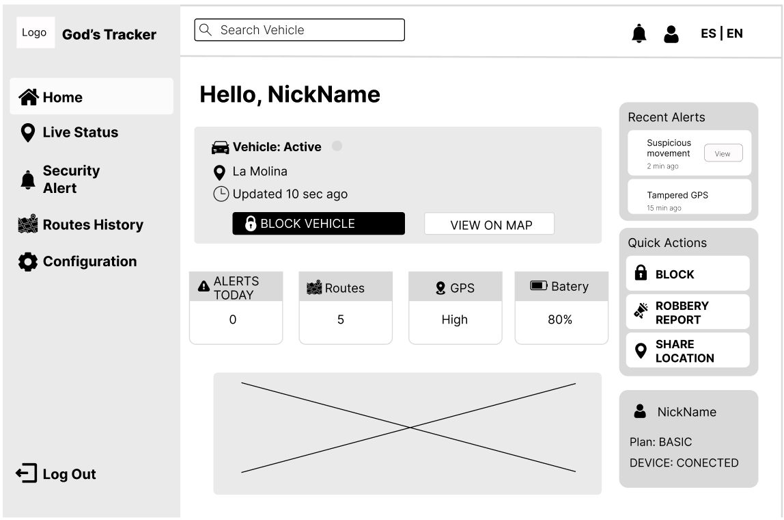

    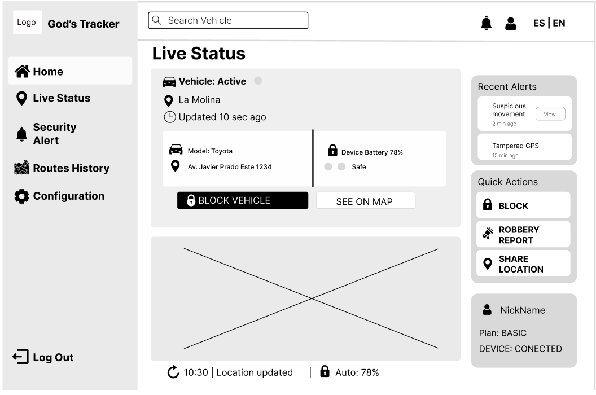

    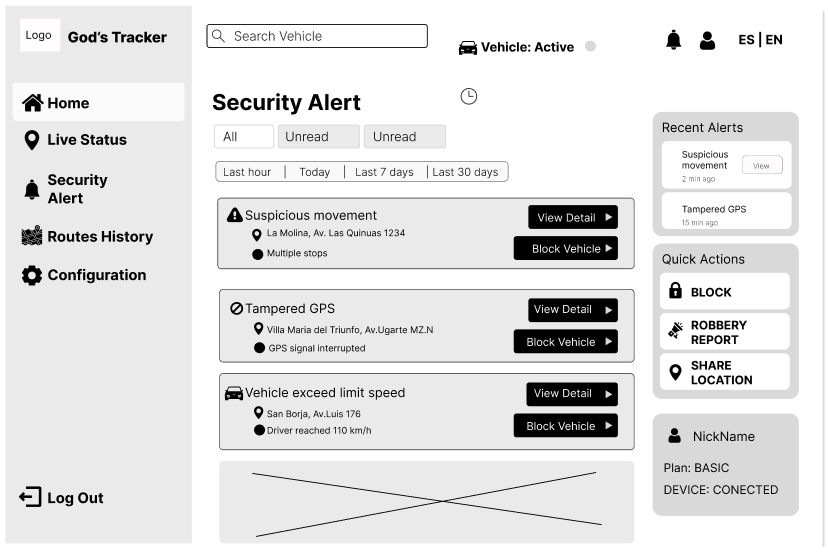

    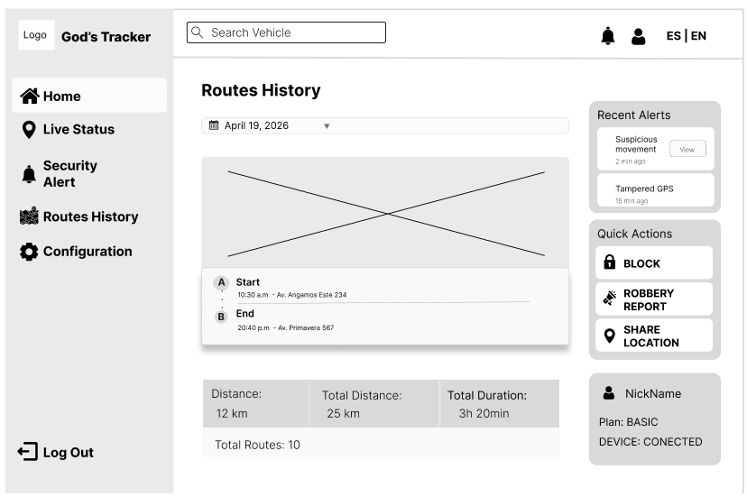

    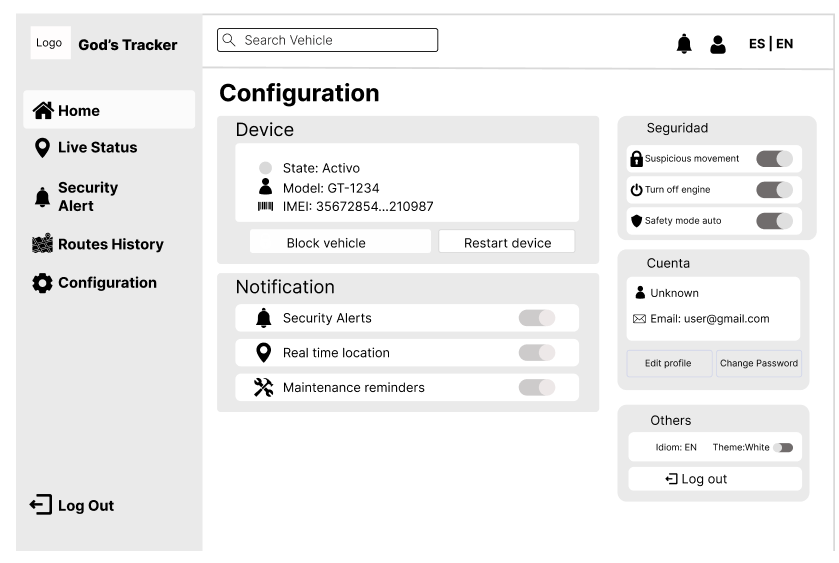

#### Segmento #2: Empresas

    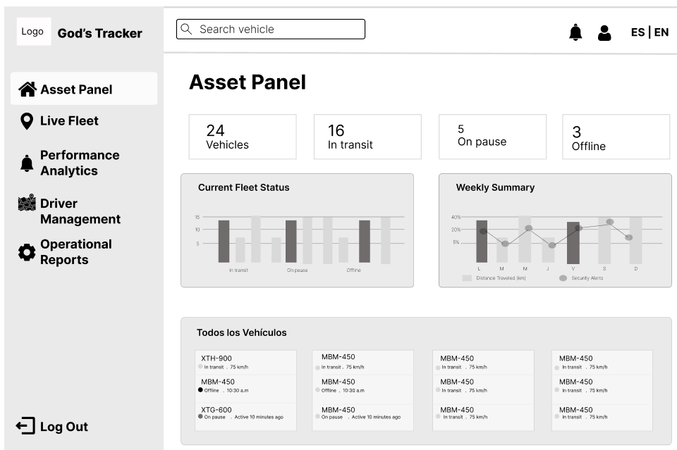

    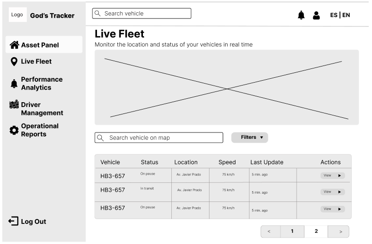

    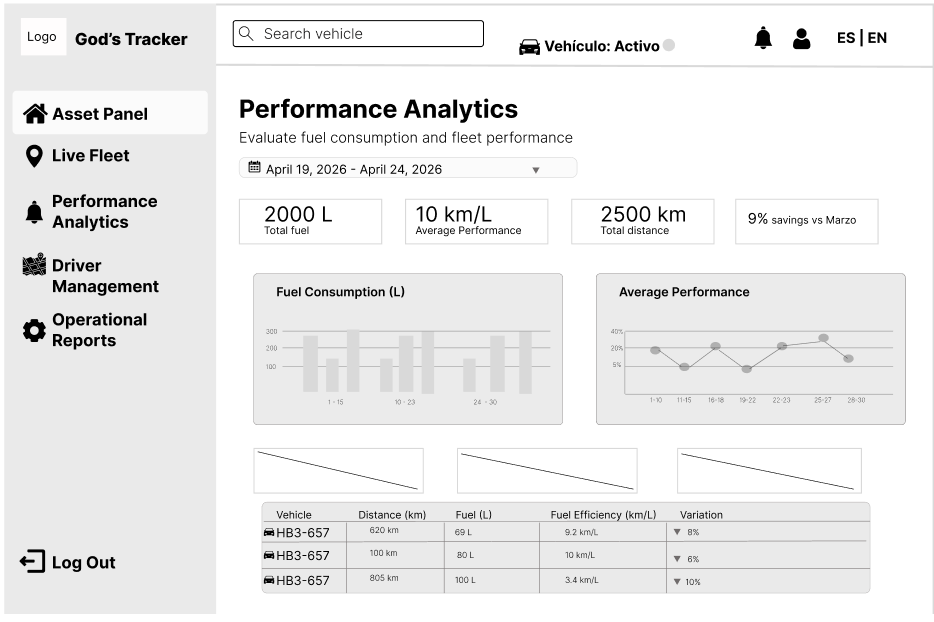

    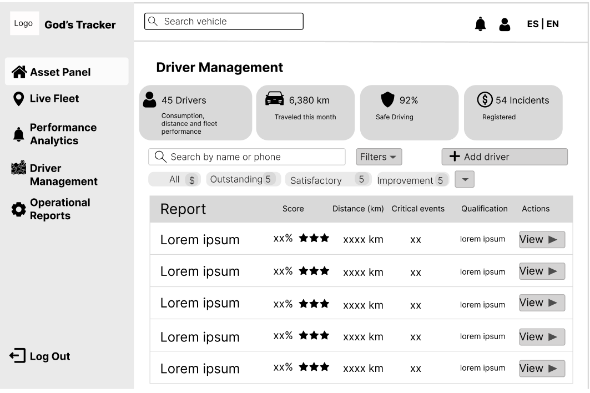

    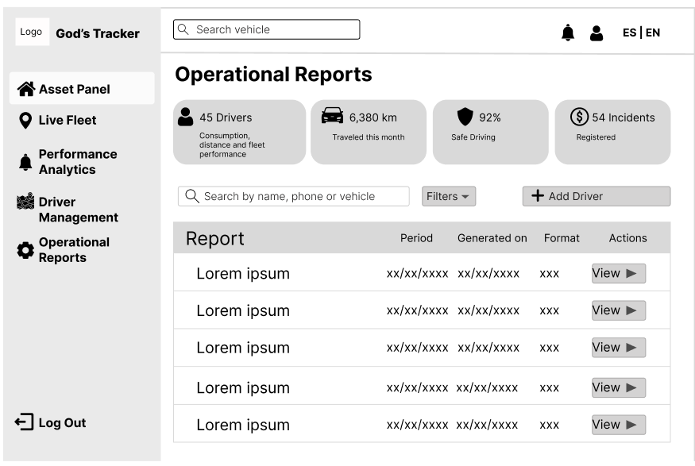

### 4.4.2. Web Applications Wireflow Diagrams

### 4.4.3. Web Applications Mock-ups

#### Segmento #1: Persona natural

    

    

    

    

    

#### Segmento #2: Empresas

    

    

    

    

    

### 4.4.4. Web Applications User Flow Diagrams

#### Segmento #1: Persona natural

Como persona natural desde la pestaña de inicio podemos visualizar un resumen de los datos del cliente. Se aprecia 2 botones para bloquear y observar en mapa el vehiculo actual del cliente.

    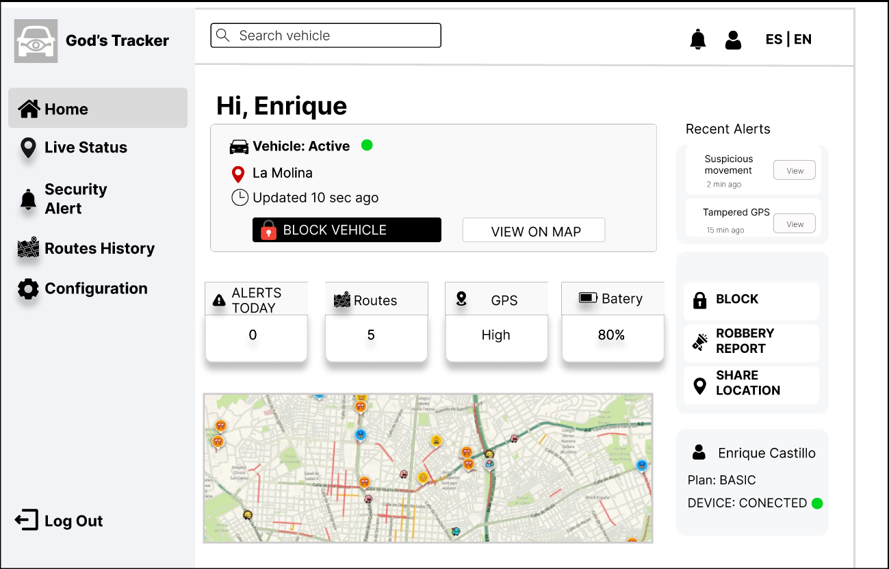

Si se presiona el boton de block vehicle Aparece este submenu en el que se muestran todos los vehiculos del cliente para realizarles un bloqueo.

    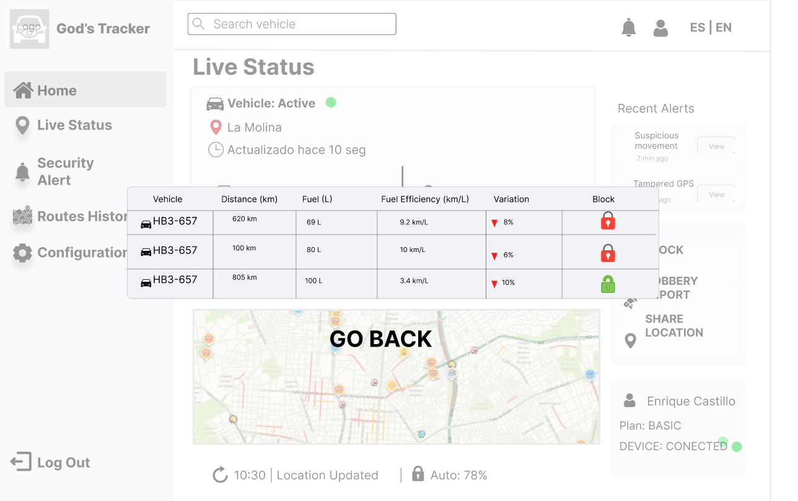

Como persona natural, quiero poder bloquear mi carro en caso de emergencia.

    

Como persona natural, quiero ver los detalles de mi vehículo 

    

    

Como persona natural, quiero poder cerrar sesión 

    

#### Segmento #2: Empresas

Como empresa, quiero poder visualizar mis vehículos mediante filtros, para identificar rápidamente aquellos que requieren atención o cumplen ciertos criterios específicos.

    

    

Como empresa, quiero poder visualizar el performance a detalle por mes.

    

Como empresa, quiero poder visualizar el reporte a detalle de cada conductor 

    

Como empresa, quiero poder descargar el reporte de cada conductor.

    

## 4.5. Web Applications Prototyping

En esta sección se presentan los prototipos de interfaz de usuario desarrollados para la versión web en navegadores de escritorio, tanto para persona natural como para empresas. Estos prototipos simulan la navegación e interacción con las principales funcionalidades, en base a los flujos definidos previamente en los Wireflow Diagrams.

Las decisiones de interacción se tomaron considerando principios de usabilidad, accesibilidad, claridad visual y una arquitectura de información coherente. Se priorizó una navegación intuitiva y eficiente, orientada a facilitar el monitoreo, la gestión de incidencias y el acceso rápido a la información relevante dentro del sistema. Asimismo, las jerarquías visuales, los flujos de interacción y la organización de módulos fueron diseñados para optimizar la experiencia del usuario, permitiendo una administración segura, ordenada y comprensible de la plataforma.

## 4.6. Domain-Driven Software Architecture

### 4.6.1. Design-Level Event Storming

Link del miro: https://miro.com/app/board/uXjVHd90Bvk=/?share_link_id=919402889853

### 4.6.2. Software Architecture Context Diagram

    

### 4.6.3. Software Architecture Container Diagrams

    

### 4.6.4. Software Architecture Components Diagrams

#### Component Diagram Indentity

    

#### Component Diagram Fleet

    

#### Component Diagram Telemetry

    

#### Component Diagram Alerting

    

#### Component Diagram Billing

    

#### Component Diagram Commands

    

#### Component Diagram Query

    

## 4.7. Software Object-Oriented Design

### 4.7.1. Class Diagrams

    

## 4.8. Database Design
### 4.8.1. Database Diagrams

En esta sección se presentan los Database Diagrams para cada bounded context. Los diagramas modelan la persistencia relacional del sistema, especificando tablas, columnas, tipos de dato, constraints (PK, FK, NOT NULL, UNIQUE) y las relaciones entre tablas con su cardinalidad. Las relaciones entre bounded contexts se materializan mediante columnas FK que referencian los IDs del contexto origen.

    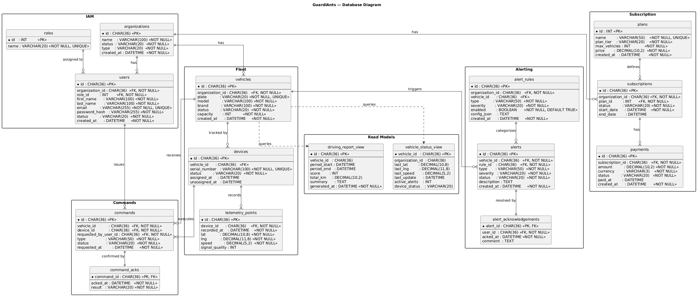

### **Identity and Access Management**

El bounded context de IAM persiste las entidades centrales de identidad y acceso. La tabla organizations actúa como raíz del sistema, siendo referenciada por prácticamente todos los demás contextos. Users centraliza las credenciales de autenticación y se vincula a organizations y roles mediante FK.

    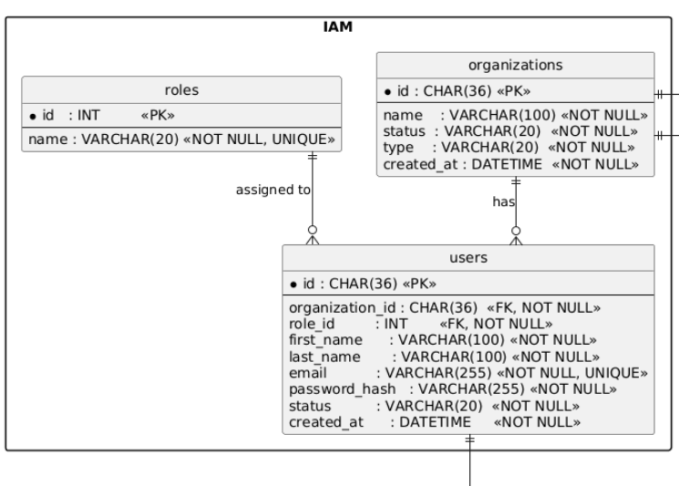

### **Subscription Management**

El Bounded Context de Subscription gestiona el ciclo de vida de los servicios contratados por una organización, estructurándose mediante la tabla plans que define los límites de vehículos y precios, la tabla subscriptions que vincula a la organización con un plan y un periodo de tiempo específico, y la tabla payments que registra las transacciones financieras asociadas. Este modelo asegura que el acceso a las funcionalidades del sistema esté condicionado a un plan activo y al cumplimiento de los pagos correspondientes.

    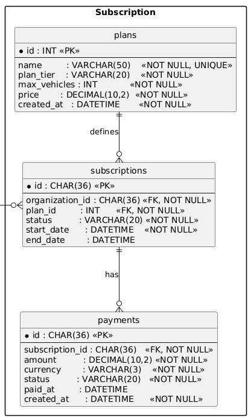

# Capítulo V: Product Implementation, Validation & Deployment

## 5.1. Software Configuration Management

### 5.1.1. Software Development Environment Configuration
<!-- Nombres de productos, el
propósito de uso en el proyecto, la ruta de referencia de los productos de software que deben utilizar los miembros del equipo para colaborar en el ciclo de vida del producto
digital, considerando todos los tipos de actividades como Project Management,
Requirements Management, Product UX/UI Design, Software Development,
Software Deployment, Software Documentation, respetando las restricciones
indicadas sobre productos de software y herramientas que se pueden utilizar.-->

**Project Management**

| Producto | Propósito | Ruta |
|----------|-----------|------|
| GitHub Projects | Planificación y seguimiento de issues, user stories y tareas del equipo mediante tableros Kanban. | https://github.com |
| WhatsApp | Comunicación rápida, coordinación de tareas mediante encuestas en el chat grupal y seguimiento de avances diarios. | https://www.whatsapp.com/ |
| Discord | Reuniones de equipo en voz y video para sesiones de planificación, revisión y retrospectiva de sprints. | https://discord.com/ |

---

**Requirements Management**

| Producto | Propósito | Ruta |
|----------|-----------|------|
| GitHub | Gestión de requerimientos mediante Issues y documentación versionada del proyecto. | https://github.com |
| UXPressia | Creación de artefactos de needfinding: User Personas, User Journey Maps y Empathy Maps para comprender las necesidades de los segmentos objetivo. | https://uxpressia.com/ |
| Miro | Desarrollo de Event Storming (Big Picture y Design Level) para el modelado de procesos y definición del dominio del sistema. | https://miro.com/ |
| Gherkin | Definición de criterios de aceptación y escenarios de prueba en formato Given–When–Then. | https://plugins.jetbrains.com/plugin/9164-gherkin |
| Markdown | Documentación estructurada de requerimientos dentro del repositorio del proyecto. | Integrado en GitHub |

---

**Product UX/UI Design**

| Producto | Propósito | Ruta |
|----------|-----------|------|
| Figma | Diseño de wireframes, mockups y prototipos interactivos de la interfaz, tanto para la Landing Page como para la Web Application. | https://www.figma.com/ |
| LucidChart | Elaboración de wireflows, user flows y diagramas de arquitectura complementarios. | https://www.lucidchart.com/ |

---

**Software Development**

| Producto | Propósito | Ruta |
|----------|-----------|------|
| Visual Studio Code | IDE principal para la programación del frontend (Landing Page y Web Application). | https://code.visualstudio.com/ |
| WebStorm | Entorno de desarrollo especializado para aplicaciones JavaScript y TypeScript. IDE complementario a VSCode. | https://www.jetbrains.com/webstorm/ |
| IntelliJ IDEA | IDE para el desarrollo del backend con Spring Boot y Java. | https://www.jetbrains.com/idea/ |
| Angular Framework | Desarrollo de la Web Application interactiva con TypeScript, HTML5 y CSS3. | https://angular.io/ |
| Spring Boot | Desarrollo de la lógica del servidor y la RESTful API bajo arquitectura orientada a servicios. | https://spring.io/projects/spring-boot |
| HTML5 / CSS3 / JavaScript | Tecnologías base para el desarrollo del Landing Page estático. | https://developer.mozilla.org/ |
| GitHub | Control de versiones y trabajo colaborativo mediante repositorios, commits y branches. | https://github.com |

---

**Software Deployment**

| Producto | Propósito | Ruta |
|----------|-----------|------|
| GitHub Pages | Despliegue del Landing Page estático de GuardiAnts directamente desde el repositorio. | https://pages.github.com/ |

---

**Software Documentation**

| Producto | Propósito | Ruta |
|----------|-----------|------|
| Structurizr | Elaboración de diagramas de arquitectura de software utilizando el modelo C4 (contexto, contenedor, componentes). | https://structurizr.com/ |
| OpenAPI / Swagger | Documentación de los endpoints del RESTful API de GuardiAnts. | https://swagger.io/ |
| Markdown | Documentación técnica del proyecto, desde el reporte hasta las user stories, licencias y otros artefactos. | Integrado en GitHub |

---

### Estrategia de Trabajo: GitFlow

El equipo ha implementado el modelo de trabajo **GitFlow**, propuesto por Vincent Driessen. Bajo este esquema se mantienen dos ramas permanentes: **main** (código estable y listo para producción) y **develop** (rama de integración para el desarrollo activo).

- **Feature Branches:** Cada funcionalidad se trabaja en ramas aisladas bajo la nomenclatura `feature/<nombre-de-sección>` (ej. `feature/gps-monitoring`, `feature/alert-system`).
- **Release Branches:** Al aproximarse una entrega, se genera una rama `release/vX.Y.Z` desde `develop` para ajustes finales, aplicando **Semantic Versioning**.
- **Integración Final:** Una vez validada, la rama de lanzamiento se fusiona tanto en `main` como en `develop`.
- **Hotfixes:** Las correcciones críticas se resuelven mediante ramas `hotfix/vX.Y.Z` integradas directamente tras su validación.

---

### Conventional Commits

Todos los mensajes de commit siguen la especificación de **Conventional Commits** para mantener un historial de cambios legible y profesional.

**Tipos utilizados:**
- `feat:` incorporación de nuevas funcionalidades
- `fix:` corrección de errores
- `docs:` modificaciones en la documentación
- `style:` cambios de formato o estilo sin impacto en la lógica
- `refactor:` mejoras internas sin añadir funcionalidades
- `test:` creación o modificación de pruebas
- `chore:` tareas de configuración o mantenimiento

**Ejemplos aplicados en el proyecto:**
- `feat(monitoring): add real-time GPS tracking endpoint`
- `fix(alerts): correct timestamp offset in security alerts`
- `docs(chapter-02): add interview analysis and user personas`
- `chore(deps): upgrade Angular Material to latest version`
- `docs(chapter-04): add C4 context and container diagrams`

### Evidencias de Repositorios

**Repositorios en la organización**
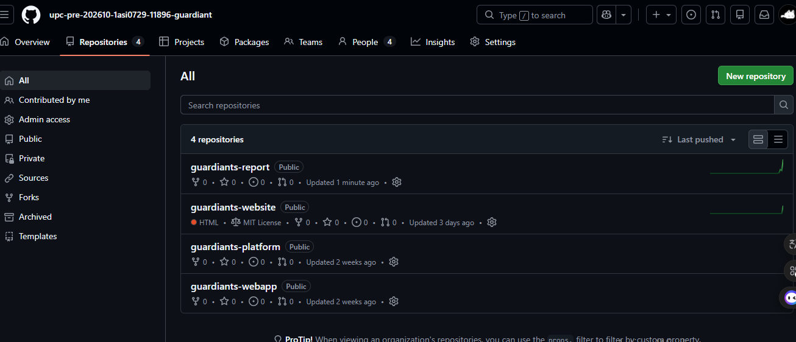

### 5.1.3. Source Code Style Guide & Conventions
### Regla General
Todos los identificadores (archivos, clases, IDs, variables, etc.) deben estar en **inglés**.

### 1. HTML

*   **Estructura Semántica:** Usar etiquetas semánticas de HTML5 (`<header>`, `<nav>`, `<main>`, `<section>`, `<article>`) en lugar de `
` genéricos siempre que sea posible.
*   **Etiquetas y atributos en minúsculas:**
    `<section id="home" class="hero"></section>`
*   **Atributos de accesibilidad (A11y) obligatorios:** Incluir siempre `aria-label`, `aria-controls`, `aria-expanded` o `aria-hidden` en elementos interactivos o decorativos.
    `<button class="btn-menu" aria-expanded="false" aria-controls="primaryNav">`
*   **Internacionalización (i18n):** Todo el texto visible por el usuario debe estar vinculado a una clave de traducción mediante el atributo `data-i18n`.
    `<h1 class="hero-title" data-i18n="heroSection.slogan">...</h1>`
*   **Optimización y manejo de imágenes:** 
    *   Cerrar siempre los elementos (``).
    *   Incluir atributo `alt`.
    *   Añadir `loading="lazy"` para imágenes fuera de la primera vista (below the fold) y manejar errores de carga.
    ``
*   **Comillas dobles:** Usar siempre comillas dobles para los valores de los atributos.
*   **Sangría:** 4 espacios para anidar elementos de forma clara.

### 2. CSS

*   **Variables Globales:** Utilizar la pseudo-clase `:root` para definir la paleta de colores, sombras y otros valores reutilizables.
    `var(--text)`, `var(--bg)`
*   **Convención de Nombres (Clases e IDs):** 
    *   Usar `kebab-case` para nombres de clases. Ej: `.site-header`, `.hero-inner`.
    *   Usar `camelCase` para los IDs que se manipularán con JavaScript. Ej: `#menuToggle`, `#primaryNav`.
*   **Metodología BEM (Bloque, Elemento, Modificador):** Aplicar BEM para variaciones de componentes usando doble guion (`--`) para los modificadores.
    `.section--white { ... }`
    `.split--reverse { ... }`
*   **Diseño Responsivo (Desktop-First):** Seguir la estructura de media queries basada en `max-width` descendente para adaptar el diseño:
    *   Tablets y menores: `@media (max-width: 980px)`
    *   Móviles grandes: `@media (max-width: 720px)`
    *   Móviles pequeños: `@media (max-width: 480px)`
*   **Omitir unidades en valores cero:**
    `margin: 0;` (No `margin: 0px;`)
*   **Separación visual:** Separar los selectores de bloques diferentes con una línea en blanco para mayor legibilidad.

### 3. JavaScript (Integración para el Frontend)

*   **Nomenclatura:** `camelCase` para variables, funciones y referencias al DOM.
    `const menuToggle = document.getElementById('menuToggle');`
*   **Declaración de variables:** Usar `const` por defecto y `let` solo si el valor va a reasignarse. Prohibido el uso de `var`.
*   **Manejo de Eventos del DOM:** Separar la lógica de manipulación del DOM (como abrir/cerrar el menú de navegación o cambiar el idioma) en funciones pequeñas y modulares.
*   **Manipulación de Clases:** Usar `classList.toggle()`, `classList.add()`, y `classList.remove()` para manejar los estados de la UI (ej. `.nav-open`).
    `siteHeader.classList.toggle('nav-open');`
*   **Sintaxis ES6+:** Preferir *arrow functions* para los *event listeners* y *callbacks*.

### 4. Gestión de Archivos y Recursos (Assets)

*   **Nomenclatura de archivos:** Todo en minúsculas y `kebab-case`.
    `logo-guardiants-short.png`, `how-natural-person.png`
*   **Organización:** Mantener las imágenes organizadas dentro de un directorio `/assets/`.
### 5.1.4. Software Deployment Configuration
- Creación de la Landing Page:
1. Se crea un repositorio (guardiants-website) desde upc-pre-202610-1asi0729-11896-guardiant organization
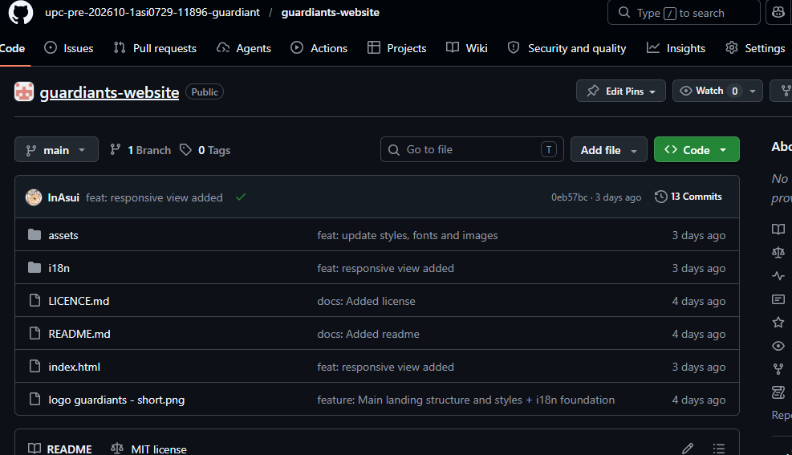

2. Agregamos a los miembros del equipo

3. Habilitamos GitHub Pages en branch main y ruta "/(root)".

## 5.2. Landing Page, Services & Applications Implementation

### 5.2.1. Sprint 1

#### 5.2.1.1. Sprint Planning 1

En esta sección se documenta el Sprint Planning Meeting del Sprint 1, en el que el equipo GuardiAnts estableció el objetivo del sprint, definió el alcance de trabajo y distribuyó las tareas entre los integrantes para lograr la primera versión desplegada de la Landing Page de GOD's Tracker.

| Sprint # | Sprint 1 |
|---|---|
| **Sprint Planning Background** | |
| Date | 2026-04-01 |
| Time | 10:00 AM |
| Location | Reunión virtual vía Discord |
| Prepared By | Poma Muñoz, Ariadna Geraldine |
| Attendees (to planning meeting) | Poma Muñoz, Ariadna Geraldine / Navarro Aldoradin, Carolina Celeste / Lozano Quispe, Fabricio Jofred / Vite Celis, Rodrigo Matias |
| Sprint 1 – 1 Review Summary | Al ser el primer sprint, no existe sprint anterior que revisar. El equipo partió de los artefactos definidos en los capítulos I al IV: User Stories, Product Backlog, Style Guidelines, Wireframes y Mockups del Landing Page. |
| Sprint 1 – 1 Retrospective Summary | Al ser el primer sprint, no existe retrospectiva previa. El equipo acordó mantener comunicación continua vía Discord, realizar revisiones de código mediante Pull Requests y respetar las convenciones de código definidas en la sección 5.1.3. |
| **Sprint Goal & User Stories** | |
| Sprint 1 Goal | Our focus is on delivering a fully deployed Landing Page that communicates GuardiAnts' value proposition to potential users. We believe it delivers the first professional touchpoint of the GOD's Tracker product to vehicle owners and fleet managers. This will be confirmed when visitors can navigate all sections of the Landing Page, understand the product's features, view the pricing plans, and access the registration call-to-action from a deployed public URL. |
| Sprint 1 Velocity | 28 Story Points |
| Sum of Story Points | 28 Story Points |

#### 5.2.1.2. Aspect Leaders and Collaborators

Para este Sprint 1, el alcance se centra íntegramente en el desarrollo y despliegue de la Landing Page. Los aspectos identificados corresponden a las secciones funcionales del sitio estático, organizadas de manera que cada integrante asuma liderazgo sobre un aspecto mientras colabora en los demás.

| Team Member (Last Name, First Name) | GitHub Username | Hero & Navbar (L/C) | Features & About (L/C) | Pricing & Testimonials (L/C) | Contact & Footer (L/C) | Deployment & i18n (L/C) |
|---|---|---|---|---|---|---|
| Poma Muñoz, Ariadna Geraldine | InAsui | L | C | C | C | C |
| Navarro Aldoradin, Carolina Celeste | genixmvp | C | L | C | C | L |
| Lozano Quispe, Fabricio Jofred | FabricioZz15 | C | C | L | C | C |
| Vite Celis, Rodrigo Matias | rodriznnn | C | C | C | L | C |

#### 5.2.1.3. Sprint Backlog 1

El objetivo principal del Sprint 1 es desplegar la primera versión funcional de la Landing Page de GuardiAnts (GOD's Tracker), que comunique la propuesta de valor a los segmentos objetivo e incluya los call-to-action correspondientes hacia la Web Application.

| Sprint # | Sprint 1 | | | | | | |
|---|---|---|---|---|---|---|---|
| **User Story** | | **Work-Item / Task** | | | | | |
| Id | Title | Id | Title | Description | Estimation (Hours) | Assigned To | Status |
| US01 | Visualizar landing page | T01 | Estructura HTML base del Landing Page | Crear el archivo `index.html` con la estructura semántica completa (header, main, sections, footer) | 3 | Poma Muñoz, Ariadna | Done |
| US01 | Visualizar landing page | T02 | Estilos globales y variables CSS | Definir variables de color, tipografía y espaciado en `:root` siguiendo el Design System de GuardiAnts | 2 | Poma Muñoz, Ariadna | Done |
| US01 | Visualizar landing page | T03 | Sección Hero y barra de navegación | Implementar el hero section con headline, subheadline, CTAs y la navbar con menú responsive | 4 | Poma Muñoz, Ariadna | Done |
| US02 | Visualizar características del producto | T04 | Sección Features del sistema GPS/IoT | Implementar la sección de características clave: monitoreo en tiempo real, alertas, bloqueo remoto | 3 | Navarro Aldoradin, Carolina | Done |
| US03 | Visualizar información del equipo | T05 | Sección About / Equipo GuardiAnts | Implementar la sección que presenta al startup con descripción de misión y visión | 3 | Navarro Aldoradin, Carolina | Done |
| US04 | Ver planes y precios | T06 | Sección Pricing con planes de suscripción | Implementar tarjetas comparativas de planes para personas naturales y empresas con CTAs | 4 | Lozano Quispe, Fabricio | Done |
| US05 | Visualizar testimonios | T07 | Sección Testimonials | Implementar cuadrícula de testimonios de los entrevistados del proceso de needfinding | 3 | Lozano Quispe, Fabricio | Done |
| US06 | Contactar desde la landing page | T08 | Sección Contact / Footer | Implementar el formulario de contacto y el footer con enlaces legales y redes sociales | 3 | Vite Celis, Rodrigo | Done |
| US01 | Visualizar landing page | T09 | Responsividad completa (Mobile & Desktop) | Aplicar media queries para correcta visualización en dispositivos móviles y desktop | 3 | Vite Celis, Rodrigo | Done |
| US01 | Visualizar landing page | T10 | Soporte multi-idioma (i18n en/es) | Implementar soporte de internacionalización con archivos JSON de traducción | 4 | Navarro Aldoradin, Carolina | Done |
| US01 | Visualizar landing page | T11 | Despliegue en GitHub Pages | Configurar GitHub Pages sobre la rama `main`, verificar despliegue y validar todos los assets | 2 | Navarro Aldoradin, Carolina | Done |

#### 5.2.1.4. Development Evidence for Sprint Review

Durante el Sprint 1, el equipo trabajó de forma colaborativa en el repositorio de la Landing Page, aplicando GitFlow con ramas por feature y mensajes de commit siguiendo Conventional Commits. A continuación se presentan los commits más relevantes relacionados con la implementación.

| Repository | Branch | Commit ID | Commit Message | Commit Message Body | Commited On (Date) |
|---|---|---|---|---|---|
| guardiants-website | main | `feat:responsive` | feat: responsive view added | Improved mobile experience for landing page sections. | Apr 22, 2026 |
| guardiants-website | main | `feat:i18n` | feature: i18n foundation | Added JSON processors for en/es translation support. | Apr 21, 2026 |
| guardiants-website | main | `feat:hero` | feat(hero): add hero section with CTA buttons | Hero section with GPS tracking value proposition. | Apr 19, 2026 |
| guardiants-website | main | `feat:pricing` | feat(pricing): add subscription plans section | Plans for persona natural and empresa segments. | Apr 18, 2026 |
| guardiants-report | main | `docs:cap4` | docs(chapter4): add diagrams | Added C4 context, container and component diagrams. | Apr 19, 2026 |
| guardiants-report | main | `docs:ux` | docs(chapter-02): add user personas | Documentation of user profiles for both segments. | Apr 18, 2026 |
| guardiants-report | main | `docs:startup` | docs: update startup description | Detailed profile of GuardiAnts startup and product. | Apr 08, 2026 |

#### 5.2.1.5. Execution Evidence for Sprint Review

Al concluir el Sprint 1, el equipo logró desplegar la primera versión funcional de la Landing Page de GuardiAnts en un entorno público accesible mediante GitHub Pages. La página presenta la propuesta de valor del producto GOD's Tracker de forma clara y estructurada, cubriendo todas las secciones planificadas: Hero, Navbar, Features, About, Pricing, Testimonials, Contact y Footer. La experiencia es consistente tanto en desktop como en dispositivos móviles, e incluye soporte para cambio de idioma (español/inglés).

Video de navegación del Sprint 1:

#### 5.2.1.6. Services Documentation Evidence for Sprint Review

Se ha completado la documentación de arquitectura en el repositorio de Report, detallando:
*   Diagramas de Contexto, Contenedor y Componentes (C4 Model).
*   Diagrama de Entidad-Relación para la persistencia de datos.
*   Especificación de estilos y lineamientos de diseño (Capítulo IV).

#### 5.2.1.7. Software Deployment Evidence for Sprint Review

El despliegue de la Landing Page se llevó a cabo mediante **GitHub Pages**. Los pasos realizados fueron:

1. Se creó el repositorio `guardiants-website` en la organización del proyecto.
2. Se desarrolló el sitio estático con HTML5, CSS3 y JavaScript con soporte i18n.
3. Se configuró GitHub Pages en **Settings > Pages**, seleccionando la rama `main` y la ruta `/(root)`.
4. GitHub Pages publicó automáticamente el sitio al detectar el `index.html` en la raíz del repositorio.
5. Se verificó el correcto funcionamiento de todos los enlaces, imágenes y el selector de idioma en el entorno de producción.

#### 5.2.1.8. Team Collaboration Insights during Sprint

Durante el Sprint 1, los cuatro integrantes del equipo GuardiAnts participaron activamente en la implementación de la Landing Page. Cada miembro lideró el aspecto asignado según la Leadership-and-Collaboration Matrix, realizando commits desde sus cuentas de GitHub hacia sus ramas feature correspondientes, y luego integrando mediante Pull Requests hacia `main`.

Se aplicó GitFlow de forma consistente: se crearon ramas con la convención `feature/<nombre-de-sección>` (ej. `feature/hero-section`, `feature/pricing`, `feature/i18n`) y se realizó el merge únicamente tras revisión del código por al menos un integrante del equipo.

## 5.2.2. Sprint 2 

#### 5.2.2.1. Sprint Planning 2

En esta sección se documenta el Sprint Planning Meeting del Sprint 2, en el que el equipo GuardiAnts definió el objetivo de implementar las funcionalidades esenciales de la plataforma web, incluyendo autenticación, monitoreo GPS en tiempo real, alertas de seguridad, gestión de vehículos y configuración del sistema.

| Sprint # | Sprint 2 |
|---|---|
| **Sprint Planning Background** | |
| Date | 2026-05-13 |
| Time | 12:00 PM |
| Location | Reunión virtual vía Discord / Google Meet |
| Prepared By | Poma Muñoz, Ariadna Geraldine |
| Attendees (to planning meeting) | Poma Muñoz, Ariadna Geraldine / Navarro Aldoradin, Carolina Celeste / Lozano Quispe, Fabricio Jofred / Vite Celis, Rodrigo Matias |
| Sprint 1 Review Summary | Durante la revisión del Sprint 1, se validó correctamente la estructura inicial de la Landing Page, la documentación del proyecto y la integración de internacionalización (i18n). La Landing Page fue desplegada exitosamente en GitHub Pages con las secciones Hero, Features, Pricing, Testimonials, Contact y Footer. Los capítulos I al IV del reporte quedaron consolidados con los artefactos de diseño y arquitectura. |
| Sprint 1 Retrospective Summary | En la retrospectiva del Sprint 1, el equipo identificó como puntos fuertes la buena comunicación y coordinación. Como áreas de mejora, se señaló la necesidad de mejorar la gestión del tiempo en la documentación y la resolución de rutas de imágenes en el reporte de Markdown para evitar enlaces rotos. |
| **Sprint Goal & User Stories** | |
| Sprint 2 Goal | Our focus is on developing and deploying the essential functionalities of the GuardiAnts platform related to user authentication, real-time GPS monitoring, vehicle asset management, security alerts, route history and system configuration. We believe it delivers a solid foundation for intelligent vehicle control and allows users to supervise their assets securely and centrally. This will be confirmed when users can register and log in successfully, visualize the location and status of their vehicles, receive security alerts, consult relevant system information, and use the main functionalities from the web platform. |
| Sprint 2 Velocity | 35 Story Points |
| Sum of Story Points | 35 Story Points |

---

#### 5.2.2.2. Aspect Leaders and Collaborators

Para este Sprint 2, el alcance se centra en el desarrollo de la Web Application (guardiants-webapp) con las funcionalidades core del sistema de monitoreo GOD's Tracker.

| Team Member (Last Name, First Name) | GitHub Username | Autenticación (Login / Register) | Monitoreo GPS en tiempo real | Alertas de seguridad | Historial de rutas | Configuración del sistema |
|---|---|---|---|---|---|---|
| Poma Muñoz, Ariadna Geraldine | InAsui | C | C | L | L | C |
| Navarro Aldoradin, Carolina Celeste | genixmvp | C | L | C | C | C |
| Lozano Quispe, Fabricio Jofred | FabricioZz15 | C | L | C | C | L |
| Vite Celis, Rodrigo Matias | rodriznnn | L | C | C | C | C |

---

#### 5.2.2.3. Sprint Backlog 2

El objetivo principal del Sprint 2 es implementar las funcionalidades esenciales de la Web Application de GuardiAnts, cubriendo los procesos core del sistema de monitoreo vehicular inteligente GOD's Tracker.

| Sprint # | Sprint 2 | | | | | | |
|---|---|---|---|---|---|---|---|
| **User Story** | | **Work-Item / Task** | | | | | |
| Id | Title | Id | Title | Description | Estimation (Hours) | Assigned To | Status |
| US07 | Registro de usuario | T12 | Formulario de registro y validación | Implementar vista de registro con campos de nombre, email, contraseña y tipo de cuenta (personal/empresa) | 4 | Vite Celis, Rodrigo | In Process |
| US08 | Inicio de sesión | T13 | Vista de login y autenticación | Implementar vista de login con validación de credenciales y redirección al dashboard | 3 | Vite Celis, Rodrigo | In Process |
| US09 | Dashboard de monitoreo GPS | T14 | Mapa de monitoreo en tiempo real | Integrar mapa interactivo con visualización de ubicación de vehículos en tiempo real mediante API de mapas | 8 | Navarro Aldoradin, Carolina / Lozano Quispe, Fabricio | To-do |
| US09 | Dashboard de monitoreo GPS | T15 | Panel de estado del vehículo | Mostrar indicadores de estado: conectado/desconectado, velocidad actual, batería del dispositivo | 4 | Navarro Aldoradin, Carolina | To-do |
| US10 | Gestión de alertas de seguridad | T16 | Lista de alertas con clasificación | Implementar vista de alertas con clasificación por tipo (movimiento sospechoso, jammer detectado, geocerca) y severidad | 5 | Poma Muñoz, Ariadna | To-do |
| US10 | Gestión de alertas de seguridad | T17 | Notificaciones push en tiempo real | Configurar sistema de notificaciones para alertas críticas de seguridad en la plataforma web | 4 | Poma Muñoz, Ariadna | To-do |
| US11 | Historial de rutas | T18 | Vista de historial de recorridos | Implementar vista de historial de rutas con filtros por fecha, vehículo y tipo de evento | 4 | Poma Muñoz, Ariadna | To-do |
| US12 | Configuración del sistema | T19 | Panel de configuración de cuenta y vehículo | Implementar vistas de configuración de perfil de usuario, datos del vehículo y preferencias de alertas | 3 | Lozano Quispe, Fabricio | To-do |

---

#### 5.2.2.4. Development Evidence for Sprint Review

Durante el Sprint 2, el equipo inició el desarrollo de la Web Application (guardiants-webapp) utilizando Angular Framework. A continuación se presentan los commits más relevantes realizados durante este sprint.

| Repository | Branch | Commit ID | Commit Message | Commit Message Body | Commited On (Date) |
|---|---|---|---|---|---|
| guardiants-webapp | develop | `feat:auth` | feat(auth): add login and register views | Authentication views with form validation implemented. | May 10, 2026 |
| guardiants-webapp | develop | `feat:dashboard` | feat(dashboard): add vehicle monitoring dashboard | Base dashboard structure with map container added. | May 11, 2026 |
| guardiants-webapp | develop | `feat:routing` | feat(routing): configure angular routing module | Routes for dashboard, alerts, history and settings configured. | May 09, 2026 |
| guardiants-webapp | develop | `chore:setup` | chore: initial Angular project setup | Angular project scaffolded with Angular Material components. | May 07, 2026 |
| guardiants-platform | develop | `feat:api` | feat(api): initial Spring Boot project setup | Base project with package structure by bounded context. | May 08, 2026 |
| guardiants-website | main | `fix:nav` | fix(nav): correct mobile navigation menu | Fixed hamburger menu display on small devices. | May 05, 2026 |

---

#### 5.2.2.5. Execution Evidence for Sprint Review

Al concluir el Sprint 2, el equipo logró implementar la estructura base de la Web Application de GuardiAnts con las vistas principales del sistema de monitoreo GOD's Tracker. Se completaron las vistas de autenticación (login y registro) y se avanzó en el desarrollo del dashboard de monitoreo GPS. La aplicación está estructurada siguiendo la arquitectura de componentes de Angular con Material Design como sistema de diseño.

Las principales vistas implementadas durante este sprint incluyen:

- **Vista de Login:** Formulario de inicio de sesión con validación de campos, integrado con el flujo de navegación hacia el dashboard principal.
- **Vista de Registro:** Formulario de creación de cuenta con selección de tipo de usuario (persona natural / empresa).
- **Dashboard de Monitoreo:** Estructura base del panel principal con mapa interactivo para visualización GPS y panel de estado de vehículos.
- **Vista de Alertas de Seguridad:** Lista de alertas clasificadas por tipo y severidad (en proceso de integración con el backend).

**Video de navegación del Sprint 2:**

#### 5.2.2.6. Services Documentation Evidence for Sprint Review

Durante el Sprint 2, el equipo inició el desarrollo del RESTful API en el repositorio `guardiants-platform` utilizando Spring Boot. Se definió la estructura base del proyecto con los bounded contexts principales y se configuró Swagger/OpenAPI para la documentación de endpoints.

Los bounded contexts definidos en este sprint son:
- **Identity & Access:** Gestión de autenticación y autorización de usuarios.
- **Vehicle Monitoring:** Endpoints para recepción y consulta de datos GPS en tiempo real.
- **Alert Management:** Endpoints para generación y consulta de alertas de seguridad.
- **Fleet Management:** Gestión de vehículos registrados por usuario o empresa.

#### 5.2.2.7. Software Deployment Evidence for Sprint Review

Durante el Sprint 2 se realizaron las siguientes actividades de despliegue:

- Se actualizó la Landing Page con una nueva versión que incluye correcciones de navegación móvil y mejoras en la sección de testimonios.
- Se inició la configuración del entorno de despliegue para la Web Application (guardiants-webapp) en preparación para el Sprint 3.
- Se configuró el proyecto Spring Boot (guardiants-platform) con las dependencias necesarias para el despliegue en un entorno cloud.

#### 5.2.2.8. Team Collaboration Insights during Sprint

Durante el Sprint 2, los cuatro integrantes del equipo participaron activamente en el desarrollo de la Web Application y el backend de GuardiAnts. Se mantuvo el uso de GitFlow con ramas feature por funcionalidad y la integración mediante Pull Requests revisados por al menos un compañero antes del merge a `develop`.

La comunicación del equipo se realizó a través de Discord para reuniones de sincronización diaria y WhatsApp para coordinación rápida de tareas. Se utilizó GitHub Projects como tablero de seguimiento de tareas del sprint.

## 5.3. Validation Interviews

### 5.3.1. Diseño de Entrevistas
**Primer segmento: Persona natural**

A continuación, se presentan las preguntas dirigidas al segmento de personas naturales, compuesto por individuos que buscan proteger su vehículo, conocer su ubicación en tiempo real y recibir alertas básicas de seguridad mediante una solución tecnológica como GOD’s Tracker.

**Preguntas principales**
1.	¿Te preocupa que puedan robar tu vehículo? ¿Por qué? 
2.	¿Has tenido alguna experiencia con robo o intento de robo? 
3.	¿Qué haces actualmente para proteger tu vehículo? 
4.	¿Te gustaría saber en todo momento dónde está tu vehículo? 
5.	¿Qué tan útil sería para ti recibir alertas en tu celular si algo pasa con tu vehículo? 
6.	¿Qué tipo de alertas te gustaría recibir? (movimiento, robo, ubicación, etc.) 
7.	¿Qué tan fácil te gustaría que sea usar una app para ver tu vehículo? 
8.	¿Confiarías en un sistema que usa GPS para rastrear tu vehículo? ¿Por qué? 
9.	¿Qué es lo más importante para ti en un sistema de seguridad vehicular?
10.	¿Qué te haría sentir más seguro usando este tipo de producto? 
11.	¿Usarías una aplicación para controlar tu vehículo desde el celular? 
12.	¿Recomendarías un sistema así a otras personas?

**Preguntas complementarias**

13.	¿Qué edad tienes?
14.	¿A qué te dedicas?
15.	¿Qué tipo de vehículo tienes?
16.	¿En qué distrito vives o sueles moverte más? 
17.	¿Qué tanto usas aplicaciones en tu celular? 
18.	¿Prefieres usar más el celular o la computadora?

**Segundo segmento: Empresas**

A continuación, se presentan las preguntas dirigidas al segmento empresarial, compuesto por empresas de transporte, logística y otros sectores que requieren monitoreo, control y análisis avanzado de sus flotas vehiculares.

**Preguntas principales**
1.	¿Les preocupa la seguridad de sus vehículos o carga? 
2.	¿Han tenido problemas de robos o pérdidas? 
3.	¿Cómo hacen actualmente para saber dónde están sus vehículos? 
4.	¿Les gustaría ver la ubicación de todos sus vehículos en tiempo real? 
5.	¿Qué tan útil sería recibir alertas si un vehículo sale de ruta o se detiene mucho tiempo? 
6.	¿Qué tipo de información necesitan sobre sus vehículos (ubicación, rutas, paradas)? 
7.	¿Les ayudaría tener reportes automáticos sobre el uso de sus vehículos? 
8.	¿Qué tan fácil debería ser usar una plataforma de monitoreo para su equipo? 
9.	¿Qué es lo más importante en un sistema como este? 
10.	¿Usarían una sola plataforma para controlar toda su flota? 
11.	¿Qué problemas les gustaría solucionar con una herramienta como esta? 
12.	¿Recomendarían este tipo de solución a otras empresas?
    
**Preguntas complementarias**

13.	¿A qué se dedica su empresa? 
14.	¿Cuántos vehículos manejan aproximadamente? 
15.	¿Cuál es su cargo dentro de la empresa? 
16.	¿En qué ciudades o zonas operan? 
17.	¿Qué herramientas digitales usan actualmente? 
18.	¿Qué tan seguido usan computadoras o apps para el trabajo? 

### 5.3.2. Registro de Entrevistas
## Segmento 1: Persona natural

| Nº Entrevista | Datos del entrevistado | Resumen de la entrevista | Evidencia de entrevista |
|--------------|------------------------|--------------------------|--------------------------|
| 1 | **Nombre:** Luis Lopez   **Edad:** 25   **Distrito:** San Borja   **Link:** [link ](https://upcedupe-my.sharepoint.com/:v:/g/personal/u20221d382_upc_edu_pe/IQB1t_JXO08-ToO-FehysAJ_Afw6wmSxswLWOmdzimUAfKc?nav=eyJyZWZlcnJhbEluZm8iOnsicmVmZXJyYWxBcHAiOiJTdHJlYW1XZWJBcHAiLCJyZWZlcnJhbFZpZXciOiJTaGFyZURpYWxvZy1MaW5rIiwicmVmZXJyYWxBcHBQbGF0Zm9ybSI6IldlYiIsInJlZmVycmFsTW9kZSI6InZpZXcifX0%3D&e=sQzaON)   Minutos: 0:00 - 3:58|  El entrevistado, trabajador en logística y usuario frecuente de su vehículo, muestra alta preocupación por el robo, reforzada por un intento previo. Considera que las medidas actuales como la alarma y precaución son insuficientes, evidenciando la necesidad de una solución más completa. Valora el monitoreo en tiempo real y las alertas inmediatas (movimiento sospechoso, intento de robo y ubicación), alineándose con la propuesta de GuardiAnts. Prioriza una app simple, rápida y fácil de usar desde el celular, destacando la precisión y confiabilidad del GPS como factores clave. Su perfil digital y disposición a recomendar la solución refuerzan el potencial de adopción del producto. | 

 |
| 2 | **Nombre:** Juana Quispe   **Edad:** 47   **Distrito:** El Agustino   **Link:** [link](https://upcedupe-my.sharepoint.com/:v:/g/personal/u20221d382_upc_edu_pe/IQB1t_JXO08-ToO-FehysAJ_Afw6wmSxswLWOmdzimUAfKc?nav=eyJyZWZlcnJhbEluZm8iOnsicmVmZXJyYWxBcHAiOiJTdHJlYW1XZWJBcHAiLCJyZWZlcnJhbFZpZXciOiJTaGFyZURpYWxvZy1MaW5rIiwicmVmZXJyYWxBcHBQbGF0Zm9ybSI6IldlYiIsInJlZmVycmFsTW9kZSI6InZpZXcifX0%3D&e=sQzaON)   Minutos: 3:59 - 7:51| La entrevistada, comerciante independiente, evidencia una alta preocupación por la inseguridad vehicular debido al contexto actual de delincuencia en Lima y a experiencias previas de intento de robo y manipulación de su vehículo mientras realizaba sus actividades laborales. Actualmente no cuenta con una medida de seguridad para su auto, pero considera que es insuficiente, ya que busca mayor control y seguimiento constante. Destaca la necesidad de conocer la ubicación de su vehículo en todo momento y recibir alertas inmediatas ante cualquier movimiento sospechoso. Valora especialmente funciones como notificaciones en tiempo real, ubicación precisa y alertas por movimiento, priorizando un sistema que le permita reaccionar rápidamente ante posibles incidentes. Busca una aplicación simple, fácil de usar y accesible desde el celular, que le brinde mayor tranquilidad y control. Además, muestra disposición a adoptar este tipo de tecnología y recomendarla a su entorno si demuestra ser confiable y efectiva. | 

 |
| 3 | **Nombre:** Enrique Castillo   **Edad:** 22   **Distrito:** Magdalena   **Link:** [link](https://upcedupe-my.sharepoint.com/:v:/g/personal/u20221d382_upc_edu_pe/IQB1t_JXO08-ToO-FehysAJ_Afw6wmSxswLWOmdzimUAfKc?nav=eyJyZWZlcnJhbEluZm8iOnsicmVmZXJyYWxBcHAiOiJTdHJlYW1XZWJBcHAiLCJyZWZlcnJhbFZpZXciOiJTaGFyZURpYWxvZy1MaW5rIiwicmVmZXJyYWxBcHBQbGF0Zm9ybSI6IldlYiIsInJlZmVycmFsTW9kZSI6InZpZXcifX0%3D&e=sQzaON)   Minutos: 7:52 - 12:53| Enrique, un estudiante de 22 años que se mueve por varias zonas de Lima, considera que sí usaría una app de seguridad vehicular sencilla que le permita ver la ubicación de su auto en tiempo real y recibir alertas ante situaciones sospechosas, especialmente por experiencias cercanas de intento de robo. | 

 |

### Resumen de entrevistas segmento #1

A partir de las entrevistas, se observa que todos los participantes comparten una fuerte preocupación por la inseguridad vehicular en Lima, influenciada tanto por el contexto actual como por experiencias cercanas o personales de intento de robo. Aunque algunos cuentan con medidas básicas como alarmas o simplemente toman precauciones, coinciden en que estas resultan insuficientes frente a los riesgos actuales, lo que genera una sensación constante de vulnerabilidad. En general, valoran mucho la posibilidad de monitorear su vehículo en tiempo real, recibir alertas inmediatas ante movimientos sospechosos y contar con una ubicación precisa, ya que esto les permitiría reaccionar rápidamente ante cualquier incidente. Además, destacan la importancia de que la solución sea fácil de usar, accesible desde el celular y confiable en términos de funcionamiento. Más allá de las funcionalidades, lo que realmente buscan es sentirse más tranquilos, tener mayor control sobre su vehículo y reducir la incertidumbre en su día a día, mostrando también una buena disposición a adoptar y recomendar una herramienta que cumpla con estas expectativas.

## Segmento 2: Empresas

| Nº Entrevista | Datos del entrevistado | Resumen de la entrevista | Evidencia de entrevista |
|--------------|------------------------|--------------------------|--------------------------|
| 1 | **Nombre:** Jesus Alvites   **Edad:** 25   **Distrito:**    **Link:** [link](https://upcedupe-my.sharepoint.com/:v:/g/personal/u20221d382_upc_edu_pe/IQB1t_JXO08-ToO-FehysAJ_Afw6wmSxswLWOmdzimUAfKc?nav=eyJyZWZlcnJhbEluZm8iOnsicmVmZXJyYWxBcHAiOiJTdHJlYW1XZWJBcHAiLCJyZWZlcnJhbFZpZXciOiJTaGFyZURpYWxvZy1MaW5rIiwicmVmZXJyYWxBcHBQbGF0Zm9ybSI6IldlYiIsInJlZmVycmFsTW9kZSI6InZpZXcifX0%3D&e=sQzaON)   Minutos: 12:54 - 18:30| El entrevistado, con experiencia como supervisor de tráfico, confirma que la inseguridad en rutas es frecuente, especialmente en zonas como el Callao o durante paradas donde ocurren robos de carga. Destaca que el monitoreo en tiempo real mediante GPS es indispensable, aunque presenta limitaciones como pérdida de conexión y falta de integración de información. Valora alertas de desvíos o detenciones, acceso a historiales y comunicación con conductores. Busca una solución simple, accesible desde el celular y centralizada que mejore el control, la toma de decisiones y reduzca riesgos operativos. | 

 |
| 2 | **Nombre:** Matias Diaz   **Edad:** 25   **Distrito:** San Juan de Lurigancho    **Link:** [link](https://upcedupe-my.sharepoint.com/:v:/g/personal/u20221d382_upc_edu_pe/IQB1t_JXO08-ToO-FehysAJ_Afw6wmSxswLWOmdzimUAfKc?nav=eyJyZWZlcnJhbEluZm8iOnsicmVmZXJyYWxBcHAiOiJTdHJlYW1XZWJBcHAiLCJyZWZlcnJhbFZpZXciOiJTaGFyZURpYWxvZy1MaW5rIiwicmVmZXJyYWxBcHBQbGF0Zm9ybSI6IldlYiIsInJlZmVycmFsTW9kZSI6InZpZXcifX0%3D&e=sQzaON)   Minutos: 18:31 - 22:48| Matias Diaz, quien se desempeña como supervisor de seguridad en una empresa de distribución, destaca que su rol se centra en la prevención de riesgos y el cumplimiento de protocolos durante el traslado de vehículos y carga. Señala que la inseguridad en rutas de Lima Metropolitana es constante, especialmente en zonas de alto riesgo, donde ha presenciado robos y pérdidas operativas. Utiliza herramientas como GPS, radios y reportes manuales, pero considera que estas no son suficientes, ya que requieren complementar información de varias fuentes. Por ello, enfatiza la necesidad de un sistema más completo que muestre la ubicación y el nivel de riesgo de las zonas. Valora especialmente funciones como monitoreo en tiempo real, alertas por desvíos, paradas prolongadas, exceso de velocidad y acceso a historiales de rutas para identificar patrones de riesgo. Busca una plataforma centralizada, rápida y confiable, que le permita reaccionar de inmediato ante emergencias, mejorar el control operativo y reducir tanto riesgos de seguridad como pérdidas económicas en la empresa. | 

 |
| 3 | **Nombre:** Juan Velasquez   **Edad:** 25   **Distrito:**    **Link:** [link](https://upcedupe-my.sharepoint.com/:v:/g/personal/u20221d382_upc_edu_pe/IQB1t_JXO08-ToO-FehysAJ_Afw6wmSxswLWOmdzimUAfKc?nav=eyJyZWZlcnJhbEluZm8iOnsicmVmZXJyYWxBcHAiOiJTdHJlYW1XZWJBcHAiLCJyZWZlcnJhbFZpZXciOiJTaGFyZURpYWxvZy1MaW5rIiwicmVmZXJyYWxBcHBQbGF0Zm9ybSI6IldlYiIsInJlZmVycmFsTW9kZSI6InZpZXcifX0%3D&e=sQzaON)   Minutos: 22:49 - 27:48| Juan revela una necesidad crítica de seguridad y visibilidad operativa, ya que actualmente depende de métodos manuales e ineficientes como llamadas y WhatsApp para gestionar su flota en un entorno de alto riesgo por robos y desvíos. La implementación de un sistema de telemetría se percibe como una inversión estratégica para obtener paz mental mediante el monitoreo en tiempo real y alertas automáticas, buscando no solo proteger el patrimonio y la carga, sino también optimizar costos de combustible y tiempos de entrega a través de una plataforma centralizada y extremadamente sencilla de usar. El interés principal no radica en la tecnología por sí misma, sino en su capacidad de transformar la incertidumbre actual en un control total que garantice la rentabilidad y la profesionalización del servicio frente al cliente. | 

 |

### Resumen de entrevistas segmento #2

A partir de las entrevistas, se puede ver que todos los participantes trabajan en entornos donde la inseguridad en rutas es un problema constante, especialmente por robos y desvíos que afectan directamente sus operaciones. Actualmente dependen de herramientas básicas como GPS, llamadas o WhatsApp, lo que hace que el seguimiento de los vehículos sea poco eficiente y muy manual, generando incertidumbre y dificultando la toma de decisiones rápidas. En general, coinciden en que necesitan tener mayor control y visibilidad en tiempo real, valorando mucho funciones como alertas automáticas ante situaciones sospechosas y el acceso a historiales de rutas para entender mejor lo que ocurre. También buscan una solución que sea simple, accesible desde el celular y que centralice toda la información en un solo lugar. Más allá de la tecnología, lo que realmente esperan es poder trabajar con mayor tranquilidad, reducir riesgos y mejorar la eficiencia de sus operaciones.

### 5.3.3. Evaluaciones según heurísticas
**UX Heuristics & Principles Evaluation**
*Usability – Inclusive Design – Information Architecture*

| Campo | Detalle |
|---|---|
| **CARRERA** | Ingeniería de Software |
| **CURSO** | Desarrollo de Aplicaciones Open Source – 1ASI0729 |
| **SECCIÓN** | NRC 11896 |
| **PROFESORES** | Bautista Ubillús, Efraín Ricardo; Flores Moroco, Juan Antonio; Mori Paiva, Hugo Allan; Robles Fernández, Iván; Velásquez Núñez, Ángel Augusto |
| **AUDITOR** | GuardiAnts – Equipo GOD's Tracker |
| **CLIENTE(S)** | Luis Lopez, Juana Quispe, Enrique Castillo, Jesus Alvites, Matias Diaz, Juan Velasquez |

---

**SITE o APP A EVALUAR:** GOD's Tracker – Landing Page y Web Application de GuardiAnts

---

**TAREAS A EVALUAR:**

El alcance de esta evaluación incluye la revisión de la usabilidad de las siguientes tareas:

1. Registro de un nuevo usuario (persona natural o empresa)
2. Inicio de sesión en la plataforma
3. Visualización de la ubicación del vehículo en el mapa de monitoreo en tiempo real
4. Recepción y consulta de alertas de seguridad
5. Configuración de geocercas y zonas de monitoreo
6. Revisión del historial de rutas
7. Configuración del perfil y datos del vehículo
8. Navegación general del Landing Page
9. Selección de un plan de suscripción desde el Landing Page

No están incluidas en esta versión de la evaluación las siguientes tareas:

1. Integración con sistemas de bloqueo remoto del motor
2. Gestión de múltiples conductores por vehículo
3. Exportación de reportes en PDF para gerencia
4. Módulo de administración de usuarios (back-office)

---

**ESCALA DE SEVERIDAD:**

| Nivel | Descripción |
|:---:|---|
| 1 | Problema superficial: puede ser fácilmente superado por el usuario u ocurre con muy poca frecuencia. No necesita ser corregido a menos que exista disponibilidad de tiempo. |
| 2 | Problema menor: puede ocurrir un poco más frecuentemente o es un poco más difícil de superar. Se le debe asignar prioridad baja para el siguiente release. |
| 3 | Problema mayor: ocurre frecuentemente o los usuarios no son capaces de resolverlo. Es importante corregirlo y se le debe asignar prioridad alta. |
| 4 | Problema muy grave: impide al usuario continuar usando la herramienta. Es imperativo corregirlo antes del lanzamiento. |

---

**TABLA RESUMEN:**

| # | Problema | Escala de Severidad | Heurística / Principio violado |
|:---:|---|:---:|---|
| 1 | El menú hamburguesa en la versión móvil del Landing Page no es fácilmente identificable por usuarios con menor familiaridad digital. | 2 | Usability: Consistencia y estándares |
| 2 | No existe un tutorial de inicio o guía interactiva para nuevos usuarios al ingresar por primera vez a la Web Application. | 3 | Usability: Ayuda y documentación |
| 3 | Las alertas de seguridad en pantallas pequeñas tienen iconos demasiado pequeños, dificultando su lectura rápida. | 2 | Usability: Flexibilidad y eficiencia de uso |
| 4 | El botón de call-to-action en la sección Hero del Landing Page no contrasta suficientemente con el fondo en modo claro. | 2 | Usability: Visibilidad del estado del sistema |
| 5 | Las geocercas configuradas por el usuario no se muestran visualmente sobre el mapa del dashboard de monitoreo. | 3 | Usability: Control y libertad del usuario |
| 6 | No existe un filtro de alertas por vehículo o conductor específico; el usuario debe revisar manualmente la lista completa. | 3 | Usability: Control y libertad del usuario |
| 7 | Algunas imágenes del Landing Page no cuentan con atributo `alt` descriptivo para lectores de pantalla. | 3 | Inclusive Design: Proporciona experiencias comparables |
| 8 | La sección de características en la versión móvil presenta bloques de texto extensos sin jerarquía visual clara. | 2 | Information Architecture: Is it usable? |
| 9 | No se indica el período de prueba gratuita en la sección de pricing, generando incertidumbre en usuarios que no quieren comprometerse sin probar el servicio. | 2 | Information Architecture: Is it findable? |
| 10 | El proceso de configuración del primer vehículo no tiene indicación de cuántos pasos quedan (ausencia de stepper o barra de progreso). | 3 | Usability: Visibilidad del estado del sistema |

---

**DESCRIPCIÓN DE PROBLEMAS:**

---

**PROBLEMA #1:** El menú hamburguesa en mobile no es fácilmente identificable

**Severidad:** 2

**Heurística violada:** Usability – Consistencia y estándares

**Problema:** Durante la sesión de validación, Juana Quispe (47 años, segmento persona natural) tuvo dificultades para identificar el menú de navegación en su dispositivo móvil. El ícono utilizado no fue reconocido de inmediato como menú de navegación, lo que generó fricción en los primeros segundos de interacción con el Landing Page.

**Recomendación:** Usar el ícono estándar de tres líneas horizontales (≡) ampliamente reconocido, y añadir una etiqueta de texto "Menú" debajo del ícono para usuarios con menor experiencia digital. Adicionalmente, considerar que el menú se mantenga fijo (sticky) durante el scroll para mejorar la accesibilidad permanente a la navegación.

---

**PROBLEMA #2:** Ausencia de tutorial de inicio o guía interactiva para nuevos usuarios

**Severidad:** 3

**Heurística violada:** Usability – Ayuda y documentación

**Problema:** Enrique Castillo y Jesus Alvites coincidieron en que al ingresar por primera vez a la Web Application no existía ningún elemento que los orientara sobre cómo comenzar a usar el sistema: cómo agregar un vehículo, cómo configurar alertas o cómo interpretar el mapa de monitoreo. Esto generó exploración no guiada e incrementó el tiempo para completar tareas básicas.

**Recomendación:** Implementar un flujo de onboarding con pasos guiados (stepper interactivo o tooltips de bienvenida) que oriente al usuario nuevo en las primeras acciones clave: agregar vehículo → configurar geocerca → activar alertas. Este flujo debe poder omitirse para usuarios que ya conocen la plataforma.

---

**PROBLEMA #3:** Iconos de alertas demasiado pequeños en pantallas móviles

**Severidad:** 2

**Heurística violada:** Usability – Flexibilidad y eficiencia de uso

**Problema:** Juana Quispe indicó que en su celular los iconos de clasificación de alertas (movimiento sospechoso, jammer detectado, geocerca) son difíciles de distinguir a primera vista. La falta de tamaño adecuado reduce la velocidad de lectura en situaciones de emergencia, que son precisamente los momentos en que el usuario más necesita responder rápido.

**Recomendación:** Aumentar el tamaño de los iconos de alertas en la vista móvil a un mínimo de 24x24px con etiqueta de texto descriptiva visible. Aplicar diferenciación por color además del ícono para reforzar la clasificación por tipo y severidad.

---

**PROBLEMA #5:** Las geocercas no se muestran visualmente sobre el mapa del dashboard

**Severidad:** 3

**Heurística violada:** Usability – Control y libertad del usuario

**Problema:** Matias Diaz, supervisor de seguridad, señaló que configuró una geocerca en la sección de ajustes pero no pudo verla superpuesta sobre el mapa de monitoreo del dashboard. Esto genera incertidumbre sobre si la configuración fue guardada correctamente y limita el control visual del usuario sobre las zonas definidas.

**Recomendación:** Mostrar las geocercas configuradas como polígonos o círculos superpuestos directamente sobre el mapa del dashboard de monitoreo, con opción de editar o eliminar desde el propio mapa. Añadir un indicador visual que confirme que la geocerca está activa.

---

**PROBLEMA #7:** Imágenes sin texto alternativo en el Landing Page

**Severidad:** 3

**Heurística violada:** Inclusive Design – Proporciona experiencias comparables

**Problema:** Varias imágenes del Landing Page, incluyendo íconos de características y la imagen del producto en la sección Hero, no cuentan con atributos `alt` descriptivos. Esto impide que usuarios que dependen de lectores de pantalla accedan al contenido de forma equivalente, vulnerando los principios de diseño inclusivo y los estándares de accesibilidad WCAG 2.1.

**Recomendación:** Revisar todas las imágenes del Landing Page y la Web Application para agregar atributos `alt` con descripciones significativas. Las imágenes decorativas deben incluir `alt=""` para que los lectores de pantalla las ignoren. Incorporar esta práctica como parte del checklist de revisión de código en cada sprint.

---

**PROBLEMA #10:** Ausencia de barra de progreso en la configuración del primer vehículo

**Severidad:** 3

**Heurística violada:** Usability – Visibilidad del estado del sistema

**Problema:** Juan Velasquez, al intentar configurar su primer vehículo en la plataforma, no encontró ningún indicador de cuántos pasos restaban para completar el proceso. La ausencia de un stepper o barra de progreso generó incertidumbre sobre si el proceso era corto o extenso, afectando la decisión de continuarlo.

**Recomendación:** Implementar un componente stepper visible (ej. "Paso 2 de 3: Datos del vehículo") en el flujo de configuración inicial. El stepper debe mostrar claramente los pasos completados, el actual y los pendientes, reduciendo la incertidumbre y aumentando la tasa de finalización del onboarding.

## 5.4. Video About-the-Product

# Conclusiones 

-  *Conclusiones preliminares*
    - Eficiencia en la Gestión de Versiones: La implementación del modelo GitFlow y el uso de la organización en GitHub han permitido una colaboración estructurada y sin conflictos críticos entre los miembros del equipo. La adopción de Conventional Commits ha sido fundamental para mantener un historial de cambios legible, lo que facilita la trazabilidad de cada funcionalidad desarrollada en la Landing Page y la documentación del Reporte.

    - Solidez Arquitectónica: El desarrollo de los diagramas C4 (Contexto, Contenedor y Componentes) y el diseño de la base de datos han proporcionado una hoja de ruta clara para el desarrollo técnico. Esta planificación previa asegura que la plataforma GuardiAnts sea escalable y que cada integrante comprenda la interacción entre el Frontend (Web App) y el Backend (Platform) antes de iniciar la codificación pesada.

    - Presencia Digital y Accesibilidad: El despliegue de la Landing Page no solo cumple con los requisitos de diseño responsivo, sino que, mediante la integración de la internacionalización (i18n), garantiza que la propuesta de valor de GuardiAnts sea accesible para una audiencia global. El uso de tecnologías estándar (HTML/CSS/JS) bajo una arquitectura limpia asegura un mantenimiento simplificado a largo plazo.

    - Validación del Enfoque en el Usuario: El proceso de entrevistas y el mapeo de User Personas realizados en los primeros capítulos han validado la necesidad del mercado por una solución de monitoreo y seguridad. Estas conclusiones iniciales han permitido refinar el Product Backlog, asegurando que los siguientes Sprints se enfoquen en funcionalidades que realmente resuelvan los puntos de dolor identificados en los segmentos de objetivo.

    - Compromiso con la Calidad Documental: La consolidación de un reporte técnico detallado, que incluye desde el Lean UX Canvas hasta especificaciones de diseño UI/UX, establece un estándar de calidad alto para el proyecto. Esto garantiza que cualquier stakeholder o futuro desarrollador pueda comprender la lógica de negocio y las decisiones técnicas detrás de GuardiAnts.
# Bibliografía

*   **Conventional Commits.** (s.f.). *A specification for adding human and machine readable meaning to commit messages*. Recuperado de [https://www.conventionalcommits.org/en/v1.0.0/](https://www.conventionalcommits.org/en/v1.0.0/)
*   **Driessen, V. (2010).** *A successful Git branching model*. nvie.com. Recuperado de [https://nvie.com/posts/a-successful-git-branching-model/](https://nvie.com/posts/a-successful-git-branching-model/)
*   **Preston-Werner, T. (s.f.).** *Semantic Versioning 2.0.0*. Recuperado de [https://semver.org/](https://semver.org/)
*   **Schwaber, K., & Sutherland, J. (2020).** *The Scrum Guide: The Definitive Guide to Scrum: The Rules of the Game*. Scrum.org. Recuperado de [https://scrumguides.org/scrum-guide.html](https://scrumguides.org/scrum-guide.html)

*   **Gibbons, J. (2018).** *UX Mapping Methods: Study Guide*. Nielsen Norman Group. Recuperado de [https://www.nngroup.com/articles/ux-mapping-methods-study-guide/](https://www.nngroup.com/articles/ux-mapping-methods-study-guide/)
*   **Gothelf, J., & Seiden, J. (2016).** *Lean UX: Designing Great Products with Agile Teams*. O'Reilly Media.
*   **Norman, D. (2013).** *The Design of Everyday Things*. Basic Books.

*   **Brown, S. (2018).** *The C4 model for visualizing software architecture*. Leanpub. Recuperado de [https://c4model.com/](https://c4model.com/)
*   **Fowler, M. (2003).** *Patterns of Enterprise Application Architecture*. Addison-Wesley Professional.
*   **Object Management Group (OMG).** (2017). *Unified Modeling Language (UML) Specification*. Recuperado de [https://www.omg.org/spec/UML/](https://www.omg.org/spec/UML/)

*   **GitHub Docs.** (2024). *GitHub Pages Documentation*. Recuperado de [https://docs.github.com/en/pages](https://docs.github.com/en/pages)
*   **Google Developers.** (s.f.). *Web Fundamentals: Responsive Web Design*. Recuperado de [https://developers.google.com/web/fundamentals/design-and-ux/responsive](https://developers.google.com/web/fundamentals/design-and-ux/responsive)
*   **Mozilla Contributors.** (2024). *MDN Web Docs: HTML, CSS and JavaScript guides*. Recuperado de [https://developer.mozilla.org/](https://developer.mozilla.org/)

# Anexos
[https://www.figma.com/design/BcC9KfySVs24zbhSwAFPmY/wireframe?node-id=0-1&t=hWPZs22fqyjzSmab-1](https://www.figma.com/design/BcC9KfySVs24zbhSwAFPmY/wireframe?node-id=0-1&t=hWPZs22fqyjzSmab-1)
