<!-- Carátula -->

    

# Universidad Peruana de Ciencias Aplicadas

## Carrera de Ingeniería de Software

 

**Ciclo:** 2026 - 1  
**Curso:** Desarrollo de aplicaciones Open Source 
**NRC:** 11896 
**Docente:** Efraín Ricardo Bautista Ubillús

## "Informe del trabajo final"
**Startup:** GuandiAnts 
**Producto:** GOD's Tracker

## Relacion de integrantes:

| Código      | Nombre                              |
|-------------|-------------------------------------|
| U20221d382  | Poma Muñoz, Ariadna Geraldine       |
| U20241b962  | Navarro Aldoradin, Carolina Celeste |
| U202412903  | Lozano Quispe, Fabricio Jofred      |
| U202410211  | Manosalva Tovar, Miroslav Oscar     |
| U202414356  | Vite Celis, Rodrigo Matias          |

 Abril, 2026

## Registro de Versiones del Informe

| Versión | Fecha    | Autor       | Descripción de Modificación            |
| ------- | -------- | ----------- | -------------------------------------- |
| 0.1     | 07/04/26 | Poma Muñoz, Ariadna Geraldine    | Desarrollo de la Estructura del informe |
| 0.1    | 00/04/26 | Navarro Aldoradin, Carolina Celeste | Desarrollo de la Estructura del informe|
| 0.1    | 00/04/26 | Lozano Quispe, Fabricio Jofred | Desarrollar de la estructura del informe |
| 0.1    | 00/04/26 | Vite Celis, Rodrigo Matias | Desarrollo de la Estructura del informe|

## Project Report Collaboration Insights

| URL de la organización del proyecto | URL del repositorio del reporte   |
| :------------------: | :---------------------------: | 
|  |  |

| URL del repositorio de la landing page |
| :----------------------------: | 
|  | 

**URL LANDING PAGE DESPLEGADO**:

Commits del Report:

## CONTENIDO

### Tabla de contenido
- [Capítulo I: Introducción](#capítulo-i-introducción)
  - [1.1. Startup Profile](#11-startup-profile)
    - [1.1.1. Descripción de la Startup](#111-descripción-de-la-startup)
    - [1.1.2. Perfiles de integrantes del equipo](#112-perfiles-de-integrantes-del-equipo)
  - [1.2. Solution Profile](#12-solution-profile)
    - [1.2.1. Antecedentes y problemática](#121-antecedentes-y-problemática)
    - [1.2.2. Lean UX Process](#122-lean-ux-process)
      - [1.2.2.1. Lean UX Problem Statements](#1221-lean-ux-problem-statements)
      - [1.2.2.2. Lean UX Assumptions](#1222-lean-ux-assumptions)
      - [1.2.2.3. Lean UX Hypothesis Statements](#1223-lean-ux-hypothesis-statements)
      - [1.2.2.4. Lean UX Canvas](#1224-lean-ux-canvas)
  - [1.3. Segmentos objetivos](#13-segmentos-objetivos)
- [Capítulo II: Requirements Elicitation & Analysis](#capítulo-ii-requirements-elicitation--analysis)
  - [2.1. Competidores](#21-competidores)
    - [2.1.1. Análisis competitivo](#211-análisis-competitivo)
    - [2.1.2. Estrategias y tácticas frente a competidores](#212-estrategias-y-tácticas-frente-a-competidores)
  - [2.2. Entrevistas](#22-entrevistas)
    - [2.2.1. Diseño de entrevistas](#221-diseño-de-entrevistas)
    - [2.2.2. Registro de entrevistas](#222-registro-de-entrevistas)
    - [2.2.3. Análisis de entrevistas](#223-análisis-de-entrevistas)
  - [2.3. Needfinding](#23-needfinding)
    - [2.3.1. User Personas](#231-user-personas)
    - [2.3.2. User Task Matrix](#232-user-task-matrix)
    - [2.3.3. User Journey Mapping](#233-user-journey-mapping)
    - [2.3.4. Empathy Mapping](#234-empathy-mapping)
  - [2.4. Big Picture Event Storming](#24-big-picture-event-storming)
  - [2.5. Ubiquitous Language](#25-ubiquitous-language)
- [Capítulo III: Requirements Specification](#capítulo-iii-requirements-specification)
  - [3.1. User Stories](#31-user-stories)
  - [3.2. Impact Mapping](#32-impact-mapping)
  - [3.3. Product Backlog](#33-product-backlog)
- [Capítulo IV: Product Design](#capítulo-iv-product-design)
  - [4.1. Style Guidelines](#41-style-guidelines)
    - [4.1.1. General Style Guidelines](#411-general-style-guidelines)
    - [4.1.2. Web Style Guidelines](#412-web-style-guidelines)
  - [4.2. Information Architecture](#42-information-architecture)
    - [4.2.1. Organization Systems](#421-organization-systems)
    - [4.2.2. Labeling Systems](#422-labeling-systems)
    - [4.2.3. SEO Tags and Meta Tags](#423-seo-tags-and-meta-tags)
    - [4.2.4. Searching Systems](#424-searching-systems)
    - [4.2.5. Navigation Systems](#425-navigation-systems)
  - [4.3. Landing Page UI Design](#43-landing-page-ui-design)
    - [4.3.1. Landing Page Wireframe](#431-landing-page-wireframe)
    - [4.3.2. Landing Page Mock-up](#432-landing-page-mock-up)
  - [4.4. Web Applications UX/UI Design](#44-web-applications-uxui-design)
    - [4.4.1. Web Applications Wireframes](#441-web-applications-wireframes)
    - [4.4.2. Web Applications Wireflow Diagrams](#442-web-applications-wireflow-diagrams)
    - [4.4.3. Web Applications Mock-ups](#443-web-applications-mock-ups)
    - [4.4.4. Web Applications User Flow Diagrams](#444-web-applications-user-flow-diagrams)
  - [4.5. Web Applications Prototyping](#45-web-applications-prototyping)
  - [4.6. Domain-Driven Software Architecture](#46-domain-driven-software-architecture)
    - [4.6.1. Design-Level Event Storming](#461-design-level-event-storming)
    - [4.6.2. Software Architecture Context Diagram](#462-software-architecture-context-diagram)
    - [4.6.3. Software Architecture Container Diagrams](#463-software-architecture-container-diagrams)
    - [4.6.4. Software Architecture Components Diagrams](#464-software-architecture-components-diagrams)
  - [4.7. Software Object-Oriented Design](#47-software-object-oriented-design)
    - [4.7.1. Class Diagrams](#471-class-diagrams)
  - [4.8. Database Design](#48-database-design)
    - [4.8.1. Database Diagrams](#481-database-diagrams)
- [Capítulo V: Product Implementation, Validation & Deployment](#capítulo-v-product-implementation-validation--deployment)
  - [5.1. Software Configuration Management](#51-software-configuration-management)
    - [5.1.1. Software Development Environment Configuration](#511-software-development-environment-configuration)
    - [5.1.2. Source Code Management](#512-source-code-management)
    - [5.1.3. Source Code Style Guide & Conventions](#513-source-code-style-guide--conventions)
    - [5.1.4. Software Deployment Configuration](#514-software-deployment-configuration)
  - [5.2. Landing Page, Services & Applications Implementation](#52-landing-page-services--applications-implementation)
    - [5.2.1. Sprint n](#521-sprint-n)
      - [5.2.1.1. Sprint Planning n](#5211-sprint-planning-n)
      - [5.2.1.2. Aspect Leaders and Collaborators](#5212-aspect-leaders-and-collaborators)
      - [5.2.1.3. Sprint Backlog n](#5213-sprint-backlog-n)
      - [5.2.1.4. Development Evidence for Sprint Review](#5214-development-evidence-for-sprint-review)
      - [5.2.1.5. Execution Evidence for Sprint Review](#5215-execution-evidence-for-sprint-review)
      - [5.2.1.6. Services Documentation Evidence for Sprint Review](#5216-services-documentation-evidence-for-sprint-review)
      - [5.2.1.7. Software Deployment Evidence for Sprint Review](#5217-software-deployment-evidence-for-sprint-review)
      - [5.2.1.8. Team Collaboration Insights during Sprint](#5218-team-collaboration-insights-during-sprint)
  - [5.3. Validation Interviews](#53-validation-interviews)
    - [5.3.1. Diseño de Entrevistas](#531-diseño-de-entrevistas)
    - [5.3.2. Registro de Entrevistas](#532-registro-de-entrevistas)
    - [5.3.3. Evaluaciones según heurísticas](#533-evaluaciones-según-heurísticas)
  - [5.4. Video About-the-Product](#54-video-about-the-product)
- [Conclusiones](#conclusiones)
  - [Conclusiones y recomendaciones](#conclusiones-y-recomendaciones)
- [Video About-the-Team](#video-about-the-team)
- [Bibliografía](#bibliografía)
- [Anexos](#anexos)

# **Student Outcomes**

# Capítulo I: Introducción

## 1.1. Startup Profile

###  1.1.1. Descripción de la Startup
En una ciudad como Lima,  donde la inseguridad ciudadana y el robo de vehículos son problemas críticos que afectan la tranquilidad y el patrimonio de miles de personas, la protección convencional ya no es suficiente. Frente a esta realidad surge GuardiAnts, una startup impulsada por estudiantes de Ingeniería de Software de la Universidad Peruana de Ciencias Aplicadas (UPC). Reconocemos que la falta de control en tiempo real y la ausencia de datos precisos generan vulnerabilidad tanto en usuarios particulares como en empresas que dependen de su logística diaria. A través de nuestra plataforma de Telemetría e IoT, conectamos directamente al propietario con su activo en tiempo real. No nos limitamos al rastreo, sino que convertimos cada unidad en un centro de datos inteligente capaz de defenderse solo, optimizar sus rutas y analizar el comportamiento de manejo para maximizar la rentabilidad operativa. En GuardiAnts, trabajamos con la precisión y agilidad de un hormiguero organizado para que tú recuperes el control total. Protegemos tu inversión, potenciamos tu eficiencia.

**Misión:** Nuestra misión es transformar la seguridad vehicular mediante un sistema de monitoreo inteligente y telemetría avanzada, permitiendo que nuestros segmentos objetivos recuperen el control absoluto de sus unidades en tiempo real. Estamos comprometidos con resguardar el patrimonio de nuestros usuarios y potenciar la rentabilidad de sus activos, eliminando la incertidumbre mediante respuestas inmediatas y analíticas personalizadas que convierten a cada vehículo en una entidad protegida y eficiente.

**Visión:** Nuestra visión es consolidarnos como la plataforma líder en seguridad vehicular y gestión inteligente de activos mediante telemetría e IoT elevando el estándar de protección frente a la delincuencia tecnificada. Asimismo, aspiramos a que cada vehículo conectado a GuardiAnts opere como un sistema inteligente y autónomo capaz de anticipar riesgos, detectar interferencias, activar protocolos de resguardo y mantener al propietario o administrador siempre en control desde cualquier lugar. Con nuestro producto buscamos construir un ecosistema confiable, seguro y de alta disponibilidad que no solo incremente la recuperación y prevención de robos, sino que también impulse una movilidad más eficiente y rentable para personas y empresas convirtiendo los datos en decisiones rápidas, claras y accionables en tiempo real.

  

 

### 1.1.2. Perfiles de integrantes del equipo
- 

 Carolina Celeste Navarro Aldoradin
 u20241b962
Ingeniería de Software

Estudiante de 5to ciclo con conocimiento de IIoT, sistemas satelitales, lenguajes de programación como C++, Python, Javascript, Typescript y otros. 
 

&nbsp;

- 

Ariadna Geraldine Poma Muñoz
 u20221d382 | Ingeniería de Software  

 Estudio la carrera de Ingeniería de Software, tengo 20 años y me considero una persona comprometida, curiosa y optimista, con pasión por el aprendizaje continuo en diversos temas relacionados con la tecnología y otros intereses personales. Cuento con una buena capacidad de adaptación al cambio constante, que se complementa con habilidades blandas como trabajo en equipo, resolución creativa de problemas y ser proactiva. Mi objetivo es aplicar lo aprendido para desarrollar soluciones innovadoras que aporten valor.
  

- 

Fabricio Jofred Lozano Quispe
 u202412903 | Ingeniería de Software  

 Estudio la carrera de Ingeniería de Software, tengo 19 años. Me considero una persona responsable, persistente y con una gran disposición por aprender constantemente. Hasta el momento he aprendido C++, Java y he fortalecido mi lógica de programación, lo que ha despertado aún más mi interés por la programación. Me motiva seguir aprendiendo y desarrollando mis habilidades, con el propósito de crear una idea innovadora que me permita crecer como persona y profesional. Siempre busco dar lo mejor de mí en cada tarea que realizo y me gusta enfrentar retos, porque me ayudan a desarrollarme tanto en el ámbito académico como en el personal. En mis tiempos libres practico fútbol, un deporte que me gusta mucho.
  

- 

Rodrigo Matias Vite Celis
 u202412903 | Ingeniería de Software  

 Estudio la carrera de Ingeniería de Software, tengo 18 años. Me destaco por mi disciplina y compromiso tanto en el estudio como en el deporte, lo que me ha enseñado a ser constante y trabajar con enfoque. Me gusta aprender de manera práctica y resolver problemas aplicando pensamiento lógico. Tengo conocimientos en programación orientada a objetos, estructuras de datos, algoritmos, y estoy familiarizado con metodologías ágiles como Scrum. Además, me esfuerzo por mejorar continuamente mi desempeño académico y mis habilidades sociales
  

## 1.2. Solution Profile

### 1.2.1 Antecedentes y problemática
### What (¿Qué?)

-¿Cuál es el problema?  
La vulnerabilidad de los vehículos frente a una delincuencia cada vez más tecnificada y la falta de control real sobre los activos, lo que resulta en robos exitosos mediante el uso de jammers, pérdida total de unidades y una gestión ineficiente basada en sistemas de rastreo pasivos que no previenen el incidente.

-¿Cuál es la relación con la persona en cuestión?  
La relación con los usuarios se basa en devolverles la tranquilidad y el control total de su patrimonio, ofreciendo una plataforma de inteligencia activa que transforma el vehículo de un objeto expuesto a un activo que se defiende solo.

### When (¿Cuándo?)

-¿Cuándo sucede el problema?  
El problema ocurre de manera latente durante cada trayecto o momento en que el vehículo queda estacionado, y se critica en el instante de un intento de robo, donde la ausencia de una respuesta automatizada impide la recuperación o el bloqueo efectivo de la unidad.

-¿Cuándo utiliza el cliente el producto?  
El usuario utiliza GuardiAnts en dos momentos clave: 1) En el monitoreo preventivo diario, para analizar el comportamiento de manejo y estado de la unidad, y 2) Durante una alerta o evento crítico, para ejecutar protocolos de seguridad y localización exacta en segundos.

### Where (¿Donde?)

-¿Dónde está el cliente cuando utiliza el producto?  
Desde cualquier lugar con acceso a su dispositivo móvil o computadora: su hogar, oficina, o incluso mientras se encuentra en tránsito.

-¿A dónde se dirige?  
El usuario o sus unidades se dirigen a rutas logísticas, zonas comerciales o áreas residenciales, muchas de ellas con altos índices de inseguridad o baja cobertura de vigilancia tradicional.

-¿Dónde surge el problema?  
El problema se origina en la brecha tecnológica que existe entre los métodos de robo modernos y los sistemas GPS convencionales. Si bien el impacto es físico (el robo del auto), el origen es la falta de una plataforma que procese telemetría avanzada y datos en tiempo real para anticipar y neutralizar amenazas antes de que el activo sea inalcanzable.

### Who (¿Quienes?)

-¿Quiénes están involucrados?  
Los principales involucrados son los propietarios de vehículos particulares, administradores de flotas comerciales, el equipo de soporte técnico de GuardiAnts y la infraestructura IoT que conecta las unidades con la plataforma de seguridad.

-¿A quiénes les sucede el problema?  
El problema afecta principalmente a dueños de vehículos y empresas de transporte que enfrentan la frustración y el impacto financiero de la inseguridad. También afecta a las aseguradoras, que ven incrementados sus costos operativos ante la baja tasa de recuperación de vehículos robados con sistemas tradicionales.

-¿Quién lo utiliza?  
La plataforma GuardiAnts será utilizada por personas que valoran la seguridad de su inversión y buscan herramientas de control avanzadas.
Why (¿Por qué?)

-¿Cuál es la causa del problema?  
La falta de una herramienta de seguridad activa que no solo "observe", sino que "actúe" mediante el procesamiento inteligente de variables como la desactivación de señales, cambios bruscos en la telemetría y patrones de conducción sospechosos.

### How (¿Cómo?)

-¿En qué condiciones nuestros clientes usan el producto?  
Los clientes usan GuardiAnts cuando necesitan garantizar que su vehículo esté protegido 24/7 y buscan minimizar el riesgo de pérdida total. Esto ocurre tanto en la supervisión rutinaria del activo como en situaciones de emergencia donde se requiere intervención inmediata.

-¿Cómo nos conocieron nuestros compradores?  
Los usuarios conocen GuardiAnts a través de marketing enfocado en seguridad patrimonial, recomendaciones de gremios de transporte, publicidad en redes sociales dirigida a entusiastas del sector automotriz y colaboraciones con empresas de tecnología y ciberseguridad.

-¿Cómo prefieren nuestros consumidores acceder a nuestro producto?  
Los usuarios accederán a GuardiAnts mediante una aplicación móvil de alta disponibilidad y un panel web robusto, complementado con notificaciones push instantáneas que informan sobre cualquier anomalía detectada por los sensores IoT.

-¿Qué llevó a la persona a esa situación?  
El aumento sostenido de la inseguridad vehicular y la ineficacia de las alarmas comunes llevan a los usuarios a buscar soluciones de "seguridad inteligente". La necesidad de proteger su inversión y la familia contra la violencia delictiva motiva la adopción de una plataforma que trabaje sin descanso, como un "hormiguero" digital.

### How much (¿Cuánto?)
En Lima, el robo de vehículos ha mostrado cifras alarmantes. Esta situación genera pérdidas económicas directas que superan los cientos de millones de soles anuales, sin contar el costo de las pólizas de seguro que suben debido a la alta siniestralidad. GuardiAnts busca reducir este impacto financiero al aumentar drásticamente las probabilidades de recuperación y prevención, minimizando el riesgo de pérdida total del activo y protegiendo la continuidad de las operaciones logísticas o personales del usuario.

### 1.2.2 Lean UX Process
#### 1.2.2.1. Lean UX Problem Statements
Nuestro servicio ofrece una aplicación web de telemetría e IoT que conecta directamente a propietarios de vehículos y administradores de flotas con sus activos en tiempo real, permitiendo a los usuarios monitorear, proteger y optimizar sus unidades mediante datos precisos de ubicación y comportamiento de manejo. Al mismo tiempo, brindamos a empresas y personas naturales herramientas de seguridad activa para ejecutar protocolos de respuesta inmediata, bloquear unidades ante intentos de robo y analizar métricas operativas de manera eficiente, promoviendo la protección del patrimonio y la rentabilidad de los activos. Hemos observado un factor crítico que afecta tanto a usuarios particulares como a empresas logísticas en Lima. Los propietarios enfrentan una vulnerabilidad extrema frente al alto índice de delincuencia y métodos de robo modernos, mientras que los sistemas de rastreo convencionales carecen de una capacidad de respuesta activa para prevenir el incidente. Esta desconexión genera frustración e inseguridad en los usuarios, que sufren la pérdida total de sus unidades, y limita el crecimiento de las empresas, que no logran neutralizar las amenazas ni optimizar sus rutas ante la falta de inteligencia en tiempo real. ¿Cómo podemos mejorar nuestra plataforma de telemetría y seguridad activa para que los propietarios de vehículos en Lima logren neutralizar intentos de robo de manera inmediata y optimizar su gestión operativa, basándonos en la reducción de pérdida total de unidades y el aumento de la eficiencia logística?

#### 1.2.2.2. Lean UX Assumptions
**User Assumptions**
- ¿Quién es mi usuario?  
  Nuestros usuarios son personas naturales que buscan proteger su patrimonio vehicular frente a la delincuencia en Lima, y empresas de logística o transporte que necesitan control total y optimización de sus flotas en tiempo real.
- ¿Dónde encaja nuestro producto en su trabajo o vida?  
  Para las personas, es una herramienta de tranquilidad diaria que protege su inversión; para las empresas, es el centro de control operativo que maximiza la rentabilidad y seguridad de sus activos.
- ¿Qué problemas tiene nuestro producto? ¿Resolver?  
  Resuelve la incapacidad de respuesta ante robos con tecnología de interferencia y la pérdida de control operativo por falta de datos en tiempo real sobre el estado y manejo de la unidad.
- ¿Cuándo y cómo es nuestro producto? ¿Usado?  
  Los usuarios lo utilizan diariamente para monitorear la ubicación y el estado de sus unidades. Además, en situaciones críticas, sirve para ejecutar protocolos de seguridad y realizar el bloqueo del vehículo en segundos.
- ¿Qué características son importantes?  
  Telemetría en tiempo real, bloqueo de motor remoto, detección de interferencias, reportes de comportamiento de manejo y alertas instantáneas mediante notificaciones push.
- ¿Cómo debe verse nuestro producto y cómo debe comportarse?  
Debe tener una interfaz limpia y profesional que facilite la lectura rápida bajo presión. Su comportamiento debe ser inmediato y de alta disponibilidad, garantizando que cada comando de seguridad se ejecute sin errores ni retrasos.
  
#### 1.2.2.3. Lean UX Hypothesis Statements
- **Creemos que** al implementar un sistema de detección de interferencias , los propietarios de vehículos reducirán el riesgo de pérdida total del activo. 
  **Sabremos que hemos tenido éxito**  
  **Cuando veamos** que el sistema ejecuta protocolos de bloqueo automático antes de perder la comunicación con la plataforma. 
- **Creemos que** la integración de notificaciones push de alta prioridad que ignoren el modo silencio garantizará que los usuarios actúen a tiempo ante eventos sospechosos.  
  **Sabremos que hemos tenido éxito**  
  **Cuando veamos** cuando veamos que el 90% de las alertas críticas son visualizadas por el usuario en menos de un minuto de haber sido emitidas.  
- **Creemos que** proporcionar analíticas de telemetría (ejemplo: hábitos de conducción) a las empresas de logística permitirá una reducción en sus costos operativos mensuales. 
  **Sabremos que hemos tenido éxito**   
  **Cuando veamos** cuando veamos una disminución del 10% en el consumo de combustible y gastos de mantenimiento en las flotas que utilizan el panel de control. 
- **Creemos que** una interfaz de respuesta rápida con un solo toque reducirá los errores operativos del usuario bajo estrés. 
  **Sabremos que hemos tenido éxito**  
  **Cuando veamos** que los usuarios logran ejecutar el bloqueo de motor exitosamente al primer intento durante los simulacros de emergencia. 
  

#### 1.2.2.4. Lean UX Canvas

- 

## 1.3. Segmentos objetivos
**Segmento #1: Persona natural**  
Personas naturales que quieren proteger su vehículo, recibir alertas básicas y conocer la ubicación del vehículo en tiempo real.
- Aspectos demográficos:
   - Sexo: Masculino y femenino.
   - Edades: Entre 25 y 65 años.
   - Ubicación: Residentes de zonas urbanas con altos índices de robo vehicular en Lima Metropolitana.
- Aspectos psicográficos:
   - Motivaciones: Recuperar la sensación de seguridad, proteger su inversión económica, evitar la pérdida total del vehículo y garantizar asistencia inmediata ante emergencias.
   - Intereses: Seguridad inteligente, tecnología IoT, protección patrimonial y herramientas de monitoreo preventivo.
   - Comportamiento: Valoran soluciones que ofrezcan respuesta activa más que solo rastreo. Investigan dispositivos de seguridad, comparan planes de protección y prefieren aplicaciones móviles intuitivas que les permitan actuar rápidamente (bloqueo remoto) ante una alerta.

**Segmento #2: Empresas**  
Empresas de todos los sectores, especialmente los de transporte de carga pesada, empresas de logística, así como de transporte público, para un análisis más avanzado. 
- Aspectos demográficos:
  - Tipo de negocio: Micro, pequeñas y medianas empresas de logística, transporte de carga pesada, delivery y transporte de personal.
  - Ubicación: Empresas con almacenes o centros de despacho ubicados en zonas estratégicas de Lima Metropolitana
- Aspectos psicográficos:
  - Motivaciones: Reducir costos operativos (combustible y mantenimiento), prevenir el robo de mercadería, mejorar los tiempos de entrega y garantizar la seguridad de sus conductores.
  - Intereses: Telemetría avanzada, eficiencia operativa, optimización de rutas, innovación tecnológica y sostenibilidad del negocio.
  - Comportamiento: Buscan un software centralizado que les permita controlar todos sus vehículos desde una sola pantalla. Priorizan herramientas que generen reportes automáticos sobre cómo conducen sus choferes y que faciliten una respuesta rápida si un camión se sale de su ruta permitida o si alguien intenta manipular el GPS.

**Segmento #3: Organismos Gubernamentales**   
Organismos del estado como la policía y otros interesados del Ministerio del interior para proteger los activos y personas de manera segura y confiable. Se considera la ubicación de los servidores para ese segmento en sus ubicaciones designadas.
- Aspectos demográficos:
  - Tipo de entidad: Policía Nacional, Ministerios (MININTER), municipalidades (Serenazgo) y entidades de respuesta a emergencias.
  - Ubicación: Jurisdicciones distritales, regionales y nacionales que requieren servidores en ubicaciones designadas.
- Aspectos psicográficos:
  - Motivaciones: Reducir los índices de criminalidad, mejorar la tasa de recuperación de vehículos robados y contar con datos precisos para inteligencia criminal.
  - Intereses: Seguridad y privacidad de la información, control absoluto sobre el almacenamiento de los datos en servidores locales, comunicación fluida entre diferentes unidades de vigilancia y la digitalización de sus procesos de seguridad ciudadana.
  - Comportamiento: Priorizan la seguridad de la información y la estabilidad de los sistemas. Prefieren soluciones que se integren con sus centros de monitoreo existentes y que permitan la gestión masiva de datos en tiempo real bajo estrictos protocolos de acceso.
  

# Capítulo II: Requirements Elicitation & Analysis
## 2.1. Competidores.
### 2.1.1. Análisis competitivo
  
**Objetivo del análisis:** Determinar cómo se posiciona nuestra solución de protección de carga mediante IoT frente a las alternativas existentes y definir un modelo de precios competitivo en el mercado de Latinoamérica.

| Característica | **Mi Startup (Propuesta)** | **SITRACK** | **Lojack México** | **Wialon (Gurtam)** | **Cloudtainer** | **IA27** |
| :--- | :--- | :--- | :--- | :--- | :--- | :--- |
| **Logo** |  |  |  |  |  |  |
| **Overview** | Empresa emergente enfocada en innovación y competitividad global mediante IoT. | Líder en telemática global con monitoreo satelital y control de combustible. | Especialista en recuperación vehicular con tecnología GPS + Radiofrecuencia. | Plataforma SaaS global masiva para gestión de flotas multimarca. | Startup de seguridad extrema con candados IoT y Blockchain. | Firma de seguridad 4.0 basada en IA predictiva antirrobos. |
| **Ventaja Competitiva** | Alineación con estándares BASC y ciberseguridad de punta. | Tecnología inteligente de sensores y geocercas para reducir pérdidas. | Recuperación garantizada y enlace directo con autoridades. | Alta personalización, escalabilidad y capacidad de integración API. | Trazabilidad inviolable, sellado digital y biometría. | Análisis de datos en tiempo real para generar rutas seguras. |
| **Mercado Objetivo** | Sector logística, carga pesada y organismos gubernamentales. | Grandes flotas (minería, construcción, petróleo) en LatAm. | Flotillas empresariales y particulares en México. | Empresas logísticas de todo tamaño y proveedores de marca blanca. | Exportadores de carga valiosa, aduanas y farmacéuticas. | Transportistas interesados en reducir siniestralidad mediante datos. |
| **Precios & Costos** | Modelo competitivo (Por definir: Suscripción/Pago por uso). | Estimado de $20-$30 USD por vehículo/mes (No público). | Planes desde ~$25 USD mensuales con contratos de 24 meses. | Licencia por unidad a través de revendedores (~$15-$40 USD). | Solución premium bajo cotización (Hardware + Suscripción). | Modelo por proyecto o licencia anual (Precios no públicos). |
| **Canales de Distribución** | Plataforma SaaS, App Móvil y alianzas estratégicas. | Portal web, Dashboard PC y App. Venta vía distribuidores. | Venta directa (Web/Teléfono) y App Lojack Connect. | Acceso vía Web, API pública y red global de socios locales. | Cloud, App para custodios y venta corporativa directa. | Integración directa con centrales de monitoreo de empresas. |
| **Fortalezas (SWOT)** | Agilidad tecnológica y enfoque en ciberseguridad. | Trayectoria internacional y plataforma madura. | Marca reconocida y respuesta rápida ante incidentes. | Software robusto con más de 4 millones de vehículos conectados. | Tecnología única e inviolable para carga crítica. | Enfoque único en analítica predictiva avanzada. |
| **Debilidades (SWOT)** | Etapa temprana de mercado y marca en construcción. | Enfoque muy amplio; poca transparencia en precios. | Presencia limitada principalmente al territorio mexicano. | Puede resultar complejo para usuarios o flotas pequeñas. | Costos elevados y barreras de adopción tecnológica. | Dependencia de la calidad de datos de dispositivos externos. |

## 2.2. Entrevistas.
### 2.2.1. Diseño de entrevistas
**Primer segmento: Persona natural**

A continuación, se presentan las preguntas dirigidas al segmento de personas naturales, compuesto por individuos que buscan proteger su vehículo, conocer su ubicación en tiempo real y recibir alertas básicas de seguridad mediante una solución tecnológica como GOD’s Tracker.

**Preguntas principales**
1.	¿Te preocupa que puedan robar tu vehículo? ¿Por qué? 
2.	¿Has tenido alguna experiencia con robo o intento de robo? 
3.	¿Qué haces actualmente para proteger tu vehículo? 
4.	¿Te gustaría saber en todo momento dónde está tu vehículo? 
5.	¿Qué tan útil sería para ti recibir alertas en tu celular si algo pasa con tu vehículo? 
6.	¿Qué tipo de alertas te gustaría recibir? (movimiento, robo, ubicación, etc.) 
7.	¿Qué tan fácil te gustaría que sea usar una app para ver tu vehículo? 
8.	¿Confiarías en un sistema que usa GPS para rastrear tu vehículo? ¿Por qué? 
9.	¿Qué es lo más importante para ti en un sistema de seguridad vehicular?
10.	¿Qué te haría sentir más seguro usando este tipo de producto? 
11.	¿Usarías una aplicación para controlar tu vehículo desde el celular? 
12.	¿Recomendarías un sistema así a otras personas?

**Preguntas complementarias**

13.	¿Qué edad tienes?
14.	¿A qué te dedicas?
15.	¿Qué tipo de vehículo tienes?
16.	¿En qué distrito vives o sueles moverte más? 
17.	¿Qué tanto usas aplicaciones en tu celular? 
18.	¿Prefieres usar más el celular o la computadora?

**Segundo segmento: Empresas**

A continuación, se presentan las preguntas dirigidas al segmento empresarial, compuesto por empresas de transporte, logística y otros sectores que requieren monitoreo, control y análisis avanzado de sus flotas vehiculares.

**Preguntas principales**
1.	¿Les preocupa la seguridad de sus vehículos o carga? 
2.	¿Han tenido problemas de robos o pérdidas? 
3.	¿Cómo hacen actualmente para saber dónde están sus vehículos? 
4.	¿Les gustaría ver la ubicación de todos sus vehículos en tiempo real? 
5.	¿Qué tan útil sería recibir alertas si un vehículo sale de ruta o se detiene mucho tiempo? 
6.	¿Qué tipo de información necesitan sobre sus vehículos (ubicación, rutas, paradas)? 
7.	¿Les ayudaría tener reportes automáticos sobre el uso de sus vehículos? 
8.	¿Qué tan fácil debería ser usar una plataforma de monitoreo para su equipo? 
9.	¿Qué es lo más importante en un sistema como este? 
10.	¿Usarían una sola plataforma para controlar toda su flota? 
11.	¿Qué problemas les gustaría solucionar con una herramienta como esta? 
12.	¿Recomendarían este tipo de solución a otras empresas?
    
**Preguntas complementarias**

13.	¿A qué se dedica su empresa? 
14.	¿Cuántos vehículos manejan aproximadamente? 
15.	¿Cuál es su cargo dentro de la empresa? 
16.	¿En qué ciudades o zonas operan? 
17.	¿Qué herramientas digitales usan actualmente? 
18.	¿Qué tan seguido usan computadoras o apps para el trabajo? 

**Tercer segmento: Organismos gubernamentales**

A continuación, se presentan las preguntas dirigidas al segmento de organismos gubernamentales, compuesto por entidades del Estado como fuerzas policiales y organismos del Ministerio del Interior, interesados en la seguridad, monitoreo y gestión eficiente de activos vehiculares.

**Preguntas principales**
1.	¿Les preocupa la seguridad de sus vehículos o unidades? 
2.	¿Qué problemas han tenido con el control de sus vehículos? 
3.	¿Les gustaría saber en tiempo real dónde están todas sus unidades? 
4.	¿Qué tan útil sería recibir alertas si un vehículo se mueve sin autorización? 
5.	¿Qué tipo de alertas les ayudarían más en su trabajo? 
6.	¿Qué información necesitan para tomar decisiones rápidas en campo? 
7.	¿Les ayudaría tener todo el monitoreo en una sola plataforma? 
8.	¿Qué tan importante es que el sistema sea fácil de usar? 
9.	¿Qué es lo más importante en una solución de este tipo? 
10.	¿Les daría más confianza un sistema seguro que proteja bien la información? 
11.	¿Qué problemas actuales les gustaría resolver con una herramienta como esta? 
12.	¿Usarían una solución como GOD’s Tracker en su institución?

**Preguntas complementarias**

13.	¿En qué institución trabaja? 
14.	¿Cuál es su cargo? 
15.	¿Qué tipo de vehículos o unidades manejan? 
16.	¿En qué zona realizan sus operaciones? 
17.	¿Qué herramientas tecnológicas usan actualmente? 
18.	¿Qué tan familiarizado está con el uso de apps o sistemas digitales?

### 2.2.2. Registro de entrevistas
> Segmento 1: Persona naturale

| Nº Entrevista | Datos del entrevistado                                                                                                                                                                | Resumen de la entrevista                                                                                                                                                                                                                                                                                                                                                                                                                                                                                       | Evidencia de entrevista                          |
|---------------|---------------|------------------------------------------------------------------------------------------------------------------------------------------------------------------------------------------------------------------------------------------------------------------------------------------------------------------------------------------------------------------------------------------------------------------------------------------------------------------------------------------------------------------|--------------------------------------------------|
| 1             | - **Nombre:** ------   - **Edad:** 00   - **Distrito:**    - **Link:** colocar link |                                                                                                           | imagenn aca |
| 2             | - **Nombre:** ------   - **Edad:** 00   - **Distrito:**    - **Link:** colocar link |                                                                                                           | imagenn aca |                                                                                                                 |  |
| 3             | - **Nombre:** ------   - **Edad:** 00   - **Distrito:**    - **Link:** colocar link |                                                                                                           | imagenn aca |

### Resumen de entrevistas segmento #1

> Segmento 2: Empresas

| Nº Entrevista | Datos del entrevistado                                                                                                                                                                | Resumen de la entrevista                                                                                                                                                                                                                                                                                                                                                                                                                                                                                       | Evidencia de entrevista                          |
|---------------|---------------|------------------------------------------------------------------------------------------------------------------------------------------------------------------------------------------------------------------------------------------------------------------------------------------------------------------------------------------------------------------------------------------------------------------------------------------------------------------------------------------------------------------|--------------------------------------------------|
| 1             | - **Nombre:** ------   - **Edad:** 00   - **Distrito:**    - **Link:** colocar link |                                                                                                           | imagenn aca |
| 2             | - **Nombre:** ------   - **Edad:** 00   - **Distrito:**    - **Link:** colocar link |                                                                                                           | imagenn aca |                                                                                                                 |  |
| 3             | - **Nombre:** ------   - **Edad:** 00   - **Distrito:**    - **Link:** colocar link |                                                                                                           | imagenn aca |

### Resumen de entrevistas segmento #2

> Segmento 3: Organismos Gubernamentales

| Nº Entrevista | Datos del entrevistado                                                                                                                                                                | Resumen de la entrevista                                                                                                                                                                                                                                                                                                                                                                                                                                                                                       | Evidencia de entrevista                          |
|---------------|---------------|------------------------------------------------------------------------------------------------------------------------------------------------------------------------------------------------------------------------------------------------------------------------------------------------------------------------------------------------------------------------------------------------------------------------------------------------------------------------------------------------------------------|--------------------------------------------------|
| 1             | - **Nombre:** ------   - **Edad:** 00   - **Distrito:**    - **Link:** colocar link |                                                                                                           | imagenn aca |
| 2             | - **Nombre:** ------   - **Edad:** 00   - **Distrito:**    - **Link:** colocar link |                                                                                                           | imagenn aca |                                                                                                                 |  |
| 3             | - **Nombre:** ------   - **Edad:** 00   - **Distrito:**    - **Link:** colocar link |                                                                                                           | imagenn aca |

### Resumen de entrevistas segmento #3

### 2.2.3. Análisis de entrevistas.

**Segmento Objetivo: Persona natural**

**Segmento Objetivo: Empresas**

**Segmento Objetivo: Organismos Gubernamentales**

## 2.3. Needfinding
### 2.3.1. User Personas

En esta sección vamos a detallar las tareas que realizan los diferentes segmentos de usuarios representados por los User Personas de nuestra aplicación GOD's Tracker

>Segmento 1: Persona Natural

>Segmento 2: Empresas

>Segmento 3: Organismos Gubernamentales

### 2.3.2. User Task Matrix  

>Segmento 1: Persona Natural

|Tarea| Frecuencia| Importancia|
|-----|-----------|-------------|
|----| Often|	High|
|-----|	Often|	High|
-----|	Often|	High|
------|	Occasionally	|High|
-----	|Sometimes	|Medium|
-----	|Occasionally	|Medium|

>Segmento 2: Empresas

|Tarea| Frecuencia| Importancia|
|-----|-----------|-------------|
------	|Often	|High|
------- |	Often	|High|
------	|Often	|High|
------	|Sometimes|	Medium|
-----	|Occasionally	|Medium|
-----	|Occasionally	|Medium|
-----	|Rarely	|Medium|  

>Segmento 3: Organismos Gubernamentales

|Tarea| Frecuencia| Importancia|
|-----|-----------|-------------|
------	|Often	|High|
------- |	Often	|High|
------	|Often	|High|
------	|Sometimes|	Medium|
-----	|Occasionally	|Medium|
-----	|Occasionally	|Medium|
-----	|Rarely	|Medium|  

### 2.3.3. User Journey Mapping  

### 2.3.4. Empathy Mapping    

### 2.3.5. As-Is Scenario Mapping  

## 2.4. Ubiquitous Language  

| Término | Definición |
| ------- | ------- |
|  |  | 
|  | | 
|  |  | 
|  |  | 
|  |  | 
| |  | 
|  |  | 
|  |  | 
|  |  | 

# Capítulo III: Requirements Specifications
### 3.1 To-Be Scenario Mapping

>Segmento 1: Persona Natural

>Segmento 2: Empresas

>Segmento 3: Organismos Gubernamentales

## 3.2. User Stories

<table>
    <thead>
        <tr style="text-align:center">
            <th>ID</th>
            <th>Nombre</th>
            <th>Descripción</th>
            <th>Criterios de aceptación</th>
            <th>Épica</th>
        </tr>
    </thead>
    <tbody>
        <tr style="text-align:center">
            <td>US01</td>
            <td></td>
            <td></td>
            <td></td>
            <td>EP01</td>
        </tr>
        <tr style="text-align:center">
            <td>US02</td>
            <td></td>
            <td></td>
            <td></td>
            <td>EP02</td>
        </tr>
    </tbody>
</table>

## 3.3. Impact Mapping
El Impact Mapping es una metodología visual y ágil que permite a las organizaciones enfocar el desarrollo de productos y servicios en función de sus metas estratégicas. Esta técnica facilita la identificación de una relación directa entre los objetivos del negocio, las acciones esperadas de los usuarios clave y las soluciones o funcionalidades que deben implementarse para lograr dichos objetivos.

Impact Map - Segmento 1:

Impact Map - Segmento 2:

Impact Map - Segmento 3:

## 3.4. Product Backlog

| #Orden | User Story Id | Título             | Descripción                                      | Story Points |
|--------|---------------|--------------------|--------------------------------------------------|--------------|
| 1      | US01          |     |      |             |
| 2      | US02          |     |      |             |
| 3      | US03          |     |      |             |

# Capítulo IV: Product Design
## 4.1. Style Guidelines
Una Style Guidelines es un conjunto de lineamientos y criterios que establecen la forma en que deben redactarse, diseñarse o presentar documentos, contenido web, software u otros tipos de trabajos creativos. A continuación, se describen las especificaciones de los parámetros aplicados en la estructura del proyecto.

### 4.1.1. General Style Guidelines. 
__Branding:__
Para la creación del logo de nuestro producto God's Tracker, se ha optado por un diseño simbólico y directo que transmite vigilancia, protección y tecnología aplicada a la seguridad. El logotipo presenta un ícono central de un vehículo integrado con un ojo, representando la capacidad de monitoreo constante y la supervisión inteligente en tiempo real. Esta fusión visual comunica claramente la idea de control, seguimiento y confianza en el cuidado del automóvil.

  

__Typography:__ 
Para la tipografía de God's Tracker, se ha seleccionado una fuente moderna, clara y fácil de leer, ideal para pantallas y aplicaciones móviles. La tipografía principal es Inter, una fuente limpia que refuerza el carácter profesional y funcional de nuestra plataforma. Para títulos y encabezados, se pueden emplear sus diferentes grosores para organizar mejor la información visual y facilitar la lectura de los datos de los vehículos.

  

__Colors:__
La paleta de colores de God's Tracker se compone de tonos que evocan precisión, seguridad y control. Los colores seleccionados son neutros pero funcionales, lo cual permite captar la atención del usuario en los datos críticos sin saturar visualmente la interfaz. A continuación, se presentan los colores seleccionados para God's Tracker:

  

__Spacing:__
El espaciado es un elemento clave en el diseño de God's Tracker, ya que permite mantener una interfaz ordenada, limpia y fácil de navegar. Se ha utilizado un espaciado preciso y coherente entre elementos, lo cual mejora la legibilidad de los datos y crea una sensación de equilibrio visual necesaria para el monitoreo vehicular. El uso uniforme del espacio contribuye a una experiencia de usuario fluida y eficiente, facilitando la gestión de información tanto en dispositivos móviles como en escritorio.

  

### 4.1.2. Web Style Guidelines
La interfaz web de God's Tracker está diseñada con un estilo moderno, sólido y totalmente adaptable a distintos dispositivos, asegurando un control operativo fluido tanto en móviles como en pantallas de escritorio. Se emplea una paleta de colores neutros con acentos técnicos que proyectan seguridad, la tipografía Inter para una lectura precisa de datos, y componentes visuales funcionales como botones de acción clara e íconos intuitivos para la gestión de vehículos.

Además, se prioriza la eficiencia del usuario mediante una navegación directa, menús simplificados para el monitoreo en tiempo real, tarjetas de estado detalladas y transiciones rápidas. Todo el diseño responde a criterios de accesibilidad y alto contraste, garantizando una legibilidad óptima de la información crítica y una respuesta inmediata ante cualquier alerta del sistema.

## 4.2. Information Architecture
La arquitectura de información de God's Tracker está diseñada para optimizar la gestión y el monitoreo de vehículos, facilitando el acceso rápido a datos críticos tanto para administradores como para conductores. La plataforma permite rastrear la ubicación en tiempo real, visualizar rutas y gestionar alertas de seguridad. La estructura de la información facilita la exploración del contenido, mejora la accesibilidad a las funciones principales y permite una experiencia fluida e intuitiva, asegurando así una respuesta eficiente ante cualquier evento operativo.

### 4.2.1 Organization Systems. 

God's Tracker aplica distintos tipos de organización para gestionar la complejidad de los datos de telemetría y asegurar que la respuesta ante emergencias sea inmediata:

**Organización jerárquica visual:**  
Para una navegación intuitiva, tanto para persona natural, empresas y organismos gubernamentales cuentan con accesos laterales clave en la pantalla principal. Las personas naturales disponen de "Estado en Vivo" para monitoreo GPS en tiempo real, "Alertas de Seguridad" para gestionar notificaciones críticas, "Historial de Rutas" para reconstrucción cronológica de recorridos y "Configuración del Dispositivo" para ejecutar el bloqueo remoto. Por otro lado, las empresas acceden a "Panel de Activos" para el control centralizado de la flota, "Analíticas de Rendimiento" para evaluar el consumo de combustible, "Gestión de Conductores" para monitorear comportamientos de manejo y "Reportes Operativos" para la descarga de métricas de rentabilidad. Finalmente, los organismos gubernamentales cuentan con "Mapa de Calor de Incidentes" para identificar zonas de alto riesgo criminal, "Unidades en Emergencia" para una respuesta táctica inmediata ante robos confirmados y "Centro de Coordinación" para la gestión interinstitucional y almacenamiento seguro de datos.

**Organización secuencial:**  
En la ejecución del protocolo de seguridad activa para usuarios, la secuencia comienza con la detección de una alerta de movimiento sospechoso, seguida por la validación de identidad del propietario y la selección del comando de acción, culminando con la confirmación del bloqueo remoto del motor. De manera similar, el registro de una nueva unidad por parte de las empresas sigue este orden: vinculación del ID del dispositivo IoT, configuración de los parámetros de telemetría, asignación de un conductor responsable y, finalmente, la activación del monitoreo en el panel centralizado.

**Organización matricial:**  
En la sección de analítica avanzada y reportes, los usuarios refinan la información mediante filtros combinables que permiten cruzar datos de distintas categorías. Por ejemplo, los administradores de flotas pueden filtrar simultáneamente por unidad vehicular, rango de fechas, comportamiento de manejo y consumo de combustible. Los resultados se actualizan dinámicamente en una cuadrícula interactiva, permitiendo identificar correlaciones directas entre el estilo de conducción y la eficiencia operativa del activo.

**Sistemas de categorización:**

- **Por tópicos:** Estado en vivo, alertas de seguridad, historial de rutas, gestión de activos, analíticas de rendimiento y protocolos de emergencia.

- **Cronológica:** Registro de eventos por milisegundos y ordenamiento de reportes operativos según fechas específicas (día, semana o mes).

- **Alfabética:** Búsqueda y ordenamiento por nombre del conductor, ID del dispositivo IoT, nombre de la sede logística o placa del vehículo.

- **Por audiencia:** Se presentan interfaces diferenciadas para Personas Naturales (protección y bloqueo), Empresas (gestión de flotas) y Organismos Gubernamentales (gestión de incidentes).

### 4.2.2. Labeling Systems. 
Para garantizar una experiencia intuitiva y sin confusiones, las etiquetas empleadas en God's Tracker han sido diseñadas con base en principios de simplicidad, claridad y consistencia técnica.

**Etiquetas para la navegación principal (menú lateral):**

* **Estado en vivo:** Acceso al monitoreo GPS y telemetría de las unidades en tiempo real.
* **Alertas:** Sección dedicada a la gestión de notificaciones críticas y eventos de seguridad.
* **Historial:** Espacio para la reconstrucción cronológica de rutas y eventos pasados.
* **Panel de control:** Acceso a la configuración del dispositivo, gestión de usuarios y perfiles.

**Etiquetas para acciones:**

* **Bloquear motor:** Acción de seguridad de alta prioridad para inmovilizar la unidad de forma remota.
* **Vincular dispositivo:** Entrada para registrar un nuevo hardware IoT mediante ID o código QR.
* **Generar reporte:** Acción para extraer métricas de rendimiento o incidencias en formato PDF/Excel.
* **Confirmar identidad:** Validación necesaria para ejecutar comandos críticos de seguridad.

**Etiquetas asociativas para categorías:**

* **Críticas, Preventivas, Informativas:** Categorías que agrupan las alertas según su nivel de urgencia.
* **En ruta, Estacionado, Fuera de zona:** Estados operativos que agrupan las unidades según su actividad actual.
* **Combustible, Velocidad, Conducción:** Agrupaciones de métricas para el análisis de rendimiento de flotas.

### 4.2.3. SEO Tags and Meta Tags 

En esta sección se definen los SEO Tags y Meta Tags que serán implementados en las principales páginas de la experiencia de GuardiAnts, tanto en la Landing Page como en la Web Application. Estos elementos permiten mejorar el posicionamiento del producto en motores de búsqueda y facilitar su descubrimiento por parte de los usuarios.

**Landing Page:**

| Elemento | Valor |
|----------|------|
| Title | GuardiAnts | Seguridad Vehicular Inteligente en Tiempo Real para protección contra robos |
| Meta Description | Plataforma de telemetría e IoT que permite monitorear, proteger y controlar vehículos en tiempo real mediante alertas inteligentes y seguimiento GPS. |
| Meta Keywords | seguridad vehicular, rastreo GPS, telemetría IoT, monitoreo de vehículos, prevención de robos, control de flotas, Lima seguridad |
| Author | Equipo GuardiAnts - UPC Ingeniería de Software |

**Web Application**

| Elemento | Valor |
|----------|------|
| Title | Dashboard de Monitoreo | GuardiAnts |
| Meta Description | Sistema de monitoreo vehicular que permite gestionar unidades, visualizar rutas, detectar anomalías y ejecutar acciones de seguridad en tiempo real. |
| Meta Keywords | dashboard GPS, monitoreo en tiempo real, control de flotas, seguridad IoT, telemetría vehicular, alertas inteligentes |
| Author | Equipo GuardiAnts - UPC Ingeniería de Software |

### 4.2.4. Searching Systems.

En esta sección se describen los mecanismos de búsqueda que ofrece GuardiAnts para facilitar al usuario la localización de información dentro del sistema, evitando que se sienta perdido frente al volumen de datos generado por la plataforma.

El sistema permitirá realizar búsquedas sobre los elementos principales del sistema, como vehículos, rutas y eventos registrados, incorporando filtros que permitan refinar los resultados según las necesidades del usuario.

**Opciones de búsqueda**

- Búsqueda de vehículos registrados mediante nombre, código o placa.
- Búsqueda de rutas realizadas según trayectos históricos.
- Búsqueda de eventos críticos como alertas, intentos de robo o bloqueos.
- Búsqueda de reportes históricos asociados a fechas específicas.

**Filtros de búsqueda**

| Filtro | Descripción |
|--------|------------|
| Fecha | Permite definir un rango de tiempo para acotar los resultados de búsqueda |
| Estado del vehículo | Filtra según estado actual: activo, inactivo o en alerta |
| Tipo de evento | Permite seleccionar eventos específicos como robo, alerta o comportamiento sospechoso |
| Ubicación | Permite buscar información según zonas geográficas o rutas recorridas |

**Presentación de resultados**

- Los resultados se muestran en listas organizadas.
- Se incluye información clave como ubicación, hora y estado.
- Integración con mapa en tiempo real para visualización geográfica.
- Uso de alertas visuales para eventos críticos.

**Características del sistema**

- Búsqueda en tiempo real.
- Resultados claros y jerarquizados.
- Reducción de carga cognitiva del usuario.
- Acceso rápido a información crítica.

### 4.2.5. Navigation Systems. 

En esta sección se describen las técnicas de navegación que permitirán a los usuarios desplazarse a través de la Landing Page y la Web Application de GuardiAnts, facilitando el cumplimiento de sus objetivos dentro de la plataforma.

El sistema de navegación estará diseñado para guiar al usuario de forma clara desde el primer contacto con la Landing Page hasta la interacción completa dentro de la aplicación.

**Tipos de navegación**

| Tipo | Descripción |
|------|------------|
| Navegación global | Menú principal visible en todas las páginas que permite acceder a secciones como Inicio, Beneficios, Servicios, Contacto y acceso al sistema |
| Navegación jerárquica | Estructura organizada por niveles que permite pasar de vistas generales a específicas (Inicio → Dashboard → Vehículo → Detalle) |
| Navegación local | Opciones internas dentro de cada módulo que permiten interactuar con funcionalidades específicas del sistema |
| Navegación contextual | Acciones disponibles según el contexto, como visualizar detalles, generar alertas o ejecutar el bloqueo del vehículo |

**Recorrido del usuario (User Flow)**

- En la Landing Page:
  - Inicio → Información del producto → Beneficios → Registro/Login

- En la Web Application:
  - Dashboard → Selección de vehículo → Visualización de datos → Ejecución de acciones (bloqueo, monitoreo, alertas)

 **Características**

- Menú de navegación claro y accesible.
- Uso de iconos y etiquetas comprensibles.
- Acceso rápido a funciones críticas.
- Reducción de pasos para acciones importantes.
  
## 4.3. Landing Page UI Design

### 4.3.1. Landing Page Wireframe
La navegación principal está compuesta por secciones clave: Home, About Us, Benefits, How Does It Work?, FAQs, Contact, complementadas por botones visibles de Login y Sign Up, ubicados estratégicamente para facilitar el acceso de los usuarios según su necesidad. La estructura de la landing page fue pensada para acompañar al visitante de forma progresiva, desde entender la propuesta de valor en seguridad vehicular hasta generar confianza e impulsar la acción de registro.

**Desktop Web Browser** 
Se presentan las siguientes secciones: 

+ Navbar: Fijo en la parte superior con acceso directo a todas las secciones del sitio y botones a la derecha para iniciar sesión o registrarse.
+ Hero Section: Espacio destacado con un eslogan potente y un botón de llamada a la acción que invita al usuario a proteger su vehículo de inmediato.
+ About Us: Breve sección que detalla la misión de God's Tracker: transformar la seguridad vehicular mediante tecnología inteligente.
+ Benefits: Cards visuales que muestran las ventajas competitivas de la plataforma, como rastreo en tiempo real, alertas de seguridad y optimización de rutas, usando íconos claros.
+ How Does It Work?: Sección paso a paso que explica el flujo de uso de la plataforma, desde la instalación del sistema hasta la visualización de datos en el panel de control.
+ FAQs: Preguntas frecuentes en formato acordeón, enfocadas en resolver dudas sobre la instalación, precisión del rastreo y seguridad de la información.
+ Contact: Formulario básico para consultas técnicas o soporte, junto con información de contacto directa y ubicación.
+ Footer: Enlaces a redes sociales, información legal y accesos rápidos a secciones institucionales.

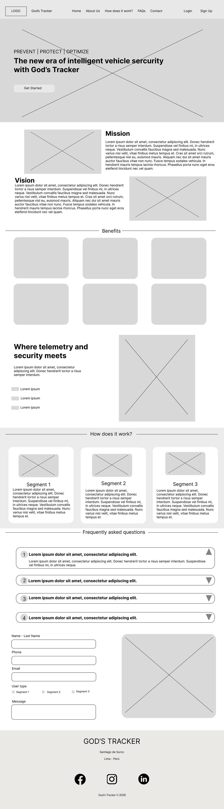

### 4.3.2. Landing Page Mock-up

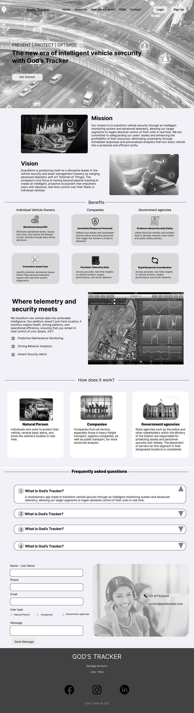

## 4.4. Web Applications UX/UI Design
La propuesta de wireframes fue desarrollada aplicando los principios de diseño centrado en el usuario, accesibilidad, jerarquía visual y usabilidad. Se busca asegurar una navegación clara y coherente, adaptando la estructura y contenido de la interfaz según el tipo de usuario, optimizando la experiencia en situaciones que requieren monitoreo y respuesta rápida. 

Estructura General:
La interfaz cuenta con una barra de navegación lateral que permite acceder de forma rápida a las funcionalidades principales del sistema. Las secciones están organizadas estratégicamente para priorizar el monitoreo en tiempo real, la gestión de alertas y el control del vehículo.

**Para persona natural**  
Se divide en Inicio, Estado en Vivo, Alertas de Seguridad, Historial de Rutas y Configuración, donde el usuario puede monitorear su vehículo, recibir notificaciones y ejecutar acciones de seguridad de manera inmediata.

**Inicio**  

Esta sección presenta un resumen general del estado del vehículo, permitiendo al usuario obtener información rápida sin necesidad de navegar por otras vistas.

    

**Estado en Vivo** 

Esta sección permite visualizar la ubicación del vehículo en tiempo real mediante un mapa interactivo, mostrando información actualizada constantemente. 

    

**Alertas de Seguridad** 

Esta sección permite gestionar las notificaciones relacionadas con eventos de riesgo o actividad sospechosa. 

    

**Historial de Rutas**

Permite visualizar los recorridos realizados por el vehículo en fechas específicas. 

    

**Configuración** 

Esta sección permite gestionar los ajustes del dispositivo y preferencias del usuario, presentándose como una vista independiente. 

    

### 4.4.1. Web Applications Wireframes

### 4.4.2. Web Applications Wireflow Diagrams

### 4.4.3. Web Applications Mock-ups

### 4.4.4. Web Applications User Flow Diagrams

## 4.5. Web Applications Prototyping

## 4.6. Domain-Driven Software Architecture

### 4.6.1. Design-Level Event Storming

Link del miro: https://miro.com/app/board/uXjVHd90Bvk=/?share_link_id=919402889853

### 4.6.2. Software Architecture Context Diagram

    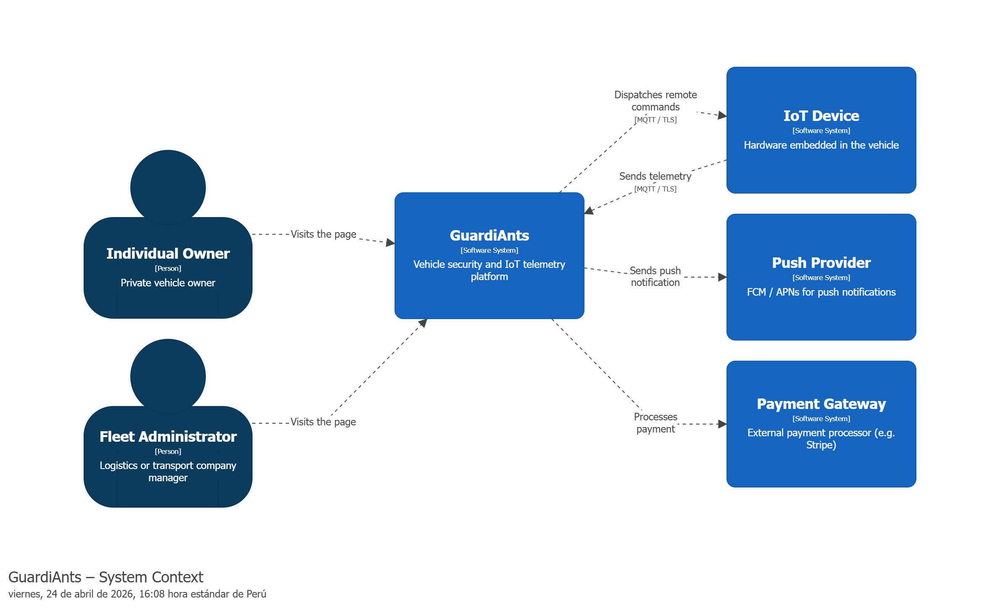

### 4.6.3. Software Architecture Container Diagrams

    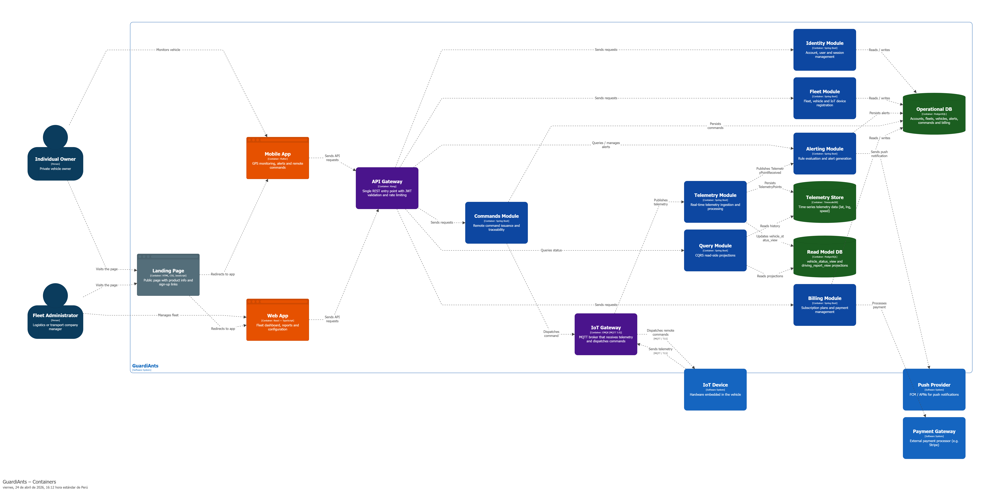

### 4.6.4. Software Architecture Components Diagrams

#### Component Diagram Indentity

    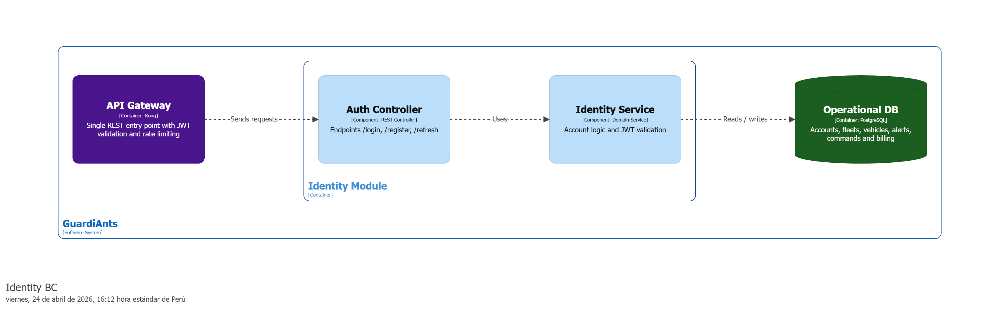

#### Component Diagram Fleet

    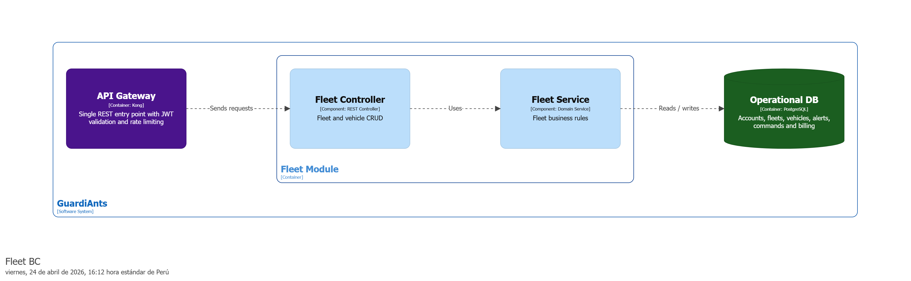

#### Component Diagram Telemetry

    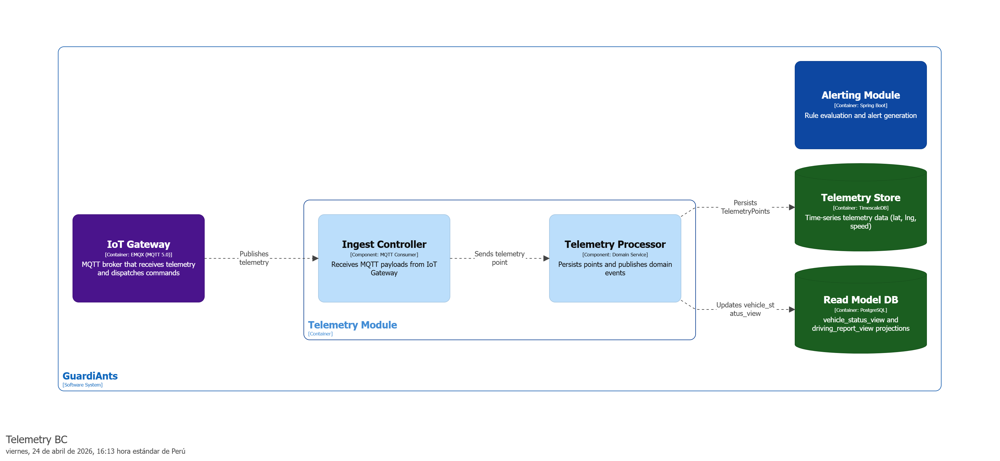

#### Component Diagram Alerting

    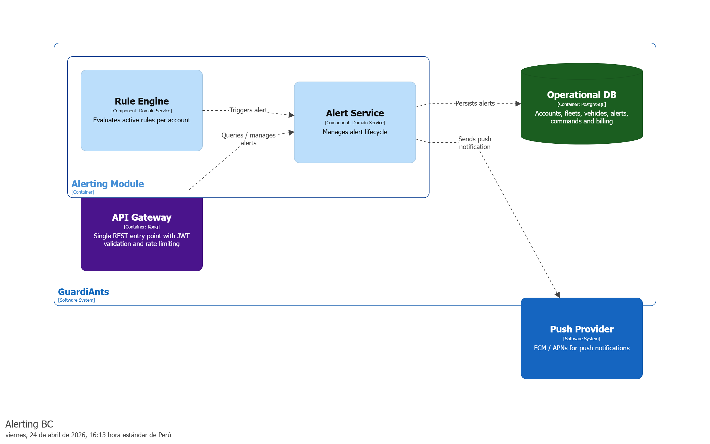

#### Component Diagram Billing

    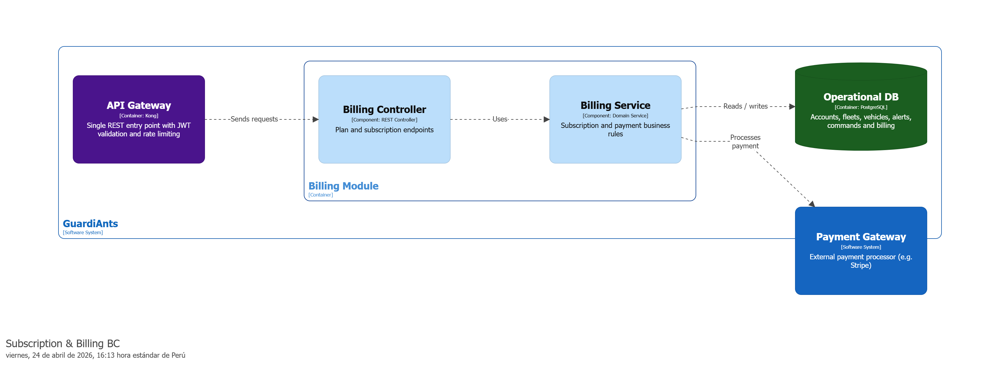

#### Component Diagram Commands

    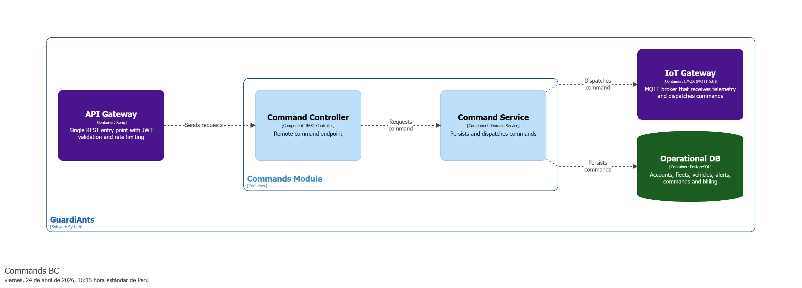

#### Component Diagram Query

    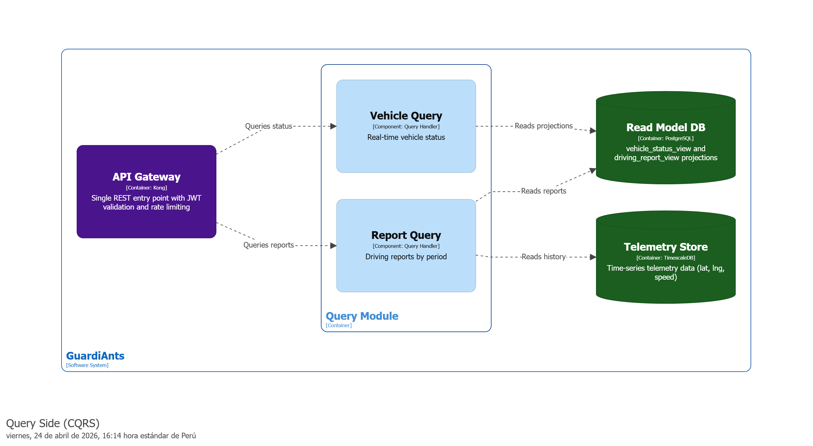

## 4.7. Software Object-Oriented Design

### 4.7.1. Class Diagrams

    

## 4.8. Database Design
### 4.8.1. Database Diagrams

    

# Capítulo V: Product Implementation, Validation & Deployment

## 5.1. Software Configuration Management

### 5.1.1. Software Development Environment Configuration

### 5.1.2. Source Code Management

### 5.1.3. Source Code Style Guide & Conventions

### 5.1.4. Software Deployment Configuration

## 5.2. Landing Page, Services & Applications Implementation

### 5.2.1. Sprint 1

#### 5.2.1.1. Sprint Planning 1

<table>
  <caption>Sprint #1</caption>
  <thead>
    <tr>
      <th colspan="2">Sprint Planning Backlog</th>
    </tr>
  </thead>
  <tbody>
    <tr>
      <td>Fecha</td>
      <td></td>
    </tr>
    <tr>
      <td>Hora</td>
      <td></td>
    </tr>
    <tr>
      <td>Ubicación</td>
      <td></td>
    </tr>
    <tr>
      <td>Preparado por</td>
      <td>Integrantes de </td>
    </tr>
    <tr>
      <td>Asistentes (a la reunión de planificación)</td>
      <td>Todos los miembros de </td>
    </tr>
    <tr>
      <td>
        <strong>Sprint 1 Review</strong>
      </td>
      <td>
        .
      </td>
    </tr>
    <tr>
      <td>
        <strong>Sprint 1 Retrospective</strong>
      </td>
      <td>
        .
      </td>
    </tr>
    <tr>
      <td colspan="2">
        <strong>Sprint Goal and User Stories</strong>
      </td>
    </tr>
    <tr>
      <td>
        <strong>Sprint 1 Goal</strong>
      </td>
      <td>
        .
      </td>
    </tr>
    <tr>
      <td><strong>Sprint 1 Velocity</strong></td>
      <td></td>
    </tr>
    <tr>
      <td><strong>Sum of Story Points</strong></td>
      <td></td>
    </tr>
  </tbody>
</table>

#### 5.2.1.2. Aspect Leaders and Collaborators
#### 5.2.1.3. Sprint Backlog 1

<table align="center" border="1" width="90%" style="text-align:center">
    <tr>
       <td colspan="1"><b>Sprint #</b></td>
       <td colspan="7"><b>Sprint 1</b></td>
     </tr>
     <tr>
       <td colspan="2"><b>User Story</b></td>
       <td colspan="6"><b>Work-Item / Task</b></td>
     </tr>
     <tr>
       <td><b>Id</b></td>
       <td><b>Title</b></td>
       <td><b>Id</b></td>
       <td><b>Title</b></td>
       <td><b>Description</b></td>
       <td><b>Estimation(Hours)</b></td>
       <td><b>Assigned To</b></td>
       <td><b>Status(To-do/ In-Process/ To-Review/ Done)</b></td>
     </tr>
     <tr>
       <td rowspan="1">US</td>
       <td rowspan="1"></td>
       <td>T01</td>
       <td></td>
       <td> </td>
       <td></td>
       <td></td>
       <td></td>
    </tr>
    </tr>
        <tr>
       <td rowspan="1">US</td>
       <td rowspan="1"></td>
       <td>T02</td>
       <td></td>
       <td></td>
       <td></td>
    </tr>
    <tr>
       <td rowspan="1">US</td>
       <td rowspan="1"></td>
       <td>T03</td>
       <td></td>
       <td></td>
       <td></td>
       <td> </td>
       <td></td>
    </tr>
</table>

#### 5.2.1.4. Development Evidence for Sprint Review

| Repository | Branch | Commit ID | Commit Message | Commit Message Body | Commited On (Date) |
|------------|--------|-----------|----------------|---------------------|--------------------|
| |  |  |  |
| |  |  |  |  |  |
| |  |  |  |  |  |
| |  |  |  |  |  |
| |  |  |  |  |  |

#### 5.2.1.5. Execution Evidence for Sprint Review
#### 5.2.1.6. Services Documentation Evidence for Sprint Review
#### 5.2.1.7. Software Deployment Evidence for Sprint Review
#### 5.2.1.8. Team Collaboration Insights during Sprint

## 5.3. Validation Interviews

### 5.3.1. Diseño de Entrevistas

### 5.3.2. Registro de Entrevistas

### 5.3.3. Evaluaciones según heurísticas

## 5.4. Video About-the-Product

# Conclusiones 
# Bibliografía
# Anexos
